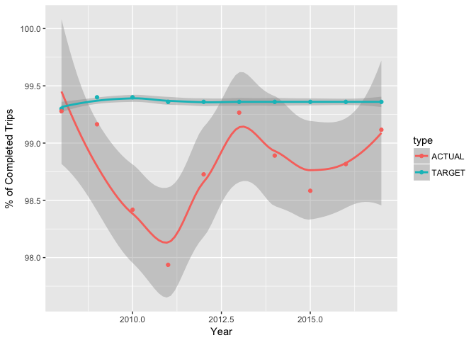

The Metropolitan Transportation Authority of New York City
================

I will begin analysing the data provided from New York City's transportation authority, also known as the MTA. The following data used will include success and failure rates for each department.
In order to use this data, I had to apply through its website in order to obtain this data. The given data will be provided along with this file, and in the website. In order to make this data easier to read, there were csv files created in order to yield a viable graph and for data wrangling purposes.

New York City is one of the most populated cities in the world, and has one of the largest public transportation systems in the world as well.

``` r
bustripdata <- read.csv("bustrip.csv")
bustripdata %>% 
  ggplot(aes(x=PERIOD_YEAR,y=count,color=type)) +
  stat_smooth() +
  geom_point() + 
  xlab("Year") + 
  ylab("% of Completed Trips")
```


