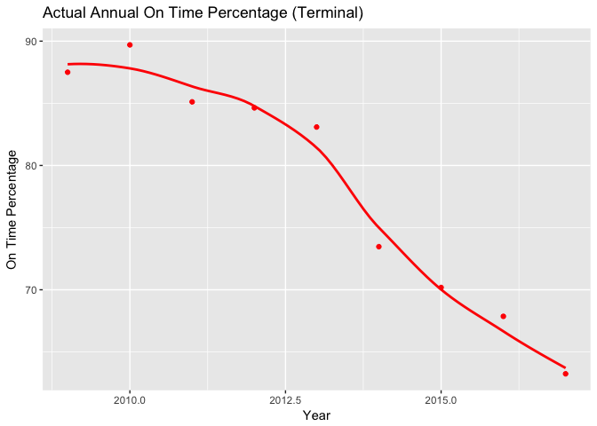

The Metropolitan Transportation Authority of New York City
================
Anthony Josue Roman

*Source file* <a href='data:text/x-markdown;base64,LS0tCnRpdGxlOiAiVGhlIE1ldHJvcG9saXRhbiBUcmFuc3BvcnRhdGlvbiBBdXRob3JpdHkgb2YgTmV3IFlvcmsgQ2l0eSIKYXV0aG9yOiBBbnRob255IEpvc3VlIFJvbWFuCm91dHB1dDogZ2l0aHViX2RvY3VtZW50Ci0tLQoKYGBge3Igc2V0dXAsIGluY2x1ZGU9RkFMU0V9CmtuaXRyOjpvcHRzX2NodW5rJHNldChlY2hvID0gVFJVRSkKYGBgCgpgYGB7ciBpbmNsdWRlPUZBTFNFfQojIERvbid0IGRlbGV0ZSB0aGlzIGNodW5rIGlmIHlvdSBhcmUgdXNpbmcgdGhlIERhdGFDb21wdXRpbmcgcGFja2FnZQpsaWJyYXJ5KERhdGFDb21wdXRpbmcpCmxpYnJhcnkobW9zYWljKQpsaWJyYXJ5KG1vc2FpY0RhdGEpCmxpYnJhcnkoZHBseXIpCmxpYnJhcnkoZ2dwbG90MikKbGlicmFyeShndGZzcikKbGlicmFyeShtYWdyaXR0cikKbGlicmFyeShkcGx5cikKcmVxdWlyZShtb3NhaWNEYXRhKQpyZXF1aXJlKG1vc2FpYykKcmVxdWlyZShnZ3Bsb3QyKQpyZXF1aXJlKGd0ZnNyKQpyZXF1aXJlKG1hZ3JpdHRyKQpyZXF1aXJlKGRwbHlyKQpgYGAKKlNvdXJjZSBmaWxlKiAKYGBge3IsIHJlc3VsdHM9J2FzaXMnLCBlY2hvPUZBTFNFfQppbmNsdWRlU291cmNlRG9jdW1lbnRzKCkKYGBgCgpJIHdpbGwgYmVnaW4gYW5hbHlzaW5nIHRoZSBkYXRhIHByb3ZpZGVkIGZyb20gTmV3IFlvcmsgQ2l0eSdzIHRyYW5zcG9ydGF0aW9uIGF1dGhvcml0eSwgYWxzbyBrbm93biBhcyB0aGUgTVRBLiBUaGUgZm9sbG93aW5nIGRhdGEgdXNlZCB3aWxsIGluY2x1ZGUgc3VjY2VzcyBhbmQgZmFpbHVyZSByYXRlcyBmb3IgZWFjaCBkZXBhcnRtZW50LiAgCkluIG9yZGVyIHRvIHVzZSB0aGlzIGRhdGEsIEkgaGFkIHRvIGFwcGx5IHRocm91Z2ggaXRzIHdlYnNpdGUgaW4gb3JkZXIgdG8gb2J0YWluIHRoaXMgZGF0YS4gVGhlIGdpdmVuIGRhdGEgd2lsbCBiZSBwcm92aWRlZCBhbG9uZyB3aXRoIHRoaXMgZmlsZSwgYW5kIGluIHRoZSB3ZWJzaXRlLiBJbiBvcmRlciB0byBtYWtlIHRoaXMgZGF0YSBlYXNpZXIgdG8gcmVhZCwgdGhlcmUgd2VyZSBjc3YgZmlsZXMgY3JlYXRlZCBpbiBvcmRlciB0byB5aWVsZCBhIHZpYWJsZSBncmFwaCBhbmQgZm9yIGRhdGEgd3JhbmdsaW5nIHB1cnBvc2VzLgoKTmV3IFlvcmsgQ2l0eSBpcyBvbmUgb2YgdGhlIG1vc3QgcG9wdWxhdGVkIGNpdGllcyBpbiB0aGUgd29ybGQsIGFuZCBoYXMgb25lIG9mIHRoZSBsYXJnZXN0IHB1YmxpYyB0cmFuc3BvcnRhdGlvbiBzeXN0ZW1zIGluIHRoZSB3b3JsZCBhcyB3ZWxsLgoKQmVsb3cgaXMgYSBjb21wYXJpc29uIGJldHdlZW4gdGhlIENvbXBsZXRlZCBhbmQgcHJvamVjdGVkIFRyaXBzIGZyb20gTVRBIEJ1cyBhbmQgTVRBIE5ldyBZb3JrIENpdHkgQnVzLiBOb3RlOiBPbiAyMDEyLCBIdXJyaWNhbmUgU2FuZHkgZGlkIGFmZmVjdCBzZXJ2aWNlLCBhbG9uZyB3aXRoIG90aGVyIHllYXJzIGR1ZSB0byBzdXNwZW5zaW9uIG9mIHNlcnZpY2UuCgojIyMgTmV3IFlvcmsgQ2l0eSBCdXMKCmBgYHtyLCBlY2hvPUZBTFNFLCBtZXNzYWdlPUZBTFNFLCB3YXJuaW5nPUZBTFNFfQpidXN0cmlwZGF0YSA8LSByZWFkLmNzdigiYnVzdHJpcC5jc3YiKQpidXN0cmlwZGF0YSAlPiUgCiAgZ2dwbG90KGFlcyh4PVBFUklPRF9ZRUFSLHk9Y291bnQsY29sb3I9dHlwZSkpICsKICBzdGF0X3Ntb290aCgpICsKICBnZW9tX3BvaW50KCkgKyAKICB4bGFiKCJZZWFyIikgKyAKICB5bGFiKCIlIG9mIENvbXBsZXRlZCBUcmlwcyIpICsKICBnZ3RpdGxlKCJDb21wbHRldGVkIHRyaXBzIGZvciB0aGUgTmV3IFlvcmsgQ2l0eSBCdXMiKQpgYGAKICAKQmVsb3cgaXMgdGhlIGRhdGEgdXNlZCBmb3IgdGhlIGdyYXBoIGFib3ZlLCB3aGljaCBleHBsYWlucyB0aGUgY29tcGxldGVkIHRyaXAgcGVyY2VudGFnZSBwZXIgeWVhci4gVGhlIHR5cGUgc2hvd3MgdGhlIGRpZmZlcmVuY2UgYmV0d2VlbiB0aGUgYWN0dWFsIGFuZCB0YXJnZXQgKHByZWRpY3RlZCkgZGF0YSBnYXRoZXJlZCBmb3IgTllDVCBCdXMuCgpgYGB7ciwgZWNobz1GQUxTRSwgbWVzc2FnZT1GQUxTRSwgd2FybmluZz1GQUxTRX0KYnVzdHJpcGRhdGEgPC0gcmVhZC5jc3YoImJ1c3RyaXAuY3N2IikKa25pdHI6OmthYmxlKGJ1c3RyaXBkYXRhKQpgYGAKCiMjIyBNZXRybyBOb3J0aCBSYWlscm9hZAoKVGhpcyBpcyB0aGUgTWV0cm8gTm9ydGggUmFpbHJvYWQgd2l0aCBtdWx0aXBsZSBpbmRpY2F0b3IgdHlwZXMsIGFuZCBJIHdpbGwgZm9jdXMgb24gdGhlIE1OUlIgSHVkc29uIEhhcmxlbSBhbmQgUG9ydCBKZXJ2aXMgTGluZXMuCgpgYGB7ciwgZWNobz1GQUxTRSwgbWVzc2FnZT1GQUxTRSwgd2FybmluZz1GQUxTRX0KbW5yciA8LSByZWFkLmNzdigiTVRBX1BlcmZvcm1hbmNlX01OUi5jc3YiKQptbnJyIDwtIAogIG1ucnIgJT4lIAogIHNlbGVjdChJTkRJQ0FUT1JfTkFNRSxQRVJJT0RfWUVBUixZVERfVEFSR0VULFlURF9BQ1RVQUwpCm1ucnIxIDwtCiAgbW5yciAlPiUKICBncm91cF9ieShJTkRJQ0FUT1JfTkFNRSxQRVJJT0RfWUVBUikgJT4lCiAgc3VtbWFyaXNlKGF2Z3RhcmdldD1tZWFuKFlURF9UQVJHRVQpLGF2Z2FjdHVhbD1tZWFuKFlURF9BQ1RVQUwpKQprbml0cjo6a2FibGUobW5ycjEpCmBgYAoKQmVsb3cgaXMgdGhlIE1ldHJvIE5vcnRoIEh1ZHNvbiBsaW5lLCB3aGVyZSB3ZSB3aWxsIGFuYWx5c2UgdGhlIGRhdGEgb24gdGhlIHBlcmNlbnRhZ2UgdGhhdCB0aGUgdHJhaW5zIGFycml2ZSBvbiB0aW1lLgoKYGBge3IsIGVjaG89RkFMU0UsIG1lc3NhZ2U9RkFMU0UsIHdhcm5pbmc9RkFMU0V9Cmh1ZHNvbiA8LSByZWFkLmNzdigibW5ycmguY3N2IikKa25pdHI6OmthYmxlKGh1ZHNvbikKYGBgCgpCZWxvdyBpcyB0aGUgZGF0YSB1c2VkIGZvciB0aGUgZ3JhcGggYWJvdmUsIHdoaWNoIGV4cGxhaW5zIHRoZSBwZXJjZW50YWdlIHRoYXQgdGhlIHRyYWlucyBhcnJpdmUgb24gdGltZSBwZXIgeWVhci4gVGhlIHR5cGUgc2hvd3MgdGhlIGRpZmZlcmVuY2UgYmV0d2VlbiB0aGUgYWN0dWFsIGFuZCB0YXJnZXQgKHByZWRpY3RlZCkgZGF0YSBnYXRoZXJlZCBmb3IgdGhlIE1OUlIgSHVkc29uIExpbmUuCgpgYGB7ciwgZWNobz1GQUxTRSwgbWVzc2FnZT1GQUxTRSwgd2FybmluZz1GQUxTRX0KbW5ycmggPC0gcmVhZC5jc3YoIm1ucnJoLmNzdiIpCm1ucnJoICU+JSAKICBnZ3Bsb3QoYWVzKHg9UEVSSU9EX1lFQVIseT1jb3VudCxjb2xvcj10eXBlKSkgKwogIHN0YXRfc21vb3RoKCkgKwogIGdlb21fcG9pbnQoKSArIAogIHhsYWIoIlllYXIiKSArIAogIHlsYWIoIiUgb2Ygb24gdGltZSBhcnJpdmFscyIpICsKICBnZ3RpdGxlKCJBcnJpdmFsIFRpbWVzIGZvciB0aGUgSHVkc29uIExpbmUiKQpgYGAKCkJlbG93IGlzIHRoZSBQb3J0IEplcnZpcyBsaW5lLCB3aGVyZSB3ZSB3aWxsIGFuYWx5c2UgdGhlIGRhdGEgb24gdGhlIHBlcmNlbnRhZ2UgdGhhdCB0aGUgdHJhaW5zIGFycml2ZSBvbiB0aW1lIGFsb25nIHdpdGggaXRzIGdyYXBoCgpgYGB7ciwgZWNobz1GQUxTRSwgbWVzc2FnZT1GQUxTRX0KbW5yciA8LSByZWFkLmNzdigibW5yci5jc3YiKQpwamwgPC0KICBtbnJyICU+JQogIGZpbHRlcihJTkRJQ0FUT1JfU0VRPT0yODQ2MCkKcGpsIDwtCiAgcGpsICU+JQogIHNlbGVjdChJTkRJQ0FUT1JfTkFNRSxQRVJJT0RfWUVBUixjb3VudCx0eXBlKQprbml0cjo6a2FibGUocGpsKQpgYGAKCmBgYHtyLCBlY2hvPUZBTFNFLCBtZXNzYWdlPUZBTFNFfQptbnJyIDwtIHJlYWQuY3N2KCJtbnJyLmNzdiIpCnBqbCA8LQogIG1ucnIgJT4lCiAgZmlsdGVyKElORElDQVRPUl9TRVE9PTI4NDYwKQpwamwgPC0KICBwamwgJT4lCiAgc2VsZWN0KElORElDQVRPUl9OQU1FLFBFUklPRF9ZRUFSLGNvdW50LHR5cGUpCnBqbCAlPiUgCiAgZ2dwbG90KGFlcyh4PVBFUklPRF9ZRUFSLHk9Y291bnQsY29sb3I9dHlwZSkpICsKICBzdGF0X3Ntb290aCgpICsKICBnZW9tX3BvaW50KCkgKyAKICB4bGFiKCJZZWFyIikgKyAKICB5bGFiKCIlIG9mIG9uIHRpbWUgYXJyaXZhbHMiKSArCiAgZ2d0aXRsZSgiQXJyaXZhbCBUaW1lcyBmb3IgdGhlIFBvcnQgSmVydmlzIExpbmUiKQpgYGAKCkJlbG93IHNob3dzIHRoZSBjb21wYXJpc29ucyBiZXR3ZWVuIGFsbCB0aGUgTU5SUiB0cnVuayBsaW5lIGFjdHVhbCBhbmQgdGFyZ2V0IGFycml2YWwgdGltZXMsIHdpdGggZWFjaCBpbmRpY2F0b3IgbmFtZSBiZWluZyB0aGUgbmFtZSBvZiB0aGUgTU5SUiB0cnVuayBsaW5lLgoKYGBge3IsIGVjaG89RkFMU0UsIG1lc3NhZ2U9RkFMU0V9Cm1ucnIgPC0gcmVhZC5jc3YoIm1ucnIuY3N2IikKbW5ycjEgPC0gCiAgbW5yciAlPiUgCiAgZmlsdGVyKElORElDQVRPUl9TRVEgJWluJSBjKDI4MzQ2LDI4MzQ1LDI4MzQ3LDI4NDYxLDI4NDYwKSkKbW5ycmEgPC0KICBtbnJyMSAlPiUKICBmaWx0ZXIodHlwZSA9PSAiYWN0dWFsIikKbW5ycmEgJT4lIAogIGdncGxvdChhZXMoeD1QRVJJT0RfWUVBUix5PWNvdW50LGNvbG9yPUlORElDQVRPUl9OQU1FKSkgKwogIHN0YXRfc21vb3RoKCkgKwogIGdlb21fcG9pbnQoKSArIAogIHhsYWIoIlllYXIiKSArIAogIHlsYWIoIiUgb2Ygb24gdGltZSBhcnJpdmFscyIpICsKICBnZ3RpdGxlKCJBY3R1YWwgQXJyaXZhbCBUaW1lcyBmb3IgRWFjaCBUcnVuayBMaW5lIikKYGBgCgpgYGB7ciwgZWNobz1GQUxTRSwgbWVzc2FnZT1GQUxTRX0KbW5yciA8LSByZWFkLmNzdigibW5yci5jc3YiKQptbnJyMSA8LSAKICBtbnJyICU+JSAKICBmaWx0ZXIoSU5ESUNBVE9SX1NFUSAlaW4lIGMoMjgzNDYsMjgzNDUsMjgzNDcsMjg0NjEsMjg0NjApKQptbnJydCA8LQogIG1ucnIxICU+JQogIGZpbHRlcih0eXBlID09ICJ0YXJnZXQiKQptbnJydCAlPiUgCiAgZ2dwbG90KGFlcyh4PVBFUklPRF9ZRUFSLHk9Y291bnQsY29sb3I9SU5ESUNBVE9SX05BTUUpKSArCiAgc3RhdF9zbW9vdGgoKSArCiAgZ2VvbV9wb2ludCgpICsgCiAgeGxhYigiWWVhciIpICsgCiAgeWxhYigiJSBvZiBvbiB0aW1lIGFycml2YWxzIikgKwogIGdndGl0bGUoIlRhcmdldCBBcnJpdmFsIFRpbWVzIGZvciBFYWNoIFRydW5rIExpbmUiKQpgYGAKCgo=' target='_blank' title='User  at /Users/Anthony' download='README.Rmd'> ⇒ README.Rmd</a>

I will begin analysing the data provided from New York City's transportation authority, also known as the MTA. The following data used will include success and failure rates for each department.
In order to use this data, I had to apply through its website in order to obtain this data. The given data will be provided along with this file, and in the website. In order to make this data easier to read, there were csv files created in order to yield a viable graph and for data wrangling purposes.

New York City is one of the most populated cities in the world, and has one of the largest public transportation systems in the world as well.

Below is a comparison between the Completed and projected Trips from MTA Bus and MTA New York City Bus. Note: On 2012, Hurricane Sandy did affect service, along with other years due to suspension of service.

### New York City Bus

Below is the data used for the graph above, which explains the completed trip percentage per year. The type shows the difference between the actual and target (predicted) data gathered for NYCT Bus.

| INDICATOR\_NAME                 |  PERIOD\_YEAR|     count| type   |
|:--------------------------------|-------------:|---------:|:-------|
| % of Completed Trips - NYCT Bus |          2008|  99.30000| TARGET |
| % of Completed Trips - NYCT Bus |          2008|  99.27833| ACTUAL |
| % of Completed Trips - NYCT Bus |          2009|  99.40000| TARGET |
| % of Completed Trips - NYCT Bus |          2009|  99.16417| ACTUAL |
| % of Completed Trips - NYCT Bus |          2010|  99.40000| TARGET |
| % of Completed Trips - NYCT Bus |          2010|  98.41750| ACTUAL |
| % of Completed Trips - NYCT Bus |          2011|  99.36000| TARGET |
| % of Completed Trips - NYCT Bus |          2011|  97.93667| ACTUAL |
| % of Completed Trips - NYCT Bus |          2012|  99.36000| TARGET |
| % of Completed Trips - NYCT Bus |          2012|  98.72667| ACTUAL |
| % of Completed Trips - NYCT Bus |          2013|  99.36000| TARGET |
| % of Completed Trips - NYCT Bus |          2013|  99.26583| ACTUAL |
| % of Completed Trips - NYCT Bus |          2014|  99.36000| TARGET |
| % of Completed Trips - NYCT Bus |          2014|  98.89083| ACTUAL |
| % of Completed Trips - NYCT Bus |          2015|  99.36000| TARGET |
| % of Completed Trips - NYCT Bus |          2015|  98.58333| ACTUAL |
| % of Completed Trips - NYCT Bus |          2016|  99.36000| TARGET |
| % of Completed Trips - NYCT Bus |          2016|  98.81667| ACTUAL |
| % of Completed Trips - NYCT Bus |          2017|  99.36000| TARGET |
| % of Completed Trips - NYCT Bus |          2017|  99.11625| ACTUAL |

### Metro North Railroad

This is the Metro North Railroad with multiple indicator types, and I will focus on the MNRR Hudson Harlem and Port Jervis Lines.

| INDICATOR\_NAME                             |  PERIOD\_YEAR|     avgtarget|     avgactual|
|:--------------------------------------------|-------------:|-------------:|-------------:|
| Customer Injury Rate                        |          2008|  3.200000e+00|  3.682500e+00|
| Customer Injury Rate                        |          2009|  3.200000e+00|  2.722500e+00|
| Customer Injury Rate                        |          2010|  2.800000e+00|  2.785000e+00|
| Customer Injury Rate                        |          2011|  2.800000e+00|  3.579167e+00|
| Customer Injury Rate                        |          2012|  2.783333e+00|  3.184167e+00|
| Customer Injury Rate                        |          2013|  2.700000e+00|  4.215833e+00|
| Customer Injury Rate                        |          2014|  2.700000e+00|  3.295000e+00|
| Customer Injury Rate                        |          2015|  2.800000e+00|  5.042500e+00|
| Customer Injury Rate                        |          2016|  3.240000e+00|  2.713333e+00|
| Customer Injury Rate                        |          2017|  3.140000e+00|  1.842222e+00|
| Elevator Availability                       |          2009|  0.000000e+00|  9.885000e+01|
| Elevator Availability                       |          2010|  9.700000e+01|  9.870000e+01|
| Elevator Availability                       |          2011|  9.700000e+01|  9.940833e+01|
| Elevator Availability                       |          2012|  9.700000e+01|  9.900583e+01|
| Elevator Availability                       |          2013|  9.700000e+01|  9.815167e+01|
| Elevator Availability                       |          2014|  9.800000e+01|  9.858750e+01|
| Elevator Availability                       |          2015|  9.800000e+01|  9.906750e+01|
| Elevator Availability                       |          2016|  9.800000e+01|  9.958083e+01|
| Elevator Availability                       |          2017|  9.800000e+01|  9.900375e+01|
| Employee Lost Time and Restricted Duty Rate |          2008|  2.000000e+00|  1.049167e+00|
| Employee Lost Time and Restricted Duty Rate |          2009|  1.900000e+00|  2.295833e+00|
| Employee Lost Time and Restricted Duty Rate |          2010|  1.800000e+00|  1.824167e+00|
| Employee Lost Time and Restricted Duty Rate |          2011|  1.700000e+00|  2.620000e+00|
| Employee Lost Time and Restricted Duty Rate |          2012|  2.000000e+00|  1.903333e+00|
| Employee Lost Time and Restricted Duty Rate |          2013|  1.750000e+00|  2.280833e+00|
| Employee Lost Time and Restricted Duty Rate |          2014|  1.750000e+00|  2.866667e+00|
| Employee Lost Time and Restricted Duty Rate |          2015|  2.000000e+00|  2.565833e+00|
| Employee Lost Time and Restricted Duty Rate |          2016|  2.340000e+00|  2.929167e+00|
| Employee Lost Time and Restricted Duty Rate |          2017|  2.560000e+00|  3.056667e+00|
| Escalator Availability                      |          2009|  0.000000e+00|  9.468083e+01|
| Escalator Availability                      |          2010|  9.700000e+01|  9.839250e+01|
| Escalator Availability                      |          2011|  9.700000e+01|  9.544917e+01|
| Escalator Availability                      |          2012|  9.000000e+01|  9.472750e+01|
| Escalator Availability                      |          2013|  9.000000e+01|  8.579167e+01|
| Escalator Availability                      |          2014|  9.300000e+01|  9.694500e+01|
| Escalator Availability                      |          2015|  9.700000e+01|  9.841083e+01|
| Escalator Availability                      |          2016|  9.700000e+01|  9.696750e+01|
| Escalator Availability                      |          2017|  9.700000e+01|  9.682125e+01|
| Harlem Line - OTP                           |          2008|  9.800000e+01|  9.853333e+01|
| Harlem Line - OTP                           |          2009|  9.820000e+01|  9.852500e+01|
| Harlem Line - OTP                           |          2010|  9.830000e+01|  9.870833e+01|
| Harlem Line - OTP                           |          2011|  9.830000e+01|  9.761667e+01|
| Harlem Line - OTP                           |          2012|  9.830000e+01|  9.850000e+01|
| Harlem Line - OTP                           |          2013|  9.830000e+01|  9.735833e+01|
| Harlem Line - OTP                           |          2014|  9.400000e+01|  9.323333e+01|
| Harlem Line - OTP                           |          2015|  9.300000e+01|  9.308333e+01|
| Harlem Line - OTP                           |          2016|  9.300000e+01|  9.487500e+01|
| Harlem Line - OTP                           |          2017|  9.300000e+01|  9.587778e+01|
| Hudson Line - OTP                           |          2008|  9.800000e+01|  9.811667e+01|
| Hudson Line - OTP                           |          2009|  9.790000e+01|  9.782500e+01|
| Hudson Line - OTP                           |          2010|  9.810000e+01|  9.825833e+01|
| Hudson Line - OTP                           |          2011|  9.820000e+01|  9.792500e+01|
| Hudson Line - OTP                           |          2012|  9.820000e+01|  9.846667e+01|
| Hudson Line - OTP                           |          2013|  9.820000e+01|  9.770000e+01|
| Hudson Line - OTP                           |          2014|  9.400000e+01|  9.148333e+01|
| Hudson Line - OTP                           |          2015|  9.300000e+01|  9.373333e+01|
| Hudson Line - OTP                           |          2016|  9.300000e+01|  9.525833e+01|
| Hudson Line - OTP                           |          2017|  9.300000e+01|  9.582222e+01|
| Mean Distance Between Failures              |          2008|  1.000000e+05|  1.265180e+05|
| Mean Distance Between Failures              |          2009|  1.050000e+05|  9.386245e+04|
| Mean Distance Between Failures              |          2010|  1.150000e+05|  1.428972e+05|
| Mean Distance Between Failures              |          2011|  1.250000e+05|  9.037150e+04|
| Mean Distance Between Failures              |          2012|  1.350000e+05|  1.745131e+05|
| Mean Distance Between Failures              |          2013|  1.550000e+05|  1.598148e+05|
| Mean Distance Between Failures              |          2014|  1.600000e+05|  1.242140e+05|
| Mean Distance Between Failures              |          2015|  1.850000e+05|  1.636395e+05|
| Mean Distance Between Failures              |          2016|  2.000000e+05|  2.182032e+05|
| Mean Distance Between Failures              |          2017|  2.000000e+05|  2.087061e+05|
| New Haven Line - OTP                        |          2008|  9.710000e+01|  9.764167e+01|
| New Haven Line - OTP                        |          2009|  9.700000e+01|  9.672500e+01|
| New Haven Line - OTP                        |          2010|  9.700000e+01|  9.720000e+01|
| New Haven Line - OTP                        |          2011|  9.720000e+01|  9.386667e+01|
| New Haven Line - OTP                        |          2012|  9.720000e+01|  9.770833e+01|
| New Haven Line - OTP                        |          2013|  9.720000e+01|  9.475833e+01|
| New Haven Line - OTP                        |          2014|  9.200000e+01|  8.847500e+01|
| New Haven Line - OTP                        |          2015|  9.300000e+01|  9.083333e+01|
| New Haven Line - OTP                        |          2016|  9.300000e+01|  9.310833e+01|
| New Haven Line - OTP                        |          2017|  9.300000e+01|  9.388889e+01|
| On-Time Performance (East of Hudson)        |          2008|  9.760000e+01|  9.805833e+01|
| On-Time Performance (East of Hudson)        |          2009|  9.760000e+01|  9.755833e+01|
| On-Time Performance (East of Hudson)        |          2010|  9.770000e+01|  9.795833e+01|
| On-Time Performance (East of Hudson)        |          2011|  9.780000e+01|  9.608333e+01|
| On-Time Performance (East of Hudson)        |          2012|  9.780000e+01|  9.815000e+01|
| On-Time Performance (East of Hudson)        |          2013|  9.780000e+01|  9.635833e+01|
| On-Time Performance (East of Hudson)        |          2014|  9.300000e+01|  9.072500e+01|
| On-Time Performance (East of Hudson)        |          2015|  9.300000e+01|  9.227500e+01|
| On-Time Performance (East of Hudson)        |          2016|  9.300000e+01|  9.421667e+01|
| On-Time Performance (East of Hudson)        |          2017|  9.300000e+01|  9.502222e+01|
| On-Time Performance (West of Hudson)        |          2008|  9.500000e+01|  9.626667e+01|
| On-Time Performance (West of Hudson)        |          2009|  9.620000e+01|  9.571667e+01|
| On-Time Performance (West of Hudson)        |          2010|  9.630000e+01|  9.670833e+01|
| On-Time Performance (West of Hudson)        |          2011|  9.640000e+01|  9.535000e+01|
| On-Time Performance (West of Hudson)        |          2012|  9.640000e+01|  9.740000e+01|
| On-Time Performance (West of Hudson)        |          2013|  9.685000e+01|  9.691667e+01|
| On-Time Performance (West of Hudson)        |          2014|  9.700000e+01|  9.430000e+01|
| On-Time Performance (West of Hudson)        |          2015|  9.550000e+01|  9.387500e+01|
| On-Time Performance (West of Hudson)        |          2016|  9.550000e+01|  9.651667e+01|
| On-Time Performance (West of Hudson)        |          2017|  9.550000e+01|  9.463333e+01|
| Pascack Valley Line - OTP                   |          2008|  9.560000e+01|  9.686667e+01|
| Pascack Valley Line - OTP                   |          2009|  9.700000e+01|  9.559167e+01|
| Pascack Valley Line - OTP                   |          2010|  9.700000e+01|  9.777500e+01|
| Pascack Valley Line - OTP                   |          2011|  9.700000e+01|  9.706667e+01|
| Pascack Valley Line - OTP                   |          2012|  9.700000e+01|  9.828333e+01|
| Pascack Valley Line - OTP                   |          2013|  9.745000e+01|  9.735833e+01|
| Pascack Valley Line - OTP                   |          2014|  9.760000e+01|  9.485833e+01|
| Pascack Valley Line - OTP                   |          2015|  9.650000e+01|  9.415000e+01|
| Pascack Valley Line - OTP                   |          2016|  9.650000e+01|  9.697500e+01|
| Pascack Valley Line - OTP                   |          2017|  9.650000e+01|  9.612222e+01|
| Port Jervis Line - OTP                      |          2008|  9.440000e+01|  9.540833e+01|
| Port Jervis Line - OTP                      |          2009|  9.500000e+01|  9.594167e+01|
| Port Jervis Line - OTP                      |          2010|  9.520000e+01|  9.508333e+01|
| Port Jervis Line - OTP                      |          2011|  9.550000e+01|  9.285000e+01|
| Port Jervis Line - OTP                      |          2012|  9.550000e+01|  9.613333e+01|
| Port Jervis Line - OTP                      |          2013|  9.602500e+01|  9.630833e+01|
| Port Jervis Line - OTP                      |          2014|  9.620000e+01|  9.345000e+01|
| Port Jervis Line - OTP                      |          2015|  9.500000e+01|  9.345000e+01|
| Port Jervis Line - OTP                      |          2016|  9.500000e+01|  9.587500e+01|
| Port Jervis Line - OTP                      |          2017|  9.500000e+01|  9.247778e+01|
| Total Ridership                             |          2008|  4.348448e+07|  4.469435e+07|
| Total Ridership                             |          2009|  4.543220e+07|  4.274454e+07|
| Total Ridership                             |          2010|  4.186437e+07|  4.298796e+07|
| Total Ridership                             |          2011|  4.328969e+07|  4.344673e+07|
| Total Ridership                             |          2012|  4.447035e+07|  4.490028e+07|
| Total Ridership                             |          2013|  4.598827e+07|  4.467362e+07|
| Total Ridership                             |          2014|  4.560714e+07|  4.489043e+07|
| Total Ridership                             |          2015|  4.571809e+07|  4.543054e+07|
| Total Ridership                             |          2016|  4.639277e+07|  4.610074e+07|
| Total Ridership                             |          2017|  3.194988e+07|  3.145262e+07|

Below is the Metro North Hudson line, where we will analyse the data on the percentage that the trains arrive on time.

| INDICATOR\_NAME   |  PERIOD\_YEAR|     count| type   |
|:------------------|-------------:|---------:|:-------|
| Hudson Line - OTP |          2008|  98.00000| target |
| Hudson Line - OTP |          2008|  98.11667| actual |
| Hudson Line - OTP |          2009|  97.90000| target |
| Hudson Line - OTP |          2009|  97.82500| actual |
| Hudson Line - OTP |          2010|  98.10000| target |
| Hudson Line - OTP |          2010|  98.25833| actual |
| Hudson Line - OTP |          2011|  98.20000| target |
| Hudson Line - OTP |          2011|  97.92500| actual |
| Hudson Line - OTP |          2012|  98.20000| target |
| Hudson Line - OTP |          2012|  98.46667| actual |
| Hudson Line - OTP |          2013|  98.20000| target |
| Hudson Line - OTP |          2013|  97.70000| actual |
| Hudson Line - OTP |          2014|  94.00000| target |
| Hudson Line - OTP |          2014|  91.48333| actual |
| Hudson Line - OTP |          2015|  93.00000| target |
| Hudson Line - OTP |          2015|  93.73333| actual |
| Hudson Line - OTP |          2016|  93.00000| target |
| Hudson Line - OTP |          2016|  95.25833| actual |
| Hudson Line - OTP |          2017|  93.00000| target |
| Hudson Line - OTP |          2017|  95.82222| actual |

Below is the data used for the graph above, which explains the percentage that the trains arrive on time per year. The type shows the difference between the actual and target (predicted) data gathered for the MNRR Hudson Line.

Below is the Port Jervis line, where we will analyse the data on the percentage that the trains arrive on time along with its graph

| INDICATOR\_NAME        |  PERIOD\_YEAR|     count| type   |
|:-----------------------|-------------:|---------:|:-------|
| Port Jervis Line - OTP |          2008|  94.40000| target |
| Port Jervis Line - OTP |          2008|  95.40833| actual |
| Port Jervis Line - OTP |          2009|  95.00000| target |
| Port Jervis Line - OTP |          2009|  95.94167| actual |
| Port Jervis Line - OTP |          2010|  95.20000| target |
| Port Jervis Line - OTP |          2010|  95.08333| actual |
| Port Jervis Line - OTP |          2011|  95.50000| target |
| Port Jervis Line - OTP |          2011|  92.85000| actual |
| Port Jervis Line - OTP |          2012|  95.50000| target |
| Port Jervis Line - OTP |          2012|  96.13333| actual |
| Port Jervis Line - OTP |          2013|  96.02500| target |
| Port Jervis Line - OTP |          2013|  96.30833| actual |
| Port Jervis Line - OTP |          2014|  96.20000| target |
| Port Jervis Line - OTP |          2014|  93.45000| actual |
| Port Jervis Line - OTP |          2015|  95.00000| target |
| Port Jervis Line - OTP |          2015|  93.45000| actual |
| Port Jervis Line - OTP |          2016|  95.00000| target |
| Port Jervis Line - OTP |          2016|  95.87500| actual |
| Port Jervis Line - OTP |          2017|  95.00000| target |
| Port Jervis Line - OTP |          2017|  92.47778| actual |

Below shows the comparisons between all the MNRR trunk line actual and target arrival times, with each indicator name being the name of the MNRR trunk line.

