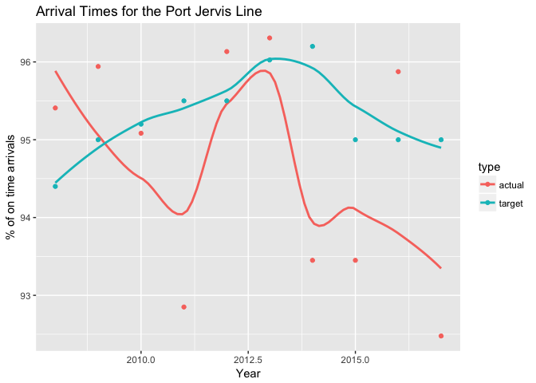
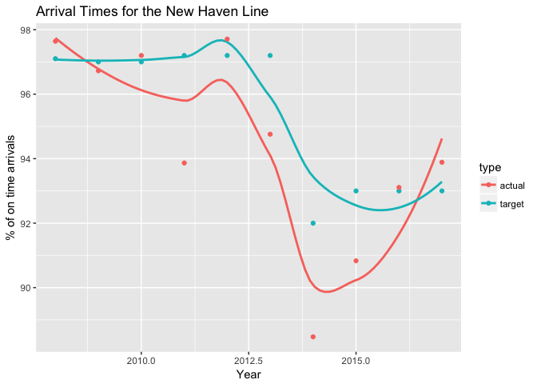
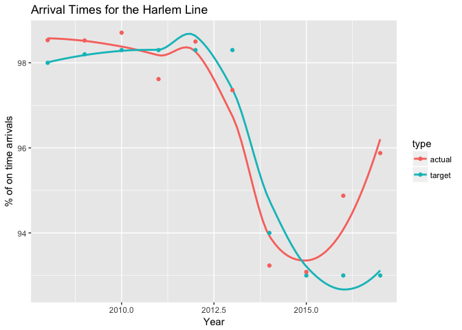

The Metropolitan Transportation Authority of New York City
================
Anthony Josue Roman

*Source file* <a href='data:text/x-markdown;base64,LS0tCnRpdGxlOiAiVGhlIE1ldHJvcG9saXRhbiBUcmFuc3BvcnRhdGlvbiBBdXRob3JpdHkgb2YgTmV3IFlvcmsgQ2l0eSIKYXV0aG9yOiBBbnRob255IEpvc3VlIFJvbWFuCm91dHB1dDogZ2l0aHViX2RvY3VtZW50CmFsd2F5c19hbGxvd19odG1sOiB5ZXMKLS0tCgpgYGB7ciBzZXR1cCwgaW5jbHVkZT1GQUxTRX0Ka25pdHI6Om9wdHNfY2h1bmskc2V0KGVjaG8gPSBUUlVFKQpgYGAKCmBgYHtyIGluY2x1ZGU9RkFMU0V9CiMgRG9uJ3QgZGVsZXRlIHRoaXMgY2h1bmsgaWYgeW91IGFyZSB1c2luZyB0aGUgRGF0YUNvbXB1dGluZyBwYWNrYWdlCmxpYnJhcnkoRGF0YUNvbXB1dGluZykKbGlicmFyeShtb3NhaWMpCmxpYnJhcnkobW9zYWljRGF0YSkKbGlicmFyeShkcGx5cikKbGlicmFyeShnZ3Bsb3QyKQpsaWJyYXJ5KGd0ZnNyKQpsaWJyYXJ5KG1hZ3JpdHRyKQpsaWJyYXJ5KGRwbHlyKQpyZXF1aXJlKERhdGFDb21wdXRpbmcpCnJlcXVpcmUobW9zYWljKQpyZXF1aXJlKG1vc2FpY0RhdGEpCnJlcXVpcmUoZHBseXIpCnJlcXVpcmUoZ2dwbG90MikKcmVxdWlyZShndGZzcikKcmVxdWlyZShtYWdyaXR0cikKcmVxdWlyZShkcGx5cikKYGBgCipTb3VyY2UgZmlsZSogCmBgYHtyLCByZXN1bHRzPSdhc2lzJywgZWNobz1GQUxTRX0KaW5jbHVkZVNvdXJjZURvY3VtZW50cygpCmBgYAoKSSB3aWxsIGJlZ2luIGFuYWx5c2luZyB0aGUgZGF0YSBwcm92aWRlZCBmcm9tIE5ldyBZb3JrIENpdHkncyB0cmFuc3BvcnRhdGlvbiBhdXRob3JpdHksIGFsc28ga25vd24gYXMgdGhlIE1UQS4gVGhlIGZvbGxvd2luZyBkYXRhIHVzZWQgd2lsbCBpbmNsdWRlIHN1Y2Nlc3MgYW5kIGZhaWx1cmUgcmF0ZXMgZm9yIGVhY2ggZGVwYXJ0bWVudC4gIApJbiBvcmRlciB0byB1c2UgdGhpcyBkYXRhLCBJIGhhZCB0byBhcHBseSB0aHJvdWdoIGl0cyB3ZWJzaXRlIGluIG9yZGVyIHRvIG9idGFpbiB0aGlzIGRhdGEuIFRoZSBnaXZlbiBkYXRhIHdpbGwgYmUgcHJvdmlkZWQgYWxvbmcgd2l0aCB0aGlzIGZpbGUsIGFuZCBpbiB0aGUgd2Vic2l0ZS4gSW4gb3JkZXIgdG8gbWFrZSB0aGlzIGRhdGEgZWFzaWVyIHRvIHJlYWQsIHRoZXJlIHdlcmUgY3N2IGZpbGVzIGNyZWF0ZWQgaW4gb3JkZXIgdG8geWllbGQgYSB2aWFibGUgZ3JhcGggYW5kIGZvciBkYXRhIHdyYW5nbGluZyBwdXJwb3Nlcy4KCkFuIEhUTUwgRG9jdW1lbnQgd2l0aCBhbiBpbnRlcmFjdGl2ZSBtYXAgaXMgc2hvd24gW2hlcmVdKGh0dHBzOi8vYXJvbWVkdGJmLmdpdGh1Yi5pby9TVEFULTE4NC9wcm9qZWN0Lmh0bWwpLgoKTmV3IFlvcmsgQ2l0eSBpcyBvbmUgb2YgdGhlIG1vc3QgcG9wdWxhdGVkIGNpdGllcyBpbiB0aGUgd29ybGQsIGFuZCBoYXMgb25lIG9mIHRoZSBsYXJnZXN0IHB1YmxpYyB0cmFuc3BvcnRhdGlvbiBzeXN0ZW1zIGluIHRoZSB3b3JsZCBhcyB3ZWxsLgoKIyMgTmV3IFlvcmsgQ2l0eSBUcmFuc2l0CkJlbG93IGlzIGEgd2hvbGUgbGlzdCBvZiBOWUNUIERhdGEgYW5kIEkgd2lsbCB3b3JrIG9uIGEgZmV3IHNlY3Rpb25zIGZvciB0aGlzIHByb2plY3QuCgpgYGB7ciBlY2hvPUZBTFNFLCBtZXNzYWdlPUZBTFNFLCB3YXJuaW5nPUZBTFNFfQptdGFzIDwtIHJlYWQuY3N2KCdNVEFfUGVyZm9ybWFuY2VfTllDVC5jc3YnKQptdGFzIDwtCiAgbXRhcyAlPiUKICBzZWxlY3QoSU5ESUNBVE9SX1NFUSxJTkRJQ0FUT1JfTkFNRSxQRVJJT0RfWUVBUixZVERfVEFSR0VULFlURF9BQ1RVQUwpCm10YXMxIDwtCiAgbXRhcyAlPiUKICBncm91cF9ieShJTkRJQ0FUT1JfTkFNRSxQRVJJT0RfWUVBUikgJT4lCiAgc3VtbWFyaXNlKGF2Z3RhcmdldD1tZWFuKFlURF9UQVJHRVQpLGF2Z2FjdHVhbD1tZWFuKFlURF9BQ1RVQUwpKQprbml0cjo6a2FibGUobXRhczEpCmBgYAoKIyMgTmV3IFlvcmsgQ2l0eSBTdWJ3YXkKCkJlbG93IGlzIHRoZSBkYXRhIGdhdGhlcmVkIGZyb20gdGhlIHN1YndheSBsaW5lcywgQS1EaXZpc2lvbiAoYWxzbyBrbm93biBhcyB0aGUgSVJUKSwgd2hpY2ggY29uc2lzdHMgdGhlIDEsMiwzLDQsNSw2IGFuZCA3ICh0ZWNobmljYWxseSB0aGUgQk1UL0ItRGl2aXNpb24pIGxpbmVzLiAgClRoZSBCLURpdmlzaW9uIChCTVQgYW5kIElORCkgY29uc2lzdHMgb2YgdGhlIEEsQixDLEQsRSxGLEcsSixMLE0sTixRLFIsVywgYW5kIFogbGluZXMuCgpgYGB7ciBlY2hvPUZBTFNFLCBtZXNzYWdlPUZBTFNFLCB3YXJuaW5nPUZBTFNFfQptdGFzIDwtIHJlYWQuY3N2KCdNVEFfUGVyZm9ybWFuY2VfTllDVC5jc3YnKQptdGFzIDwtCiAgbXRhcyAlPiUKICBzZWxlY3QoSU5ESUNBVE9SX1NFUSxJTkRJQ0FUT1JfTkFNRSxQRVJJT0RfWUVBUixZVERfVEFSR0VULFlURF9BQ1RVQUwpCm10YXNzIDwtCiAgbXRhcyAlPiUKICBmaWx0ZXIoSU5ESUNBVE9SX1NFUSAlaW4lIGMoNjc4MTYsNjc4MjMsNjc5MjMsMTAzOTI5KSkKbXRhc3MgPC0KICBtdGFzcyAlPiUKICBncm91cF9ieShJTkRJQ0FUT1JfTkFNRSxQRVJJT0RfWUVBUikgJT4lCiAgc3VtbWFyaXNlKGF2Z3RhcmdldD1tZWFuKFlURF9UQVJHRVQpLGF2Z2FjdHVhbD1tZWFuKFlURF9BQ1RVQUwpKQprbml0cjo6a2FibGUobXRhc3MpCmBgYAogIApgYGB7ciBlY2hvPUZBTFNFLCBtZXNzYWdlPUZBTFNFLCB3YXJuaW5nPUZBTFNFfQptdGFzIDwtIHJlYWQuY3N2KCdNVEFfUGVyZm9ybWFuY2VfTllDVC5jc3YnKQptdGFzIDwtCiAgbXRhcyAlPiUKICBzZWxlY3QoSU5ESUNBVE9SX1NFUSxJTkRJQ0FUT1JfTkFNRSxQRVJJT0RfWUVBUixZVERfVEFSR0VULFlURF9BQ1RVQUwpCm10YXNzIDwtIAogIG10YXMgJT4lCiAgZmlsdGVyKElORElDQVRPUl9TRVEgPiAzOTE2OTApCm10YXNzIDwtCiAgbXRhc3MgJT4lCiAgZ3JvdXBfYnkoSU5ESUNBVE9SX05BTUUsUEVSSU9EX1lFQVIpICU+JQogIHN1bW1hcmlzZShhdmd0YXJnZXQ9bWVhbihZVERfVEFSR0VUKSxhdmdhY3R1YWw9bWVhbihZVERfQUNUVUFMKSkKa25pdHI6OmthYmxlKG10YXNzKQpgYGAKICAKIyMjIFRvdGFsIFJpZGVyc2hpcCAtIE5ZQyBTdWJ3YXlzCgpCZWxvdyBpcyBhIHRhYmxlIGZvciB0aGUgdG90YWwgYW5udWFsIHJpZGVyc2hpcCBpbiB0aGUgc3Vid2F5cyBmcm9tIDIwMDggdG8gMjAxNy4KCmBgYHtyfQptdGFzIDwtIHJlYWQuY3N2KCdNVEFfUGVyZm9ybWFuY2VfTllDVC5jc3YnKQptdGFzIDwtCiAgbXRhcyAlPiUKICBzZWxlY3QoSU5ESUNBVE9SX1NFUSxJTkRJQ0FUT1JfTkFNRSxQRVJJT0RfWUVBUixZVERfVEFSR0VULFlURF9BQ1RVQUwpCm10YXNzIDwtIAogIG10YXMgJT4lCiAgZmlsdGVyKElORElDQVRPUl9TRVEgPT0gMTAzOTI5KQptdGFzcyA8LQogIG10YXNzICU+JQogIGdyb3VwX2J5KFBFUklPRF9ZRUFSKSAlPiUKICBzdW1tYXJpc2UoYXZndGFyZ2V0PW1lYW4oWVREX1RBUkdFVCksYXZnYWN0dWFsPW1lYW4oWVREX0FDVFVBTCkpCmtuaXRyOjprYWJsZShtdGFzcykKYGBgCgojIyBOZXcgWW9yayBDaXR5IEJ1cwoKQmVsb3cgaXMgYSBjb21wYXJpc29uIGJldHdlZW4gdGhlIENvbXBsZXRlZCBhbmQgcHJvamVjdGVkIFRyaXBzIGZyb20gTVRBIEJ1cyBhbmQgTVRBIE5ldyBZb3JrIENpdHkgQnVzLiBOb3RlOiBPbiAyMDEyLCBIdXJyaWNhbmUgU2FuZHkgZGlkIGFmZmVjdCBzZXJ2aWNlLCBhbG9uZyB3aXRoIG90aGVyIHllYXJzIGR1ZSB0byBzdXNwZW5zaW9uIG9mIHNlcnZpY2UuCgpgYGB7ciwgZWNobz1GQUxTRSwgbWVzc2FnZT1GQUxTRSwgd2FybmluZz1GQUxTRSwgZmlnLndpZHRoPTYsIGZpZy5oZWlnaHQ9NH0KYnVzdHJpcGRhdGEgPC0gcmVhZC5jc3YoImJ1c3RyaXAuY3N2IikKYnVzdHJpcGRhdGEgJT4lIAogIGdncGxvdChhZXMoeD1QRVJJT0RfWUVBUix5PWNvdW50LGNvbG9yPXR5cGUpKSArCiAgc3RhdF9zbW9vdGgoKSArCiAgZ2VvbV9wb2ludCgpICsgCiAgeGxhYigiWWVhciIpICsgCiAgeWxhYigiJSBvZiBDb21wbGV0ZWQgVHJpcHMiKSArCiAgZ2d0aXRsZSgiQ29tcGx0ZXRlZCB0cmlwcyBmb3IgdGhlIE5ldyBZb3JrIENpdHkgQnVzIikKYGBgCiAgCkJlbG93IGlzIHRoZSBkYXRhIHVzZWQgZm9yIHRoZSBncmFwaCBhYm92ZSwgd2hpY2ggZXhwbGFpbnMgdGhlIGNvbXBsZXRlZCB0cmlwIHBlcmNlbnRhZ2UgcGVyIHllYXIuIFRoZSB0eXBlIHNob3dzIHRoZSBkaWZmZXJlbmNlIGJldHdlZW4gdGhlIGFjdHVhbCBhbmQgdGFyZ2V0IChwcmVkaWN0ZWQpIGRhdGEgZ2F0aGVyZWQgZm9yIE5ZQ1QgQnVzLgoKYGBge3IsIGVjaG89RkFMU0UsIG1lc3NhZ2U9RkFMU0UsIHdhcm5pbmc9RkFMU0V9CmJ1c3RyaXBkYXRhIDwtIHJlYWQuY3N2KCJidXN0cmlwLmNzdiIpCmJ1c3RyaXBkYXRhIDwtCiAgYnVzdHJpcGRhdGEgJT4lCiAgc2VsZWN0KFBFUklPRF9ZRUFSLGNvdW50LHR5cGUpCmtuaXRyOjprYWJsZShidXN0cmlwZGF0YSkKYGBgCgojIyBNZXRybyBOb3J0aCBSYWlscm9hZAoKVGhpcyBpcyB0aGUgTWV0cm8gTm9ydGggUmFpbHJvYWQgd2l0aCBtdWx0aXBsZSBpbmRpY2F0b3IgdHlwZXMsIGFuZCBJIHdpbGwgZm9jdXMgb24gdGhlIE1OUlIgSHVkc29uIEhhcmxlbSBhbmQgUG9ydCBKZXJ2aXMgTGluZXMuCgpgYGB7ciwgZWNobz1GQUxTRSwgbWVzc2FnZT1GQUxTRSwgd2FybmluZz1GQUxTRX0KbW5yciA8LSByZWFkLmNzdigiTVRBX1BlcmZvcm1hbmNlX01OUi5jc3YiKQptbnJyIDwtIAogIG1ucnIgJT4lIAogIHNlbGVjdChJTkRJQ0FUT1JfU0VRLElORElDQVRPUl9OQU1FLFBFUklPRF9ZRUFSLFlURF9UQVJHRVQsWVREX0FDVFVBTCkKbW5ycjEgPC0gCiAgbW5yciAlPiUgCiAgZmlsdGVyKElORElDQVRPUl9TRVEgJWluJSBjKDI4MzQ2LDI4MzQ1LDI4MzQ3LDI4NDYxLDI4NDYwKSkKbW5ycjEgPC0KICBtbnJyMSAlPiUKICBncm91cF9ieShJTkRJQ0FUT1JfTkFNRSxQRVJJT0RfWUVBUikgJT4lCiAgc3VtbWFyaXNlKGF2Z3RhcmdldD1tZWFuKFlURF9UQVJHRVQpLGF2Z2FjdHVhbD1tZWFuKFlURF9BQ1RVQUwpKQprbml0cjo6a2FibGUobW5ycjEpCmBgYAoKIyMjIEh1ZHNvbiBMaW5lCgpCZWxvdyBpcyB0aGUgTWV0cm8gTm9ydGggSHVkc29uIGxpbmUsIHdoZXJlIHdlIHdpbGwgYW5hbHlzZSB0aGUgZGF0YSBvbiB0aGUgcGVyY2VudGFnZSB0aGF0IHRoZSB0cmFpbnMgYXJyaXZlIG9uIHRpbWUuCgpgYGB7ciwgZWNobz1GQUxTRSwgbWVzc2FnZT1GQUxTRSwgd2FybmluZz1GQUxTRX0KbW5yciA8LSByZWFkLmNzdigiTVRBX1BlcmZvcm1hbmNlX01OUi5jc3YiKQptbnJyIDwtIAogIG1ucnIgJT4lIAogIHNlbGVjdChJTkRJQ0FUT1JfU0VRLElORElDQVRPUl9OQU1FLFBFUklPRF9ZRUFSLFlURF9UQVJHRVQsWVREX0FDVFVBTCkKaHVkc29uICA8LSAKICBtbnJyICU+JSAKICBmaWx0ZXIoSU5ESUNBVE9SX1NFUT09MjgzNDUpCmh1ZHNvbiA8LQogIGh1ZHNvbiAlPiUKICBncm91cF9ieShQRVJJT0RfWUVBUikgJT4lCiAgc3VtbWFyaXNlKGF2Z3RhcmdldD1tZWFuKFlURF9UQVJHRVQpLGF2Z2FjdHVhbD1tZWFuKFlURF9BQ1RVQUwpKQprbml0cjo6a2FibGUoaHVkc29uKQpgYGAKCkJlbG93IGlzIHRoZSBkYXRhIHVzZWQgZm9yIHRoZSBncmFwaCBhYm92ZSwgd2hpY2ggZXhwbGFpbnMgdGhlIHBlcmNlbnRhZ2UgdGhhdCB0aGUgdHJhaW5zIGFycml2ZSBvbiB0aW1lIHBlciB5ZWFyLiBUaGUgdHlwZSBzaG93cyB0aGUgZGlmZmVyZW5jZSBiZXR3ZWVuIHRoZSBhY3R1YWwgYW5kIHRhcmdldCAocHJlZGljdGVkKSBkYXRhIGdhdGhlcmVkIGZvciB0aGUgTU5SUiBIdWRzb24gTGluZS4KCmBgYHtyLCBlY2hvPUZBTFNFLCBtZXNzYWdlPUZBTFNFLCB3YXJuaW5nPUZBTFNFLCBmaWcud2lkdGg9NiwgZmlnLmhlaWdodD00fQptbnJyaCA8LSByZWFkLmNzdigibW5ycmguY3N2IikKbW5ycmggJT4lIAogIGdncGxvdChhZXMoeD1QRVJJT0RfWUVBUix5PWNvdW50LGNvbG9yPXR5cGUpKSArCiAgc3RhdF9zbW9vdGgoKSArCiAgZ2VvbV9wb2ludCgpICsgCiAgeGxhYigiWWVhciIpICsgCiAgeWxhYigiJSBvZiBvbiB0aW1lIGFycml2YWxzIikgKwogIGdndGl0bGUoIkFycml2YWwgVGltZXMgZm9yIHRoZSBIdWRzb24gTGluZSIpCmBgYAoKIyMjIFBvcnQgSmVydmlzIExpbmUgCgpCZWxvdyBpcyB0aGUgUG9ydCBKZXJ2aXMgbGluZSwgd2hlcmUgd2Ugd2lsbCBhbmFseXNlIHRoZSBkYXRhIG9uIHRoZSBwZXJjZW50YWdlIHRoYXQgdGhlIHRyYWlucyBhcnJpdmUgb24gdGltZSBhbG9uZyB3aXRoIGl0cyBncmFwaC4KCmBgYHtyLCBlY2hvPUZBTFNFLCBtZXNzYWdlPUZBTFNFLCB3YXJuaW5nPUZBTFNFfQptbnJyIDwtIHJlYWQuY3N2KCJNVEFfUGVyZm9ybWFuY2VfTU5SLmNzdiIpCm1ucnIgPC0gCiAgbW5yciAlPiUgCiAgc2VsZWN0KElORElDQVRPUl9TRVEsSU5ESUNBVE9SX05BTUUsUEVSSU9EX1lFQVIsWVREX1RBUkdFVCxZVERfQUNUVUFMKQpwamwgIDwtIAogIG1ucnIgJT4lIAogIGZpbHRlcihJTkRJQ0FUT1JfU0VRPT0yODQ2MCkKcGpsIDwtCiAgcGpsICU+JQogIGdyb3VwX2J5KFBFUklPRF9ZRUFSKSAlPiUKICBzdW1tYXJpc2UoYXZndGFyZ2V0PW1lYW4oWVREX1RBUkdFVCksYXZnYWN0dWFsPW1lYW4oWVREX0FDVFVBTCkpCmtuaXRyOjprYWJsZShwamwpCmBgYAoKYGBge3IsIGVjaG89RkFMU0UsIG1lc3NhZ2U9RkFMU0UsIHdhcm5pbmc9RkFMU0UsIGZpZy53aWR0aD02LCBmaWcuaGVpZ2h0PTR9Cm1ucnIgPC0gcmVhZC5jc3YoIm1ucnIuY3N2IikKcGpsIDwtCiAgbW5yciAlPiUKICBmaWx0ZXIoSU5ESUNBVE9SX1NFUT09Mjg0NjApCnBqbCA8LQogIHBqbCAlPiUKICBzZWxlY3QoSU5ESUNBVE9SX05BTUUsUEVSSU9EX1lFQVIsY291bnQsdHlwZSkKcGpsICU+JSAKICBnZ3Bsb3QoYWVzKHg9UEVSSU9EX1lFQVIseT1jb3VudCxjb2xvcj10eXBlKSkgKwogIHN0YXRfc21vb3RoKCkgKwogIGdlb21fcG9pbnQoKSArIAogIHhsYWIoIlllYXIiKSArIAogIHlsYWIoIiUgb2Ygb24gdGltZSBhcnJpdmFscyIpICsKICBnZ3RpdGxlKCJBcnJpdmFsIFRpbWVzIGZvciB0aGUgUG9ydCBKZXJ2aXMgTGluZSIpCmBgYAoKCiMjIyBOZXcgSGF2ZW4gTGluZQoKQmVsb3cgaXMgdGhlIE5ldyBIYXZlbiBsaW5lLCB3aGVyZSB3ZSB3aWxsIGFuYWx5c2UgdGhlIGRhdGEgb24gdGhlIHBlcmNlbnRhZ2UgdGhhdCB0aGUgdHJhaW5zIGFycml2ZSBvbiB0aW1lIGFsb25nIHdpdGggaXRzIGdyYXBoLgoKYGBge3IsIGVjaG89RkFMU0UsIG1lc3NhZ2U9RkFMU0UsIHdhcm5pbmc9RkFMU0V9Cm1ucnIgPC0gcmVhZC5jc3YoIk1UQV9QZXJmb3JtYW5jZV9NTlIuY3N2IikKbW5yciA8LSAKICBtbnJyICU+JSAKICBzZWxlY3QoSU5ESUNBVE9SX1NFUSxJTkRJQ0FUT1JfTkFNRSxQRVJJT0RfWUVBUixZVERfVEFSR0VULFlURF9BQ1RVQUwpCm5obCAgPC0gCiAgbW5yciAlPiUgCiAgZmlsdGVyKElORElDQVRPUl9TRVE9PTI4MzQ3KQpuaGwgPC0KICBuaGwgJT4lCiAgZ3JvdXBfYnkoUEVSSU9EX1lFQVIpICU+JQogIHN1bW1hcmlzZShhdmd0YXJnZXQ9bWVhbihZVERfVEFSR0VUKSxhdmdhY3R1YWw9bWVhbihZVERfQUNUVUFMKSkKa25pdHI6OmthYmxlKG5obCkKYGBgCgpgYGB7ciwgZWNobz1GQUxTRSwgbWVzc2FnZT1GQUxTRSwgd2FybmluZz1GQUxTRSwgZmlnLndpZHRoPTYsIGZpZy5oZWlnaHQ9NH0KbW5yciA8LSByZWFkLmNzdigibW5yci5jc3YiKQpuaGwgPC0KICBtbnJyICU+JQogIGZpbHRlcihJTkRJQ0FUT1JfU0VRPT0yODM0NykKbmhsIDwtCiAgbmhsICU+JQogIHNlbGVjdChJTkRJQ0FUT1JfTkFNRSxQRVJJT0RfWUVBUixjb3VudCx0eXBlKQpuaGwgJT4lIAogIGdncGxvdChhZXMoeD1QRVJJT0RfWUVBUix5PWNvdW50LGNvbG9yPXR5cGUpKSArCiAgc3RhdF9zbW9vdGgoKSArCiAgZ2VvbV9wb2ludCgpICsgCiAgeGxhYigiWWVhciIpICsgCiAgeWxhYigiJSBvZiBvbiB0aW1lIGFycml2YWxzIikgKwogIGdndGl0bGUoIkFycml2YWwgVGltZXMgZm9yIHRoZSBOZXcgSGF2ZW4gTGluZSIpCmBgYAoKIyMjIEhhcmxlbSBMaW5lCgpCZWxvdyBpcyB0aGUgSGFybGVtIGxpbmUsIHdoZXJlIHdlIHdpbGwgYW5hbHlzZSB0aGUgZGF0YSBvbiB0aGUgcGVyY2VudGFnZSB0aGF0IHRoZSB0cmFpbnMgYXJyaXZlIG9uIHRpbWUgYWxvbmcgd2l0aCBpdHMgZ3JhcGguCgpgYGB7ciwgZWNobz1GQUxTRSwgbWVzc2FnZT1GQUxTRSwgd2FybmluZz1GQUxTRX0KbW5yciA8LSByZWFkLmNzdigiTVRBX1BlcmZvcm1hbmNlX01OUi5jc3YiKQptbnJyIDwtIAogIG1ucnIgJT4lIAogIHNlbGVjdChJTkRJQ0FUT1JfU0VRLElORElDQVRPUl9OQU1FLFBFUklPRF9ZRUFSLFlURF9UQVJHRVQsWVREX0FDVFVBTCkKaGwgIDwtIAogIG1ucnIgJT4lIAogIGZpbHRlcihJTkRJQ0FUT1JfU0VRPT0yODM0NikKaGwgPC0KICBobCAlPiUKICBncm91cF9ieShQRVJJT0RfWUVBUikgJT4lCiAgc3VtbWFyaXNlKGF2Z3RhcmdldD1tZWFuKFlURF9UQVJHRVQpLGF2Z2FjdHVhbD1tZWFuKFlURF9BQ1RVQUwpKQprbml0cjo6a2FibGUoaGwpCmBgYAoKYGBge3IsIGVjaG89RkFMU0UsIG1lc3NhZ2U9RkFMU0UsIHdhcm5pbmc9RkFMU0UsIGZpZy53aWR0aD02LCBmaWcuaGVpZ2h0PTR9Cm1ucnIgPC0gcmVhZC5jc3YoIm1ucnIuY3N2IikKaGwgPC0KICBtbnJyICU+JQogIGZpbHRlcihJTkRJQ0FUT1JfU0VRPT0yODM0NikKaGwgPC0KICBobCAlPiUKICBzZWxlY3QoSU5ESUNBVE9SX05BTUUsUEVSSU9EX1lFQVIsY291bnQsdHlwZSkKaGwgJT4lIAogIGdncGxvdChhZXMoeD1QRVJJT0RfWUVBUix5PWNvdW50LGNvbG9yPXR5cGUpKSArCiAgc3RhdF9zbW9vdGgoKSArCiAgZ2VvbV9wb2ludCgpICsgCiAgeGxhYigiWWVhciIpICsgCiAgeWxhYigiJSBvZiBvbiB0aW1lIGFycml2YWxzIikgKwogIGdndGl0bGUoIkFycml2YWwgVGltZXMgZm9yIHRoZSBIYXJsZW0gTGluZSIpCmBgYAoKIyMjIFBhc2NhY2sgVmFsbGV5IExpbmUKCkJlbG93IGlzIHRoZSBQYXNjYWNrIFZhbGxleSBsaW5lLCB3aGVyZSB3ZSB3aWxsIGFuYWx5c2UgdGhlIGRhdGEgb24gdGhlIHBlcmNlbnRhZ2UgdGhhdCB0aGUgdHJhaW5zIGFycml2ZSBvbiB0aW1lIGFsb25nIHdpdGggaXRzIGdyYXBoLgoKYGBge3IsIGVjaG89RkFMU0UsIG1lc3NhZ2U9RkFMU0UsIHdhcm5pbmc9RkFMU0V9Cm1ucnIgPC0gcmVhZC5jc3YoIk1UQV9QZXJmb3JtYW5jZV9NTlIuY3N2IikKbW5yciA8LSAKICBtbnJyICU+JSAKICBzZWxlY3QoSU5ESUNBVE9SX1NFUSxJTkRJQ0FUT1JfTkFNRSxQRVJJT0RfWUVBUixZVERfVEFSR0VULFlURF9BQ1RVQUwpCnB2bCAgPC0gCiAgbW5yciAlPiUgCiAgZmlsdGVyKElORElDQVRPUl9TRVE9PTI4NDYxKQpwdmwgPC0KICBwdmwgJT4lCiAgZ3JvdXBfYnkoUEVSSU9EX1lFQVIpICU+JQogIHN1bW1hcmlzZShhdmd0YXJnZXQ9bWVhbihZVERfVEFSR0VUKSxhdmdhY3R1YWw9bWVhbihZVERfQUNUVUFMKSkKa25pdHI6OmthYmxlKHB2bCkKYGBgCgpgYGB7ciwgZWNobz1GQUxTRSwgbWVzc2FnZT1GQUxTRSwgd2FybmluZz1GQUxTRSwgZmlnLndpZHRoPTYsIGZpZy5oZWlnaHQ9NH0KbW5yciA8LSByZWFkLmNzdigibW5yci5jc3YiKQpwdmwgPC0KICBtbnJyICU+JQogIGZpbHRlcihJTkRJQ0FUT1JfU0VRPT0yODQ2MSkKcHZsIDwtCiAgcHZsICU+JQogIHNlbGVjdChJTkRJQ0FUT1JfTkFNRSxQRVJJT0RfWUVBUixjb3VudCx0eXBlKQpwdmwgJT4lIAogIGdncGxvdChhZXMoeD1QRVJJT0RfWUVBUix5PWNvdW50LGNvbG9yPXR5cGUpKSArCiAgc3RhdF9zbW9vdGgoKSArCiAgZ2VvbV9wb2ludCgpICsgCiAgeGxhYigiWWVhciIpICsgCiAgeWxhYigiJSBvZiBvbiB0aW1lIGFycml2YWxzIikgKwogIGdndGl0bGUoIkFycml2YWwgVGltZXMgZm9yIHRoZSBQYXNjYWNrIFZhbGxleSBMaW5lIikKYGBgCgojIyMgTU5SUiBUcnVuayBMaW5lcwoKQmVsb3cgc2hvd3MgdGhlIGNvbXBhcmlzb25zIGJldHdlZW4gYWxsIHRoZSBNTlJSIHRydW5rIGxpbmUgYWN0dWFsIGFuZCB0YXJnZXQgYXJyaXZhbCB0aW1lcywgd2l0aCBlYWNoIGluZGljYXRvciBuYW1lIGJlaW5nIHRoZSBuYW1lIG9mIHRoZSBNTlJSIHRydW5rIGxpbmUuCgpgYGB7ciwgZWNobz1GQUxTRSwgbWVzc2FnZT1GQUxTRSwgd2FybmluZz1GQUxTRSwgZmlnLndpZHRoPTYsIGZpZy5oZWlnaHQ9NH0KbW5yciA8LSByZWFkLmNzdigibW5yci5jc3YiKQptbnJyMSA8LSAKICBtbnJyICU+JSAKICBmaWx0ZXIoSU5ESUNBVE9SX1NFUSAlaW4lIGMoMjgzNDYsMjgzNDUsMjgzNDcsMjg0NjEsMjg0NjApKQptbnJyYSA8LQogIG1ucnIxICU+JQogIGZpbHRlcih0eXBlID09ICJhY3R1YWwiKQptbnJyYSAlPiUgCiAgZ2dwbG90KGFlcyh4PVBFUklPRF9ZRUFSLHk9Y291bnQsY29sb3I9SU5ESUNBVE9SX05BTUUpKSArCiAgc3RhdF9zbW9vdGgoKSArCiAgZ2VvbV9wb2ludCgpICsgCiAgeGxhYigiWWVhciIpICsgCiAgeWxhYigiJSBvZiBvbiB0aW1lIGFycml2YWxzIikgKwogIGdndGl0bGUoIkFjdHVhbCBBcnJpdmFsIFRpbWVzIGZvciBFYWNoIFRydW5rIExpbmUiKQpgYGAKCmBgYHtyLCBlY2hvPUZBTFNFLCBtZXNzYWdlPUZBTFNFLCB3YXJuaW5nPUZBTFNFLCBmaWcud2lkdGg9NiwgZmlnLmhlaWdodD00fQptbnJyIDwtIHJlYWQuY3N2KCJtbnJyLmNzdiIpCm1ucnIxIDwtIAogIG1ucnIgJT4lIAogIGZpbHRlcihJTkRJQ0FUT1JfU0VRICVpbiUgYygyODM0NiwyODM0NSwyODM0NywyODQ2MSwyODQ2MCkpCm1ucnJ0IDwtCiAgbW5ycjEgJT4lCiAgZmlsdGVyKHR5cGUgPT0gInRhcmdldCIpCm1ucnJ0ICU+JSAKICBnZ3Bsb3QoYWVzKHg9UEVSSU9EX1lFQVIseT1jb3VudCxjb2xvcj1JTkRJQ0FUT1JfTkFNRSkpICsKICBzdGF0X3Ntb290aCgpICsKICBnZW9tX3BvaW50KCkgKyAKICB4bGFiKCJZZWFyIikgKyAKICB5bGFiKCIlIG9mIG9uIHRpbWUgYXJyaXZhbHMiKSArCiAgZ2d0aXRsZSgiVGFyZ2V0IEFycml2YWwgVGltZXMgZm9yIEVhY2ggVHJ1bmsgTGluZSIpCmBgYAoKIyMgVG90YWwgUmlkZXJzaGlwCgpCZWxvdyBpcyB0aGUgdG90YWwgcmlkZXJzaGlwIG92ZXIgdGhlIHllYXJzIGZyb20gMjAwOCB0byAyMDEwLCBhbmQgdGhlIE1UQSBhbHNvIGluY2x1ZGVkIHRoZSB0YXJnZXQgcmlkZXJzaGlwIHBlciB5ZWFyLiAKCmBgYHtyIGVjaG89RkFMU0UsIG1lc3NhZ2U9RkFMU0UsIHdhcm5pbmc9RkFMU0UsIHBhZ2VkLnByaW50PUZBTFNFfQptbnJyIDwtIHJlYWQuY3N2KCJNVEFfUGVyZm9ybWFuY2VfTU5SLmNzdiIpCm1ucnIgPC0gCiAgbW5yciAlPiUgCiAgc2VsZWN0KElORElDQVRPUl9TRVEsSU5ESUNBVE9SX05BTUUsUEVSSU9EX1lFQVIsWVREX1RBUkdFVCxZVERfQUNUVUFMKQpyaWRlcnNoaXAgPC0KICBtbnJyICU+JQogIGZpbHRlcihJTkRJQ0FUT1JfU0VRPT01NTUxMikKcmlkZXJzaGlwIDwtCiAgcmlkZXJzaGlwICU+JQogIGdyb3VwX2J5KFBFUklPRF9ZRUFSKSAlPiUKICBzdW1tYXJpc2UoYXZndGFyZ2V0PW1lYW4oWVREX1RBUkdFVCksYXZnYWN0dWFsPW1lYW4oWVREX0FDVFVBTCkpCmtuaXRyOjprYWJsZShyaWRlcnNoaXApCmBgYAoKYGBge3IsIGVjaG89RkFMU0UsIG1lc3NhZ2U9RkFMU0UsIHdhcm5pbmc9RkFMU0V9Cm1ucnIgPC0gcmVhZC5jc3YoIm1ucnIuY3N2IikKcmlkZXJzaGlwIDwtCiAgbW5yciAlPiUKICBmaWx0ZXIoSU5ESUNBVE9SX1NFUT09NTU1MTIpCnJpZGVyc2hpcCAlPiUgCiAgZ2dwbG90KGFlcyh4PVBFUklPRF9ZRUFSLHk9Y291bnQsY29sb3I9dHlwZSkpICsKICBzdGF0X3Ntb290aCgpICsKICBnZW9tX3BvaW50KCkgKyAKICB4bGFiKCJZZWFyIikgKyAKICB5bGFiKCJUb3RhbCBSaWRlcnNoaXAiKSArCiAgZ2d0aXRsZSgiQW5udWFsIFJpZGVyc2hpcCBmb3IgdGhlIE1ldHJvIE5vcnRoIikKYGBgCgpZb3Ugbm90aWNlIHRoYXQgdGhlcmUgaXMgYSBkZWNyZWFzZSBpbiByaWRlcnNoaXAgZnJvbSAyMDE1IHRvIDIwMTcgc2luY2UgdGhlcmUgd2VyZSBpbmNpZGVudHMgdGhhdCBvY2N1cmVkLiBBbHNvLCAyMDE3IGlzIG5vdCBjb21wbGV0ZSBhcyBvZiB5ZXQgc2luY2UgaXQgb25seSBnb2VzIHVwIHRvIE5vdmVtYmVyIG9mIDIwMTcuIFRoZXJlIHdhcyBhbHNvIGRlcmFpbG1lbnRzIHRoYXQgZGlkIGFmZmVjdCB0aGUgbGluZSB0aHJvdWdob3V0IHRoZXNlIHllYXJzIHRoYXQgYWZmZWN0ZWQgdGhlIGxpbmVzIGFsb25nIHdpdGggUGVubiBTdGF0aW9uIGJlaW5nIGNsb3NlZCBkb3duIHRvIGZpeCB0aGUgdHJhY2tzLiBBbXRyYWsgaGFkIHRvIHVzZSB0aGUgdHJhY2tzIGluIEdyYW5kIENlbnRyYWwsIHdoaWNoIHNoYXJlZCB0aGUgdHJhY2tzIGFsb25nIHdpdGggTWV0cm8gTm9ydGguCgojIyBDdXN0b21lciBJbmp1cnkgUmF0ZQoKQmVsb3cgaXMgdGhlIHRhYmxlIGZvciB0aGUgY3VzdG9tZXIgaW5qdXJ5IHJhdGUgZnJvbSAyMDA4IHRocm91Z2ggMjAxNy4gIAoKYGBge3IgZWNobz1GQUxTRSwgbWVzc2FnZT1GQUxTRSwgd2FybmluZz1GQUxTRX0KbW5yciA8LSByZWFkLmNzdigiTVRBX1BlcmZvcm1hbmNlX01OUi5jc3YiKQptbnJyIDwtIAogIG1ucnIgJT4lIAogIHNlbGVjdChJTkRJQ0FUT1JfU0VRLElORElDQVRPUl9OQU1FLFBFUklPRF9ZRUFSLFlURF9UQVJHRVQsWVREX0FDVFVBTCkKaXIgPC0KICBtbnJyICU+JQogIGZpbHRlcihJTkRJQ0FUT1JfU0VRPT0yODUzMCkKaXIgPC0KICBpciAlPiUKICBncm91cF9ieShQRVJJT0RfWUVBUikgJT4lCiAgc3VtbWFyaXNlKGF2Z3RhcmdldD1tZWFuKFlURF9UQVJHRVQpLGF2Z2FjdHVhbD1tZWFuKFlURF9BQ1RVQUwpKQprbml0cjo6a2FibGUoaXIpCmBgYAoKQmVsb3cgaXMgdGhlIGdyYXBoIHRoYXQgY29tcGFyZXMgdGhlIHRhcmdldGVkIGluanVyeSByYXRlcyBhbmQgdGhlIGFjdHVhbCBpbmp1cnkgcmF0ZXMuCgpgYGB7ciBlY2hvPUZBTFNFLCBtZXNzYWdlPUZBTFNFLCB3YXJuaW5nPUZBTFNFfQptbnJyIDwtIHJlYWQuY3N2KCJtbnJyLmNzdiIpCmlyIDwtCiAgbW5yciAlPiUKICBmaWx0ZXIoSU5ESUNBVE9SX1NFUT09Mjg1MzApCmlyICU+JSAKICBnZ3Bsb3QoYWVzKHg9UEVSSU9EX1lFQVIseT1jb3VudCxjb2xvcj10eXBlKSkgKwogIHN0YXRfc21vb3RoKCkgKwogIGdlb21fcG9pbnQoKSArIAogIHhsYWIoIlllYXIiKSArIAogIHlsYWIoIlRvdGFsIFJpZGVyc2hpcCIpICsKICBnZ3RpdGxlKCJBbm51YWwgQ3VzdG9tZXIgSW5qdXJ5IFJhdGVzIGZvciB0aGUgTWV0cm8gTm9ydGgiKQpgYGAKClRoZSBhY3R1YWwgY3VzdG9tZXIgaW5qdXJ5IHJhdGVzIGRpZCBzaG93IGFuIGRlY3JlYXNlIGZyb20gMjAxNCB0aHJvdWdoIHByZXNlbnQgZHVlIHRvIGFkdmVydGlzZW1lbnRzIGFuZCBhY3Rpb25zIG1hZGUgaW4gb3JkZXIgdG8gcHJldmVudCBhbnkgZnVydGhlciBpbmp1cmllcy4gU29tZSBhY3Rpb25zIHRha2VuIHdpbGwgYmUgdG8gcHJldmVudCBjdXN0b21lcnMgZnJvbSBqdW1waW5nIGludG8gdGhlIHRyYWNrcywgZXRjLgoK' target='_blank' title='User  at /Users/Anthony' download='README.Rmd'> ⇒ README.Rmd</a>

I will begin analysing the data provided from New York City's transportation authority, also known as the MTA. The following data used will include success and failure rates for each department.
In order to use this data, I had to apply through its website in order to obtain this data. The given data will be provided along with this file, and in the website. In order to make this data easier to read, there were csv files created in order to yield a viable graph and for data wrangling purposes.

An HTML Document with an interactive map is shown [here](https://aromedtbf.github.io/STAT-184/project.html).

New York City is one of the most populated cities in the world, and has one of the largest public transportation systems in the world as well.

New York City Transit
---------------------

Below is a whole list of NYCT Data and I will work on a few sections for this project.

| INDICATOR\_NAME                                             |  PERIOD\_YEAR|     avgtarget|     avgactual|
|:------------------------------------------------------------|-------------:|-------------:|-------------:|
| Bus Passenger Wheelchair Lift Usage - NYCT Bus              |          2008|  0.000000e+00|  5.944566e+05|
| Bus Passenger Wheelchair Lift Usage - NYCT Bus              |          2009|  0.000000e+00|  6.547572e+05|
| Bus Passenger Wheelchair Lift Usage - NYCT Bus              |          2010|  0.000000e+00|  6.544907e+05|
| Bus Passenger Wheelchair Lift Usage - NYCT Bus              |          2011|  0.000000e+00|  6.467224e+05|
| Bus Passenger Wheelchair Lift Usage - NYCT Bus              |          2012|  6.440691e+05|  7.553790e+05|
| Bus Passenger Wheelchair Lift Usage - NYCT Bus              |          2013|  7.553790e+05|  7.561077e+05|
| Bus Passenger Wheelchair Lift Usage - NYCT Bus              |          2014|  7.561077e+05|  7.460343e+05|
| Bus Passenger Wheelchair Lift Usage - NYCT Bus              |          2015|  7.460343e+05|  7.417225e+05|
| Bus Passenger Wheelchair Lift Usage - NYCT Bus              |          2016|  7.417225e+05|  7.839108e+05|
| Bus Passenger Wheelchair Lift Usage - NYCT Bus              |          2017|  4.996841e+05|  5.018975e+05|
| % of Completed Trips - NYCT Bus                             |          2008|  9.930000e+01|  9.927833e+01|
| % of Completed Trips - NYCT Bus                             |          2009|  9.940000e+01|  9.916417e+01|
| % of Completed Trips - NYCT Bus                             |          2010|  9.940000e+01|  9.841750e+01|
| % of Completed Trips - NYCT Bus                             |          2011|  9.936000e+01|  9.793667e+01|
| % of Completed Trips - NYCT Bus                             |          2012|  9.936000e+01|  9.872667e+01|
| % of Completed Trips - NYCT Bus                             |          2013|  9.936000e+01|  9.926583e+01|
| % of Completed Trips - NYCT Bus                             |          2014|  9.936000e+01|  9.889083e+01|
| % of Completed Trips - NYCT Bus                             |          2015|  9.936000e+01|  9.858333e+01|
| % of Completed Trips - NYCT Bus                             |          2016|  9.936000e+01|  9.881667e+01|
| % of Completed Trips - NYCT Bus                             |          2017|  9.936000e+01|  9.911625e+01|
| 100th Street Depot - % of Completed Trips                   |          2008|  9.940000e+01|  9.911417e+01|
| 100th Street Depot - % of Completed Trips                   |          2009|  9.940000e+01|  9.873417e+01|
| 100th Street Depot - % of Completed Trips                   |          2010|  9.940000e+01|  9.848667e+01|
| 100th Street Depot - % of Completed Trips                   |          2011|  9.936000e+01|  9.714083e+01|
| 100th Street Depot - % of Completed Trips                   |          2012|  9.936000e+01|  9.867083e+01|
| 100th Street Depot - % of Completed Trips                   |          2013|  9.936000e+01|  9.887417e+01|
| 100th Street Depot - % of Completed Trips                   |          2014|  9.936000e+01|  9.804000e+01|
| 100th Street Depot - % of Completed Trips                   |          2015|  9.936000e+01|  9.740167e+01|
| 100th Street Depot - % of Completed Trips                   |          2016|  9.936000e+01|  9.781167e+01|
| 100th Street Depot - % of Completed Trips                   |          2017|  9.936000e+01|  9.797500e+01|
| 126th Street Depot - % of Completed Trips                   |          2008|  9.940000e+01|  9.939833e+01|
| 126th Street Depot - % of Completed Trips                   |          2009|  9.940000e+01|  9.903333e+01|
| 126th Street Depot - % of Completed Trips                   |          2010|  9.940000e+01|  9.889083e+01|
| 126th Street Depot - % of Completed Trips                   |          2011|  9.936000e+01|  9.793583e+01|
| 126th Street Depot - % of Completed Trips                   |          2012|  9.936000e+01|  9.881833e+01|
| 126th Street Depot - % of Completed Trips                   |          2013|  9.936000e+01|  9.919750e+01|
| 126th Street Depot - % of Completed Trips                   |          2014|  9.936000e+01|  9.863500e+01|
| 126th Street Depot - % of Completed Trips                   |          2015|  9.936000e+01|  9.951000e+01|
| Casey Stengel Depot - % of Completed Trips                  |          2008|  9.940000e+01|  9.940250e+01|
| Casey Stengel Depot - % of Completed Trips                  |          2009|  9.940000e+01|  9.926917e+01|
| Casey Stengel Depot - % of Completed Trips                  |          2010|  9.940000e+01|  9.891333e+01|
| Casey Stengel Depot - % of Completed Trips                  |          2011|  9.936000e+01|  9.859917e+01|
| Casey Stengel Depot - % of Completed Trips                  |          2012|  9.936000e+01|  9.896083e+01|
| Casey Stengel Depot - % of Completed Trips                  |          2013|  9.936000e+01|  9.935750e+01|
| Casey Stengel Depot - % of Completed Trips                  |          2014|  9.936000e+01|  9.802417e+01|
| Casey Stengel Depot - % of Completed Trips                  |          2015|  9.936000e+01|  9.758583e+01|
| Casey Stengel Depot - % of Completed Trips                  |          2016|  9.936000e+01|  9.879833e+01|
| Casey Stengel Depot - % of Completed Trips                  |          2017|  9.936000e+01|  9.916750e+01|
| Castleton Depot - % of Completed Trips                      |          2008|  9.940000e+01|  9.888917e+01|
| Castleton Depot - % of Completed Trips                      |          2009|  9.940000e+01|  9.896750e+01|
| Castleton Depot - % of Completed Trips                      |          2010|  9.940000e+01|  9.824333e+01|
| Castleton Depot - % of Completed Trips                      |          2011|  9.936000e+01|  9.812917e+01|
| Castleton Depot - % of Completed Trips                      |          2012|  9.936000e+01|  9.843500e+01|
| Castleton Depot - % of Completed Trips                      |          2013|  9.936000e+01|  9.932750e+01|
| Castleton Depot - % of Completed Trips                      |          2014|  9.936000e+01|  9.914250e+01|
| Castleton Depot - % of Completed Trips                      |          2015|  9.936000e+01|  9.910667e+01|
| Castleton Depot - % of Completed Trips                      |          2016|  9.936000e+01|  9.944333e+01|
| Castleton Depot - % of Completed Trips                      |          2017|  9.936000e+01|  9.945500e+01|
| Charleston Depot - % of Completed Trips                     |          2010|  9.940000e+01|  9.443000e+01|
| Charleston Depot - % of Completed Trips                     |          2011|  9.936000e+01|  9.635583e+01|
| Charleston Depot - % of Completed Trips                     |          2012|  9.936000e+01|  9.793667e+01|
| Charleston Depot - % of Completed Trips                     |          2013|  9.936000e+01|  9.847833e+01|
| Charleston Depot - % of Completed Trips                     |          2014|  9.936000e+01|  9.860833e+01|
| Charleston Depot - % of Completed Trips                     |          2015|  9.936000e+01|  9.867000e+01|
| Charleston Depot - % of Completed Trips                     |          2016|  9.936000e+01|  9.917250e+01|
| Charleston Depot - % of Completed Trips                     |          2017|  9.936000e+01|  9.930000e+01|
| Collisions with Injury Rate - NYCT Bus                      |          2008|  0.000000e+00|  5.880000e+00|
| Collisions with Injury Rate - NYCT Bus                      |          2009|  5.760000e+00|  6.175000e+00|
| Collisions with Injury Rate - NYCT Bus                      |          2010|  5.910000e+00|  6.447500e+00|
| Collisions with Injury Rate - NYCT Bus                      |          2011|  7.410000e+00|  5.624167e+00|
| Collisions with Injury Rate - NYCT Bus                      |          2012|  6.730000e+00|  6.824167e+00|
| Collisions with Injury Rate - NYCT Bus                      |          2013|  6.440000e+00|  6.223333e+00|
| Collisions with Injury Rate - NYCT Bus                      |          2014|  0.000000e+00|  5.880000e+00|
| Collisions with Injury Rate - NYCT Bus                      |          2015|  6.270000e+00|  6.928333e+00|
| Collisions with Injury Rate - NYCT Bus                      |          2016|  6.700000e+00|  6.485833e+00|
| Collisions with Injury Rate - NYCT Bus                      |          2017|  0.000000e+00|  6.231250e+00|
| Customer Accident Injury Rate - NYCT Bus                    |          2008|  0.000000e+00|  1.334167e+00|
| Customer Accident Injury Rate - NYCT Bus                    |          2009|  1.010000e+00|  9.675000e-01|
| Customer Accident Injury Rate - NYCT Bus                    |          2010|  1.060000e+00|  9.708333e-01|
| Customer Accident Injury Rate - NYCT Bus                    |          2011|  9.700000e-01|  1.095000e+00|
| Customer Accident Injury Rate - NYCT Bus                    |          2012|  1.110000e+00|  1.116667e+00|
| Customer Accident Injury Rate - NYCT Bus                    |          2013|  1.120000e+00|  1.068333e+00|
| Customer Accident Injury Rate - NYCT Bus                    |          2014|  0.000000e+00|  1.097500e+00|
| Customer Accident Injury Rate - NYCT Bus                    |          2015|  1.150000e+00|  1.164167e+00|
| Customer Accident Injury Rate - NYCT Bus                    |          2016|  1.140000e+00|  1.252500e+00|
| Customer Accident Injury Rate - NYCT Bus                    |          2017|  0.000000e+00|  1.328750e+00|
| Customer Injury Rate - Subways                              |          2008|  3.456667e+00|  3.225000e+00|
| Customer Injury Rate - Subways                              |          2009|  3.070000e+00|  3.571667e+00|
| Customer Injury Rate - Subways                              |          2010|  3.200000e+00|  3.064167e+00|
| Customer Injury Rate - Subways                              |          2011|  3.000000e+00|  3.115833e+00|
| Customer Injury Rate - Subways                              |          2012|  3.000000e+00|  2.772500e+00|
| Customer Injury Rate - Subways                              |          2013|  2.770000e+00|  3.038333e+00|
| Customer Injury Rate - Subways                              |          2014|  2.870000e+00|  2.894167e+00|
| Customer Injury Rate - Subways                              |          2015|  2.560000e+00|  2.828333e+00|
| Customer Injury Rate - Subways                              |          2016|  2.510000e+00|  2.640000e+00|
| Customer Injury Rate - Subways                              |          2017|  2.510000e+00|  3.220000e+00|
| East New York Depot - % of Completed Trips                  |          2008|  9.940000e+01|  9.954333e+01|
| East New York Depot - % of Completed Trips                  |          2009|  9.940000e+01|  9.949333e+01|
| East New York Depot - % of Completed Trips                  |          2010|  9.940000e+01|  9.870083e+01|
| East New York Depot - % of Completed Trips                  |          2011|  9.936000e+01|  9.845750e+01|
| East New York Depot - % of Completed Trips                  |          2012|  9.936000e+01|  9.879750e+01|
| East New York Depot - % of Completed Trips                  |          2013|  9.936000e+01|  9.942000e+01|
| East New York Depot - % of Completed Trips                  |          2014|  9.936000e+01|  9.927750e+01|
| East New York Depot - % of Completed Trips                  |          2015|  9.936000e+01|  9.898167e+01|
| East New York Depot - % of Completed Trips                  |          2016|  9.936000e+01|  9.881667e+01|
| East New York Depot - % of Completed Trips                  |          2017|  9.936000e+01|  9.925625e+01|
| Elevator Availability - Subways                             |          2008|  9.650000e+01|  9.630000e+01|
| Elevator Availability - Subways                             |          2009|  9.750000e+01|  9.665000e+01|
| Elevator Availability - Subways                             |          2010|  9.650000e+01|  9.719167e+01|
| Elevator Availability - Subways                             |          2011|  9.650000e+01|  9.631667e+01|
| Elevator Availability - Subways                             |          2012|  9.650000e+01|  9.788333e+01|
| Elevator Availability - Subways                             |          2013|  9.650000e+01|  9.738333e+01|
| Elevator Availability - Subways                             |          2014|  9.650000e+01|  9.650000e+01|
| Elevator Availability - Subways                             |          2015|  9.650000e+01|  9.655000e+01|
| Elevator Availability - Subways                             |          2016|  9.650000e+01|  9.587500e+01|
| Elevator Availability - Subways                             |          2017|  9.650000e+01|  9.545750e+01|
| Employee Lost Time and Restricted Duty Rate                 |          2008|  2.370000e+00|  2.182500e+00|
| Employee Lost Time and Restricted Duty Rate                 |          2009|  2.260000e+00|  2.885000e+00|
| Employee Lost Time and Restricted Duty Rate                 |          2010|  2.750000e+00|  2.652500e+00|
| Employee Lost Time and Restricted Duty Rate                 |          2011|  0.000000e+00|  3.312500e+00|
| Employee Lost Time and Restricted Duty Rate                 |          2012|  0.000000e+00|  3.141667e+00|
| Employee Lost Time and Restricted Duty Rate                 |          2013|  0.000000e+00|  3.357500e+00|
| Employee Lost Time and Restricted Duty Rate                 |          2014|  0.000000e+00|  3.353333e+00|
| Employee Lost Time and Restricted Duty Rate                 |          2015|  3.200000e+00|  3.563333e+00|
| Employee Lost Time and Restricted Duty Rate                 |          2016|  3.240000e+00|  3.815833e+00|
| Employee Lost Time and Restricted Duty Rate                 |          2017|  3.360000e+00|  3.183750e+00|
| Escalator Availability - Subways                            |          2008|  9.500000e+01|  9.290000e+01|
| Escalator Availability - Subways                            |          2009|  9.600000e+01|  9.279167e+01|
| Escalator Availability - Subways                            |          2010|  9.520000e+01|  9.340000e+01|
| Escalator Availability - Subways                            |          2011|  9.520000e+01|  9.266667e+01|
| Escalator Availability - Subways                            |          2012|  9.520000e+01|  9.620000e+01|
| Escalator Availability - Subways                            |          2013|  9.520000e+01|  9.561667e+01|
| Escalator Availability - Subways                            |          2014|  9.520000e+01|  9.530000e+01|
| Escalator Availability - Subways                            |          2015|  9.520000e+01|  9.432500e+01|
| Escalator Availability - Subways                            |          2016|  9.520000e+01|  9.386417e+01|
| Escalator Availability - Subways                            |          2017|  9.520000e+01|  9.456250e+01|
| Flatbush Depot - % of Completed Trips                       |          2008|  9.940000e+01|  9.938083e+01|
| Flatbush Depot - % of Completed Trips                       |          2009|  9.940000e+01|  9.944167e+01|
| Flatbush Depot - % of Completed Trips                       |          2010|  9.940000e+01|  9.887333e+01|
| Flatbush Depot - % of Completed Trips                       |          2011|  9.936000e+01|  9.872500e+01|
| Flatbush Depot - % of Completed Trips                       |          2012|  9.936000e+01|  9.850000e+01|
| Flatbush Depot - % of Completed Trips                       |          2013|  9.936000e+01|  9.936000e+01|
| Flatbush Depot - % of Completed Trips                       |          2014|  9.936000e+01|  9.922417e+01|
| Flatbush Depot - % of Completed Trips                       |          2015|  9.936000e+01|  9.856667e+01|
| Flatbush Depot - % of Completed Trips                       |          2016|  9.936000e+01|  9.878417e+01|
| Flatbush Depot - % of Completed Trips                       |          2017|  9.936000e+01|  9.894375e+01|
| Fresh Pond Depot - % of Completed Trips                     |          2008|  9.940000e+01|  9.927583e+01|
| Fresh Pond Depot - % of Completed Trips                     |          2009|  9.940000e+01|  9.911000e+01|
| Fresh Pond Depot - % of Completed Trips                     |          2010|  9.940000e+01|  9.823000e+01|
| Fresh Pond Depot - % of Completed Trips                     |          2011|  9.936000e+01|  9.700167e+01|
| Fresh Pond Depot - % of Completed Trips                     |          2012|  9.936000e+01|  9.904083e+01|
| Fresh Pond Depot - % of Completed Trips                     |          2013|  9.936000e+01|  9.940417e+01|
| Fresh Pond Depot - % of Completed Trips                     |          2014|  9.936000e+01|  9.918750e+01|
| Fresh Pond Depot - % of Completed Trips                     |          2015|  9.936000e+01|  9.863417e+01|
| Fresh Pond Depot - % of Completed Trips                     |          2016|  9.936000e+01|  9.914583e+01|
| Fresh Pond Depot - % of Completed Trips                     |          2017|  9.936000e+01|  9.912000e+01|
| Grand Avenue Depot - % of Completed Trips                   |          2008|  9.940000e+01|  9.909667e+01|
| Grand Avenue Depot - % of Completed Trips                   |          2009|  9.940000e+01|  9.892750e+01|
| Grand Avenue Depot - % of Completed Trips                   |          2010|  9.940000e+01|  9.785333e+01|
| Grand Avenue Depot - % of Completed Trips                   |          2011|  9.936000e+01|  9.756000e+01|
| Grand Avenue Depot - % of Completed Trips                   |          2012|  9.936000e+01|  9.900667e+01|
| Grand Avenue Depot - % of Completed Trips                   |          2013|  9.936000e+01|  9.955000e+01|
| Grand Avenue Depot - % of Completed Trips                   |          2014|  9.936000e+01|  9.907750e+01|
| Grand Avenue Depot - % of Completed Trips                   |          2015|  9.936000e+01|  9.860667e+01|
| Grand Avenue Depot - % of Completed Trips                   |          2016|  9.936000e+01|  9.850167e+01|
| Grand Avenue Depot - % of Completed Trips                   |          2017|  9.936000e+01|  9.897250e+01|
| Gun Hill Depot - % of Completed Trips                       |          2008|  9.940000e+01|  9.910583e+01|
| Gun Hill Depot - % of Completed Trips                       |          2009|  9.940000e+01|  9.889750e+01|
| Gun Hill Depot - % of Completed Trips                       |          2010|  9.940000e+01|  9.825000e+01|
| Gun Hill Depot - % of Completed Trips                       |          2011|  9.936000e+01|  9.757583e+01|
| Gun Hill Depot - % of Completed Trips                       |          2012|  9.936000e+01|  9.850583e+01|
| Gun Hill Depot - % of Completed Trips                       |          2013|  9.936000e+01|  9.924833e+01|
| Gun Hill Depot - % of Completed Trips                       |          2014|  9.936000e+01|  9.889917e+01|
| Gun Hill Depot - % of Completed Trips                       |          2015|  9.936000e+01|  9.847500e+01|
| Gun Hill Depot - % of Completed Trips                       |          2016|  9.936000e+01|  9.882583e+01|
| Gun Hill Depot - % of Completed Trips                       |          2017|  9.936000e+01|  9.889750e+01|
| Jackie Gleason Depot - % of Completed Trips                 |          2008|  9.940000e+01|  9.943417e+01|
| Jackie Gleason Depot - % of Completed Trips                 |          2009|  9.940000e+01|  9.944167e+01|
| Jackie Gleason Depot - % of Completed Trips                 |          2010|  9.940000e+01|  9.871667e+01|
| Jackie Gleason Depot - % of Completed Trips                 |          2011|  9.936000e+01|  9.805833e+01|
| Jackie Gleason Depot - % of Completed Trips                 |          2012|  9.936000e+01|  9.884917e+01|
| Jackie Gleason Depot - % of Completed Trips                 |          2013|  9.936000e+01|  9.952083e+01|
| Jackie Gleason Depot - % of Completed Trips                 |          2014|  9.936000e+01|  9.932917e+01|
| Jackie Gleason Depot - % of Completed Trips                 |          2015|  9.936000e+01|  9.900833e+01|
| Jackie Gleason Depot - % of Completed Trips                 |          2016|  9.936000e+01|  9.840500e+01|
| Jackie Gleason Depot - % of Completed Trips                 |          2017|  9.936000e+01|  9.904875e+01|
| Jamaica Depot - % of Completed Trips                        |          2008|  9.940000e+01|  9.956833e+01|
| Jamaica Depot - % of Completed Trips                        |          2009|  9.940000e+01|  9.939000e+01|
| Jamaica Depot - % of Completed Trips                        |          2010|  9.940000e+01|  9.880667e+01|
| Jamaica Depot - % of Completed Trips                        |          2011|  9.936000e+01|  9.848167e+01|
| Jamaica Depot - % of Completed Trips                        |          2012|  9.936000e+01|  9.885000e+01|
| Jamaica Depot - % of Completed Trips                        |          2013|  9.936000e+01|  9.921417e+01|
| Jamaica Depot - % of Completed Trips                        |          2014|  9.936000e+01|  9.814083e+01|
| Jamaica Depot - % of Completed Trips                        |          2015|  9.936000e+01|  9.827833e+01|
| Jamaica Depot - % of Completed Trips                        |          2016|  9.936000e+01|  9.868667e+01|
| Jamaica Depot - % of Completed Trips                        |          2017|  9.936000e+01|  9.930750e+01|
| Kingsbridge Depot - % of Completed Trips                    |          2008|  9.940000e+01|  9.899667e+01|
| Kingsbridge Depot - % of Completed Trips                    |          2009|  9.940000e+01|  9.891833e+01|
| Kingsbridge Depot - % of Completed Trips                    |          2010|  9.940000e+01|  9.770417e+01|
| Kingsbridge Depot - % of Completed Trips                    |          2011|  9.936000e+01|  9.797167e+01|
| Kingsbridge Depot - % of Completed Trips                    |          2012|  9.936000e+01|  9.836083e+01|
| Kingsbridge Depot - % of Completed Trips                    |          2013|  9.936000e+01|  9.902750e+01|
| Kingsbridge Depot - % of Completed Trips                    |          2014|  9.936000e+01|  9.902083e+01|
| Kingsbridge Depot - % of Completed Trips                    |          2015|  9.936000e+01|  9.874083e+01|
| Kingsbridge Depot - % of Completed Trips                    |          2016|  9.936000e+01|  9.913000e+01|
| Kingsbridge Depot - % of Completed Trips                    |          2017|  9.936000e+01|  9.922000e+01|
| Manhattanville Depot - % of Completed Trips                 |          2008|  9.940000e+01|  9.930500e+01|
| Manhattanville Depot - % of Completed Trips                 |          2009|  9.940000e+01|  9.909750e+01|
| Manhattanville Depot - % of Completed Trips                 |          2010|  9.940000e+01|  9.868833e+01|
| Manhattanville Depot - % of Completed Trips                 |          2011|  9.936000e+01|  9.782833e+01|
| Manhattanville Depot - % of Completed Trips                 |          2012|  9.936000e+01|  9.869583e+01|
| Manhattanville Depot - % of Completed Trips                 |          2013|  9.936000e+01|  9.930750e+01|
| Manhattanville Depot - % of Completed Trips                 |          2014|  9.936000e+01|  9.888417e+01|
| Manhattanville Depot - % of Completed Trips                 |          2015|  9.936000e+01|  9.827917e+01|
| Manhattanville Depot - % of Completed Trips                 |          2016|  9.936000e+01|  9.892583e+01|
| Manhattanville Depot - % of Completed Trips                 |          2017|  9.936000e+01|  9.912750e+01|
| Mean Distance Between Failures - NYCT Bus                   |          2008|  4.011000e+03|  4.006083e+03|
| Mean Distance Between Failures - NYCT Bus                   |          2009|  3.955750e+03|  3.954917e+03|
| Mean Distance Between Failures - NYCT Bus                   |          2010|  3.973500e+03|  3.928917e+03|
| Mean Distance Between Failures - NYCT Bus                   |          2011|  3.943250e+03|  3.345667e+03|
| Mean Distance Between Failures - NYCT Bus                   |          2012|  3.729917e+03|  4.382167e+03|
| Mean Distance Between Failures - NYCT Bus                   |          2013|  4.677750e+03|  5.056750e+03|
| Mean Distance Between Failures - NYCT Bus                   |          2014|  4.945667e+03|  3.958750e+03|
| Mean Distance Between Failures - NYCT Bus                   |          2015|  4.536917e+03|  4.431417e+03|
| Mean Distance Between Failures - NYCT Bus                   |          2016|  4.748500e+03|  5.894417e+03|
| Mean Distance Between Failures - NYCT Bus                   |          2017|  5.640625e+03|  6.243625e+03|
| Mean Distance Between Failures - Staten Island Railway      |          2008|  1.829833e+05|  1.787140e+05|
| Mean Distance Between Failures - Staten Island Railway      |          2009|  1.814202e+05|  1.443306e+05|
| Mean Distance Between Failures - Staten Island Railway      |          2010|  1.800000e+05|  2.512534e+05|
| Mean Distance Between Failures - Staten Island Railway      |          2011|  1.800000e+05|  2.888829e+05|
| Mean Distance Between Failures - Staten Island Railway      |          2012|  1.800000e+05|  1.095709e+05|
| Mean Distance Between Failures - Staten Island Railway      |          2013|  1.800000e+05|  7.489708e+04|
| Mean Distance Between Failures - Staten Island Railway      |          2014|  1.800000e+05|  6.918233e+04|
| Mean Distance Between Failures - Staten Island Railway      |          2015|  8.000000e+04|  4.978747e+04|
| Mean Distance Between Failures - Staten Island Railway      |          2016|  8.000000e+04|  7.692615e+04|
| Mean Distance Between Failures - Staten Island Railway      |          2017|  8.000000e+04|  5.702199e+04|
| Mean Distance Between Failures - Subways                    |          2008|  1.488266e+05|  1.414572e+05|
| Mean Distance Between Failures - Subways                    |          2009|  1.450000e+05|  1.398199e+05|
| Mean Distance Between Failures - Subways                    |          2010|  1.550000e+05|  1.670370e+05|
| Mean Distance Between Failures - Subways                    |          2011|  1.680000e+05|  1.710347e+05|
| Mean Distance Between Failures - Subways                    |          2012|  1.680000e+05|  1.667426e+05|
| Mean Distance Between Failures - Subways                    |          2013|  1.660000e+05|  1.604279e+05|
| Mean Distance Between Failures - Subways                    |          2014|  1.660000e+05|  1.404176e+05|
| Mean Distance Between Failures - Subways                    |          2015|  1.500000e+05|  1.401358e+05|
| Mean Distance Between Failures - Subways                    |          2016|  1.500000e+05|  1.194298e+05|
| Mean Distance Between Failures - Subways                    |          2017|  1.500000e+05|  1.255957e+05|
| Meredith Avenue Depot - % of Completed Trips                |          2010|  9.940000e+01|  9.765083e+01|
| Meredith Avenue Depot - % of Completed Trips                |          2011|  9.936000e+01|  9.834833e+01|
| Meredith Avenue Depot - % of Completed Trips                |          2012|  9.936000e+01|  9.935583e+01|
| Meredith Avenue Depot - % of Completed Trips                |          2013|  9.936000e+01|  9.902250e+01|
| Meredith Avenue Depot - % of Completed Trips                |          2014|  9.936000e+01|  9.908000e+01|
| Meredith Avenue Depot - % of Completed Trips                |          2015|  9.936000e+01|  9.799833e+01|
| Meredith Avenue Depot - % of Completed Trips                |          2016|  9.936000e+01|  9.967833e+01|
| Meredith Avenue Depot - % of Completed Trips                |          2017|  9.936000e+01|  9.947750e+01|
| Michael J. Quill Depot - % of Completed Trips               |          2008|  9.940000e+01|  9.947417e+01|
| Michael J. Quill Depot - % of Completed Trips               |          2009|  9.940000e+01|  9.932000e+01|
| Michael J. Quill Depot - % of Completed Trips               |          2010|  9.940000e+01|  9.856333e+01|
| Michael J. Quill Depot - % of Completed Trips               |          2011|  9.936000e+01|  9.791083e+01|
| Michael J. Quill Depot - % of Completed Trips               |          2012|  9.936000e+01|  9.892583e+01|
| Michael J. Quill Depot - % of Completed Trips               |          2013|  9.936000e+01|  9.934667e+01|
| Michael J. Quill Depot - % of Completed Trips               |          2014|  9.936000e+01|  9.894167e+01|
| Michael J. Quill Depot - % of Completed Trips               |          2015|  9.936000e+01|  9.877583e+01|
| Michael J. Quill Depot - % of Completed Trips               |          2016|  9.936000e+01|  9.888750e+01|
| Michael J. Quill Depot - % of Completed Trips               |          2017|  9.936000e+01|  9.907625e+01|
| On-Time Performance - Staten Island Railway                 |          2008|  9.650000e+01|  9.719167e+01|
| On-Time Performance - Staten Island Railway                 |          2009|  9.650000e+01|  9.625000e+01|
| On-Time Performance - Staten Island Railway                 |          2010|  9.500000e+01|  9.614167e+01|
| On-Time Performance - Staten Island Railway                 |          2011|  9.600000e+01|  9.554167e+01|
| On-Time Performance - Staten Island Railway                 |          2012|  9.500000e+01|  9.541667e+01|
| On-Time Performance - Staten Island Railway                 |          2013|  9.500000e+01|  9.536667e+01|
| On-Time Performance - Staten Island Railway                 |          2014|  9.500000e+01|  9.307500e+01|
| On-Time Performance - Staten Island Railway                 |          2015|  9.500000e+01|  9.517500e+01|
| On-Time Performance - Staten Island Railway                 |          2016|  9.500000e+01|  9.647500e+01|
| On-Time Performance - Staten Island Railway                 |          2017|  9.500000e+01|  9.717500e+01|
| On-Time Performance (Terminal)                              |          2009|  0.000000e+00|  8.750000e+01|
| On-Time Performance (Terminal)                              |          2010|  9.200000e+01|  8.970000e+01|
| On-Time Performance (Terminal)                              |          2011|  9.190000e+01|  8.511667e+01|
| On-Time Performance (Terminal)                              |          2012|  9.190000e+01|  8.463333e+01|
| On-Time Performance (Terminal)                              |          2013|  9.190000e+01|  8.309167e+01|
| On-Time Performance (Terminal)                              |          2014|  9.190000e+01|  7.346667e+01|
| On-Time Performance (Terminal)                              |          2015|  7.500000e+01|  7.018333e+01|
| On-Time Performance (Terminal)                              |          2016|  7.500000e+01|  6.786167e+01|
| On-Time Performance (Terminal)                              |          2017|  7.500000e+01|  6.323875e+01|
| OTP (Terminal) - 1 Line                                     |          2009|  0.000000e+00|  8.960000e+01|
| OTP (Terminal) - 1 Line                                     |          2010|  9.090000e+01|  9.146000e+01|
| OTP (Terminal) - 1 Line                                     |          2011|  9.150000e+01|  9.112500e+01|
| OTP (Terminal) - 1 Line                                     |          2012|  9.150000e+01|  8.900833e+01|
| OTP (Terminal) - 1 Line                                     |          2013|  9.150000e+01|  8.528333e+01|
| OTP (Terminal) - 1 Line                                     |          2014|  9.150000e+01|  7.700833e+01|
| OTP (Terminal) - 1 Line                                     |          2015|  7.500000e+01|  7.603333e+01|
| OTP (Terminal) - 1 Line                                     |          2016|  7.500000e+01|  7.360667e+01|
| OTP (Terminal) - 1 Line                                     |          2017|  7.500000e+01|  6.871125e+01|
| OTP (Terminal) - 2 Line                                     |          2009|  0.000000e+00|  7.987143e+01|
| OTP (Terminal) - 2 Line                                     |          2010|  8.070000e+01|  8.075000e+01|
| OTP (Terminal) - 2 Line                                     |          2011|  8.110000e+01|  6.867500e+01|
| OTP (Terminal) - 2 Line                                     |          2012|  8.110000e+01|  6.334167e+01|
| OTP (Terminal) - 2 Line                                     |          2013|  8.110000e+01|  5.738333e+01|
| OTP (Terminal) - 2 Line                                     |          2014|  8.110000e+01|  4.206667e+01|
| OTP (Terminal) - 2 Line                                     |          2015|  7.500000e+01|  4.386667e+01|
| OTP (Terminal) - 2 Line                                     |          2016|  7.500000e+01|  3.846167e+01|
| OTP (Terminal) - 2 Line                                     |          2017|  7.500000e+01|  3.087250e+01|
| OTP (Terminal) - 3 Line                                     |          2009|  0.000000e+00|  7.487143e+01|
| OTP (Terminal) - 3 Line                                     |          2010|  8.490000e+01|  8.332000e+01|
| OTP (Terminal) - 3 Line                                     |          2011|  8.490000e+01|  7.488333e+01|
| OTP (Terminal) - 3 Line                                     |          2012|  8.490000e+01|  7.362500e+01|
| OTP (Terminal) - 3 Line                                     |          2013|  8.490000e+01|  7.258333e+01|
| OTP (Terminal) - 3 Line                                     |          2014|  8.490000e+01|  6.214167e+01|
| OTP (Terminal) - 3 Line                                     |          2015|  7.500000e+01|  6.563333e+01|
| OTP (Terminal) - 3 Line                                     |          2016|  7.500000e+01|  6.073667e+01|
| OTP (Terminal) - 3 Line                                     |          2017|  7.500000e+01|  5.141375e+01|
| OTP (Terminal) - 4 Line                                     |          2009|  0.000000e+00|  8.258571e+01|
| OTP (Terminal) - 4 Line                                     |          2010|  7.990000e+01|  8.097000e+01|
| OTP (Terminal) - 4 Line                                     |          2011|  8.010000e+01|  6.805833e+01|
| OTP (Terminal) - 4 Line                                     |          2012|  8.010000e+01|  6.591667e+01|
| OTP (Terminal) - 4 Line                                     |          2013|  8.010000e+01|  5.880000e+01|
| OTP (Terminal) - 4 Line                                     |          2014|  8.010000e+01|  4.265000e+01|
| OTP (Terminal) - 4 Line                                     |          2015|  7.500000e+01|  4.415833e+01|
| OTP (Terminal) - 4 Line                                     |          2016|  7.500000e+01|  3.898167e+01|
| OTP (Terminal) - 4 Line                                     |          2017|  7.500000e+01|  3.178500e+01|
| OTP (Terminal) - 5 Line                                     |          2009|  0.000000e+00|  8.331429e+01|
| OTP (Terminal) - 5 Line                                     |          2010|  8.620000e+01|  8.467000e+01|
| OTP (Terminal) - 5 Line                                     |          2011|  8.620000e+01|  6.805833e+01|
| OTP (Terminal) - 5 Line                                     |          2012|  8.620000e+01|  6.762500e+01|
| OTP (Terminal) - 5 Line                                     |          2013|  8.620000e+01|  5.891667e+01|
| OTP (Terminal) - 5 Line                                     |          2014|  8.620000e+01|  4.115000e+01|
| OTP (Terminal) - 5 Line                                     |          2015|  7.500000e+01|  4.237500e+01|
| OTP (Terminal) - 5 Line                                     |          2016|  7.500000e+01|  3.758167e+01|
| OTP (Terminal) - 5 Line                                     |          2017|  7.500000e+01|  3.239875e+01|
| OTP (Terminal) - 6 Line                                     |          2009|  0.000000e+00|  8.690000e+01|
| OTP (Terminal) - 6 Line                                     |          2010|  9.050000e+01|  8.681000e+01|
| OTP (Terminal) - 6 Line                                     |          2011|  9.050000e+01|  7.801667e+01|
| OTP (Terminal) - 6 Line                                     |          2012|  9.050000e+01|  7.954167e+01|
| OTP (Terminal) - 6 Line                                     |          2013|  9.050000e+01|  7.480833e+01|
| OTP (Terminal) - 6 Line                                     |          2014|  9.050000e+01|  5.359167e+01|
| OTP (Terminal) - 6 Line                                     |          2015|  7.500000e+01|  4.673333e+01|
| OTP (Terminal) - 6 Line                                     |          2016|  7.500000e+01|  4.822000e+01|
| OTP (Terminal) - 6 Line                                     |          2017|  7.500000e+01|  4.948625e+01|
| OTP (Terminal) - 7 Line                                     |          2009|  0.000000e+00|  9.242857e+01|
| OTP (Terminal) - 7 Line                                     |          2010|  9.340000e+01|  9.162000e+01|
| OTP (Terminal) - 7 Line                                     |          2011|  9.410000e+01|  8.592500e+01|
| OTP (Terminal) - 7 Line                                     |          2012|  9.410000e+01|  9.036667e+01|
| OTP (Terminal) - 7 Line                                     |          2013|  9.410000e+01|  8.885000e+01|
| OTP (Terminal) - 7 Line                                     |          2014|  9.410000e+01|  8.736667e+01|
| OTP (Terminal) - 7 Line                                     |          2015|  7.500000e+01|  8.292500e+01|
| OTP (Terminal) - 7 Line                                     |          2016|  7.500000e+01|  7.672000e+01|
| OTP (Terminal) - 7 Line                                     |          2017|  7.500000e+01|  7.393250e+01|
| OTP (Terminal) - A Line                                     |          2009|  0.000000e+00|  8.182857e+01|
| OTP (Terminal) - A Line                                     |          2010|  8.910000e+01|  8.609000e+01|
| OTP (Terminal) - A Line                                     |          2011|  8.910000e+01|  8.360833e+01|
| OTP (Terminal) - A Line                                     |          2012|  8.910000e+01|  8.406667e+01|
| OTP (Terminal) - A Line                                     |          2013|  8.943333e+01|  8.652500e+01|
| OTP (Terminal) - A Line                                     |          2014|  8.910000e+01|  7.313333e+01|
| OTP (Terminal) - A Line                                     |          2015|  7.500000e+01|  6.661667e+01|
| OTP (Terminal) - A Line                                     |          2016|  7.500000e+01|  6.438167e+01|
| OTP (Terminal) - A Line                                     |          2017|  7.500000e+01|  5.730000e+01|
| OTP (Terminal) - B Line                                     |          2009|  0.000000e+00|  8.868571e+01|
| OTP (Terminal) - B Line                                     |          2010|  9.420000e+01|  9.254000e+01|
| OTP (Terminal) - B Line                                     |          2011|  9.420000e+01|  8.726667e+01|
| OTP (Terminal) - B Line                                     |          2012|  9.420000e+01|  8.774167e+01|
| OTP (Terminal) - B Line                                     |          2013|  9.420000e+01|  8.682500e+01|
| OTP (Terminal) - B Line                                     |          2014|  9.420000e+01|  7.432500e+01|
| OTP (Terminal) - B Line                                     |          2015|  7.500000e+01|  7.632500e+01|
| OTP (Terminal) - B Line                                     |          2016|  7.500000e+01|  7.076167e+01|
| OTP (Terminal) - B Line                                     |          2017|  7.500000e+01|  5.600250e+01|
| OTP (Terminal) - C Line                                     |          2009|  0.000000e+00|  9.034286e+01|
| OTP (Terminal) - C Line                                     |          2010|  9.450000e+01|  9.271000e+01|
| OTP (Terminal) - C Line                                     |          2011|  9.450000e+01|  9.191667e+01|
| OTP (Terminal) - C Line                                     |          2012|  9.450000e+01|  9.254167e+01|
| OTP (Terminal) - C Line                                     |          2013|  9.450000e+01|  9.335000e+01|
| OTP (Terminal) - C Line                                     |          2014|  9.450000e+01|  8.361667e+01|
| OTP (Terminal) - C Line                                     |          2015|  7.500000e+01|  8.100000e+01|
| OTP (Terminal) - C Line                                     |          2016|  7.500000e+01|  7.345000e+01|
| OTP (Terminal) - C Line                                     |          2017|  7.500000e+01|  5.976375e+01|
| OTP (Terminal) - D Line                                     |          2009|  0.000000e+00|  8.240000e+01|
| OTP (Terminal) - D Line                                     |          2010|  9.160000e+01|  8.667000e+01|
| OTP (Terminal) - D Line                                     |          2011|  9.160000e+01|  8.807500e+01|
| OTP (Terminal) - D Line                                     |          2012|  9.160000e+01|  8.988333e+01|
| OTP (Terminal) - D Line                                     |          2013|  9.160000e+01|  8.660833e+01|
| OTP (Terminal) - D Line                                     |          2014|  9.160000e+01|  7.514167e+01|
| OTP (Terminal) - D Line                                     |          2015|  7.500000e+01|  7.425833e+01|
| OTP (Terminal) - D Line                                     |          2016|  7.500000e+01|  6.815000e+01|
| OTP (Terminal) - D Line                                     |          2017|  7.500000e+01|  5.656750e+01|
| OTP (Terminal) - E Line                                     |          2009|  0.000000e+00|  8.290000e+01|
| OTP (Terminal) - E Line                                     |          2010|  9.070000e+01|  8.744000e+01|
| OTP (Terminal) - E Line                                     |          2011|  9.070000e+01|  8.785000e+01|
| OTP (Terminal) - E Line                                     |          2012|  9.070000e+01|  8.675833e+01|
| OTP (Terminal) - E Line                                     |          2013|  9.070000e+01|  8.292500e+01|
| OTP (Terminal) - E Line                                     |          2014|  9.070000e+01|  7.074167e+01|
| OTP (Terminal) - E Line                                     |          2015|  7.500000e+01|  6.969167e+01|
| OTP (Terminal) - E Line                                     |          2016|  7.500000e+01|  6.861833e+01|
| OTP (Terminal) - E Line                                     |          2017|  7.500000e+01|  6.132375e+01|
| OTP (Terminal) - F Line                                     |          2009|  0.000000e+00|  7.012857e+01|
| OTP (Terminal) - F Line                                     |          2010|  8.410000e+01|  8.185000e+01|
| OTP (Terminal) - F Line                                     |          2011|  8.410000e+01|  8.423333e+01|
| OTP (Terminal) - F Line                                     |          2012|  8.410000e+01|  8.100000e+01|
| OTP (Terminal) - F Line                                     |          2013|  8.410000e+01|  7.806667e+01|
| OTP (Terminal) - F Line                                     |          2014|  8.410000e+01|  5.311667e+01|
| OTP (Terminal) - F Line                                     |          2015|  7.500000e+01|  5.745833e+01|
| OTP (Terminal) - F Line                                     |          2016|  7.500000e+01|  5.976333e+01|
| OTP (Terminal) - F Line                                     |          2017|  7.500000e+01|  4.768250e+01|
| OTP (Terminal) - G Line                                     |          2009|  0.000000e+00|  8.357143e+01|
| OTP (Terminal) - G Line                                     |          2010|  9.660000e+01|  9.146000e+01|
| OTP (Terminal) - G Line                                     |          2011|  9.660000e+01|  9.383333e+01|
| OTP (Terminal) - G Line                                     |          2012|  9.660000e+01|  9.260000e+01|
| OTP (Terminal) - G Line                                     |          2013|  9.660000e+01|  8.651667e+01|
| OTP (Terminal) - G Line                                     |          2014|  9.660000e+01|  8.018333e+01|
| OTP (Terminal) - G Line                                     |          2015|  7.500000e+01|  6.764167e+01|
| OTP (Terminal) - G Line                                     |          2016|  7.500000e+01|  8.062833e+01|
| OTP (Terminal) - G Line                                     |          2017|  7.500000e+01|  7.536750e+01|
| OTP (Terminal) - J Z Line                                   |          2009|  0.000000e+00|  9.604286e+01|
| OTP (Terminal) - J Z Line                                   |          2010|  9.870000e+01|  9.788000e+01|
| OTP (Terminal) - J Z Line                                   |          2011|  9.870000e+01|  9.663333e+01|
| OTP (Terminal) - J Z Line                                   |          2012|  9.870000e+01|  9.617500e+01|
| OTP (Terminal) - J Z Line                                   |          2013|  9.870000e+01|  9.492500e+01|
| OTP (Terminal) - J Z Line                                   |          2014|  9.870000e+01|  8.682500e+01|
| OTP (Terminal) - J Z Line                                   |          2015|  7.500000e+01|  7.634167e+01|
| OTP (Terminal) - J Z Line                                   |          2016|  7.500000e+01|  6.511833e+01|
| OTP (Terminal) - J Z Line                                   |          2017|  7.500000e+01|  6.316875e+01|
| OTP (Terminal) - L Line                                     |          2009|  0.000000e+00|  9.581429e+01|
| OTP (Terminal) - L Line                                     |          2010|  9.490000e+01|  9.593000e+01|
| OTP (Terminal) - L Line                                     |          2011|  9.550000e+01|  9.573333e+01|
| OTP (Terminal) - L Line                                     |          2012|  9.550000e+01|  9.514167e+01|
| OTP (Terminal) - L Line                                     |          2013|  9.570000e+01|  9.501667e+01|
| OTP (Terminal) - L Line                                     |          2014|  9.570000e+01|  9.305833e+01|
| OTP (Terminal) - L Line                                     |          2015|  7.500000e+01|  9.169167e+01|
| OTP (Terminal) - L Line                                     |          2016|  7.500000e+01|  9.011500e+01|
| OTP (Terminal) - L Line                                     |          2017|  7.500000e+01|  9.279125e+01|
| OTP (Terminal) - M Line                                     |          2009|  0.000000e+00|  9.800000e+01|
| OTP (Terminal) - M Line                                     |          2010|  9.270000e+01|  9.692000e+01|
| OTP (Terminal) - M Line                                     |          2011|  9.270000e+01|  9.042500e+01|
| OTP (Terminal) - M Line                                     |          2012|  9.270000e+01|  9.104167e+01|
| OTP (Terminal) - M Line                                     |          2013|  9.270000e+01|  8.560000e+01|
| OTP (Terminal) - M Line                                     |          2014|  9.270000e+01|  7.474167e+01|
| OTP (Terminal) - M Line                                     |          2015|  7.500000e+01|  6.956667e+01|
| OTP (Terminal) - M Line                                     |          2016|  7.500000e+01|  6.845333e+01|
| OTP (Terminal) - M Line                                     |          2017|  7.500000e+01|  6.220000e+01|
| OTP (Terminal) - N Line                                     |          2009|  0.000000e+00|  8.910000e+01|
| OTP (Terminal) - N Line                                     |          2010|  9.280000e+01|  8.969000e+01|
| OTP (Terminal) - N Line                                     |          2011|  9.280000e+01|  7.918333e+01|
| OTP (Terminal) - N Line                                     |          2012|  9.280000e+01|  8.081667e+01|
| OTP (Terminal) - N Line                                     |          2013|  9.280000e+01|  8.180000e+01|
| OTP (Terminal) - N Line                                     |          2014|  9.280000e+01|  7.050833e+01|
| OTP (Terminal) - N Line                                     |          2015|  7.500000e+01|  6.750833e+01|
| OTP (Terminal) - N Line                                     |          2016|  7.500000e+01|  6.325167e+01|
| OTP (Terminal) - N Line                                     |          2017|  7.500000e+01|  5.252125e+01|
| OTP (Terminal) - Q Line                                     |          2009|  0.000000e+00|  9.501429e+01|
| OTP (Terminal) - Q Line                                     |          2010|  9.680000e+01|  9.362000e+01|
| OTP (Terminal) - Q Line                                     |          2011|  9.680000e+01|  8.593333e+01|
| OTP (Terminal) - Q Line                                     |          2012|  9.680000e+01|  8.656667e+01|
| OTP (Terminal) - Q Line                                     |          2013|  9.680000e+01|  8.556667e+01|
| OTP (Terminal) - Q Line                                     |          2014|  9.680000e+01|  7.630000e+01|
| OTP (Terminal) - Q Line                                     |          2015|  7.500000e+01|  7.163333e+01|
| OTP (Terminal) - Q Line                                     |          2016|  7.500000e+01|  7.005000e+01|
| OTP (Terminal) - Q Line                                     |          2017|  7.500000e+01|  6.537375e+01|
| OTP (Terminal) - R Line                                     |          2009|  0.000000e+00|  8.985714e+01|
| OTP (Terminal) - R Line                                     |          2010|  9.320000e+01|  8.980000e+01|
| OTP (Terminal) - R Line                                     |          2011|  9.320000e+01|  8.766667e+01|
| OTP (Terminal) - R Line                                     |          2012|  9.320000e+01|  8.951667e+01|
| OTP (Terminal) - R Line                                     |          2013|  9.320000e+01|  8.471667e+01|
| OTP (Terminal) - R Line                                     |          2014|  9.320000e+01|  8.613333e+01|
| OTP (Terminal) - R Line                                     |          2015|  7.500000e+01|  6.053333e+01|
| OTP (Terminal) - R Line                                     |          2016|  7.500000e+01|  6.031833e+01|
| OTP (Terminal) - R Line                                     |          2017|  7.500000e+01|  6.734625e+01|
| OTP (Terminal) - S Fkln Line                                |          2009|  0.000000e+00|  9.947143e+01|
| OTP (Terminal) - S Fkln Line                                |          2010|  9.980000e+01|  9.948000e+01|
| OTP (Terminal) - S Fkln Line                                |          2011|  9.980000e+01|  9.848333e+01|
| OTP (Terminal) - S Fkln Line                                |          2012|  9.980000e+01|  9.954167e+01|
| OTP (Terminal) - S Fkln Line                                |          2013|  9.980000e+01|  9.947500e+01|
| OTP (Terminal) - S Fkln Line                                |          2014|  9.980000e+01|  9.855833e+01|
| OTP (Terminal) - S Fkln Line                                |          2015|  7.500000e+01|  9.945833e+01|
| OTP (Terminal) - S Fkln Line                                |          2016|  7.500000e+01|  9.973333e+01|
| OTP (Terminal) - S Fkln Line                                |          2017|  7.500000e+01|  9.978875e+01|
| OTP (Terminal) - S Line 42 St.                              |          2009|  0.000000e+00|  9.737143e+01|
| OTP (Terminal) - S Line 42 St.                              |          2010|  9.970000e+01|  9.980000e+01|
| OTP (Terminal) - S Line 42 St.                              |          2011|  9.970000e+01|  9.905833e+01|
| OTP (Terminal) - S Line 42 St.                              |          2012|  9.970000e+01|  9.906667e+01|
| OTP (Terminal) - S Line 42 St.                              |          2013|  9.970000e+01|  9.831667e+01|
| OTP (Terminal) - S Line 42 St.                              |          2014|  9.970000e+01|  9.696667e+01|
| OTP (Terminal) - S Line 42 St.                              |          2015|  7.500000e+01|  9.868333e+01|
| OTP (Terminal) - S Line 42 St.                              |          2016|  7.500000e+01|  9.920000e+01|
| OTP (Terminal) - S Line 42 St.                              |          2017|  7.500000e+01|  9.924250e+01|
| OTP (Terminal) - S Line Rock                                |          2009|  0.000000e+00|  9.370000e+01|
| OTP (Terminal) - S Line Rock                                |          2010|  9.880000e+01|  9.675000e+01|
| OTP (Terminal) - S Line Rock                                |          2011|  9.880000e+01|  9.531667e+01|
| OTP (Terminal) - S Line Rock                                |          2012|  9.880000e+01|  9.682500e+01|
| OTP (Terminal) - S Line Rock                                |          2013|  9.880000e+01|  9.790000e+01|
| OTP (Terminal) - S Line Rock                                |          2014|  9.880000e+01|  9.468333e+01|
| OTP (Terminal) - S Line Rock                                |          2015|  7.500000e+01|  9.533333e+01|
| OTP (Terminal) - S Line Rock                                |          2016|  7.500000e+01|  9.504500e+01|
| OTP (Terminal) - S Line Rock                                |          2017|  7.500000e+01|  9.468250e+01|
| Queens Village Depot - % of Completed Trips                 |          2008|  9.940000e+01|  9.936583e+01|
| Queens Village Depot - % of Completed Trips                 |          2009|  9.940000e+01|  9.929500e+01|
| Queens Village Depot - % of Completed Trips                 |          2010|  9.940000e+01|  9.868250e+01|
| Queens Village Depot - % of Completed Trips                 |          2011|  9.936000e+01|  9.780500e+01|
| Queens Village Depot - % of Completed Trips                 |          2012|  9.936000e+01|  9.866833e+01|
| Queens Village Depot - % of Completed Trips                 |          2013|  9.936000e+01|  9.907333e+01|
| Queens Village Depot - % of Completed Trips                 |          2014|  9.936000e+01|  9.833250e+01|
| Queens Village Depot - % of Completed Trips                 |          2015|  9.936000e+01|  9.775667e+01|
| Queens Village Depot - % of Completed Trips                 |          2016|  9.936000e+01|  9.870333e+01|
| Queens Village Depot - % of Completed Trips                 |          2017|  9.936000e+01|  9.926375e+01|
| Subway Wait Assessment                                      |          2009|  0.000000e+00|  7.690833e+01|
| Subway Wait Assessment                                      |          2010|  6.508333e+01|  7.866667e+01|
| Subway Wait Assessment                                      |          2011|  7.900000e+01|  7.880833e+01|
| Subway Wait Assessment                                      |          2012|  7.920000e+01|  7.922500e+01|
| Subway Wait Assessment                                      |          2013|  5.955000e+01|  7.978333e+01|
| Subway Wait Assessment                                      |          2014|  8.070000e+01|  7.825833e+01|
| Subway Wait Assessment                                      |          2015|  8.070000e+01|  7.820833e+01|
| Subway Wait Assessment                                      |          2016|  8.071000e+01|  7.419250e+01|
| Subway Wait Assessment                                      |          2017|  8.070000e+01|  7.205000e+01|
| Subway Wait Assessment - 1 Line                             |          2009|  0.000000e+00|  7.453333e+01|
| Subway Wait Assessment - 1 Line                             |          2010|  6.358333e+01|  7.561667e+01|
| Subway Wait Assessment - 1 Line                             |          2011|  7.527500e+01|  7.822500e+01|
| Subway Wait Assessment - 1 Line                             |          2012|  7.860000e+01|  8.265000e+01|
| Subway Wait Assessment - 1 Line                             |          2013|  6.232500e+01|  8.210000e+01|
| Subway Wait Assessment - 1 Line                             |          2014|  8.250000e+01|  8.009167e+01|
| Subway Wait Assessment - 1 Line                             |          2015|  8.250000e+01|  7.936667e+01|
| Subway Wait Assessment - 1 Line                             |          2016|  8.254000e+01|  7.813333e+01|
| Subway Wait Assessment - 1 Line                             |          2017|  8.250000e+01|  7.690000e+01|
| Subway Wait Assessment - 2 Line                             |          2009|  0.000000e+00|  7.310833e+01|
| Subway Wait Assessment - 2 Line                             |          2010|  6.191667e+01|  7.244167e+01|
| Subway Wait Assessment - 2 Line                             |          2011|  7.135833e+01|  7.207500e+01|
| Subway Wait Assessment - 2 Line                             |          2012|  7.250000e+01|  7.360833e+01|
| Subway Wait Assessment - 2 Line                             |          2013|  5.550000e+01|  7.307500e+01|
| Subway Wait Assessment - 2 Line                             |          2014|  7.360000e+01|  7.133333e+01|
| Subway Wait Assessment - 2 Line                             |          2015|  7.360000e+01|  7.254167e+01|
| Subway Wait Assessment - 2 Line                             |          2016|  7.361000e+01|  7.041667e+01|
| Subway Wait Assessment - 2 Line                             |          2017|  7.360000e+01|  6.741250e+01|
| Subway Wait Assessment - 3 Line                             |          2009|  0.000000e+00|  7.623333e+01|
| Subway Wait Assessment - 3 Line                             |          2010|  6.433333e+01|  7.705833e+01|
| Subway Wait Assessment - 3 Line                             |          2011|  7.680000e+01|  7.622500e+01|
| Subway Wait Assessment - 3 Line                             |          2012|  7.660000e+01|  7.716667e+01|
| Subway Wait Assessment - 3 Line                             |          2013|  5.820000e+01|  7.777500e+01|
| Subway Wait Assessment - 3 Line                             |          2014|  7.820000e+01|  7.685000e+01|
| Subway Wait Assessment - 3 Line                             |          2015|  7.820000e+01|  7.821667e+01|
| Subway Wait Assessment - 3 Line                             |          2016|  7.820000e+01|  7.547500e+01|
| Subway Wait Assessment - 3 Line                             |          2017|  7.820000e+01|  7.202500e+01|
| Subway Wait Assessment - 4 Line                             |          2009|  0.000000e+00|  6.932500e+01|
| Subway Wait Assessment - 4 Line                             |          2010|  5.950000e+01|  7.325000e+01|
| Subway Wait Assessment - 4 Line                             |          2011|  7.343333e+01|  7.235833e+01|
| Subway Wait Assessment - 4 Line                             |          2012|  7.270000e+01|  7.416667e+01|
| Subway Wait Assessment - 4 Line                             |          2013|  5.595000e+01|  7.353333e+01|
| Subway Wait Assessment - 4 Line                             |          2014|  7.400000e+01|  7.174167e+01|
| Subway Wait Assessment - 4 Line                             |          2015|  7.400000e+01|  7.138333e+01|
| Subway Wait Assessment - 4 Line                             |          2016|  7.403000e+01|  6.915000e+01|
| Subway Wait Assessment - 4 Line                             |          2017|  7.400000e+01|  6.687500e+01|
| Subway Wait Assessment - 5 Line                             |          2009|  0.000000e+00|  7.116667e+01|
| Subway Wait Assessment - 5 Line                             |          2010|  5.966667e+01|  7.114167e+01|
| Subway Wait Assessment - 5 Line                             |          2011|  7.140000e+01|  7.021667e+01|
| Subway Wait Assessment - 5 Line                             |          2012|  7.060000e+01|  7.243333e+01|
| Subway Wait Assessment - 5 Line                             |          2013|  5.460000e+01|  7.053333e+01|
| Subway Wait Assessment - 5 Line                             |          2014|  7.100000e+01|  6.835833e+01|
| Subway Wait Assessment - 5 Line                             |          2015|  7.100000e+01|  6.698333e+01|
| Subway Wait Assessment - 5 Line                             |          2016|  7.105000e+01|  6.545833e+01|
| Subway Wait Assessment - 5 Line                             |          2017|  7.100000e+01|  6.205000e+01|
| Subway Wait Assessment - 6 Line                             |          2009|  0.000000e+00|  7.285833e+01|
| Subway Wait Assessment - 6 Line                             |          2010|  6.083333e+01|  7.414167e+01|
| Subway Wait Assessment - 6 Line                             |          2011|  7.530833e+01|  7.495000e+01|
| Subway Wait Assessment - 6 Line                             |          2012|  7.540000e+01|  7.832500e+01|
| Subway Wait Assessment - 6 Line                             |          2013|  5.902500e+01|  7.644167e+01|
| Subway Wait Assessment - 6 Line                             |          2014|  7.700000e+01|  7.200000e+01|
| Subway Wait Assessment - 6 Line                             |          2015|  7.700000e+01|  6.712500e+01|
| Subway Wait Assessment - 6 Line                             |          2016|  7.699000e+01|  6.661667e+01|
| Subway Wait Assessment - 6 Line                             |          2017|  7.700000e+01|  6.775000e+01|
| Subway Wait Assessment - 7 Line                             |          2009|  0.000000e+00|  7.517500e+01|
| Subway Wait Assessment - 7 Line                             |          2010|  6.341667e+01|  7.489167e+01|
| Subway Wait Assessment - 7 Line                             |          2011|  7.450000e+01|  7.555833e+01|
| Subway Wait Assessment - 7 Line                             |          2012|  7.720000e+01|  7.680000e+01|
| Subway Wait Assessment - 7 Line                             |          2013|  5.857500e+01|  7.901667e+01|
| Subway Wait Assessment - 7 Line                             |          2014|  7.900000e+01|  7.643333e+01|
| Subway Wait Assessment - 7 Line                             |          2015|  7.900000e+01|  7.550000e+01|
| Subway Wait Assessment - 7 Line                             |          2016|  7.897000e+01|  7.339167e+01|
| Subway Wait Assessment - 7 Line                             |          2017|  7.900000e+01|  7.085000e+01|
| Subway Wait Assessment - A Line                             |          2009|  0.000000e+00|  7.110000e+01|
| Subway Wait Assessment - A Line                             |          2010|  5.883333e+01|  7.128333e+01|
| Subway Wait Assessment - A Line                             |          2011|  7.260000e+01|  7.305000e+01|
| Subway Wait Assessment - A Line                             |          2012|  7.430000e+01|  7.299167e+01|
| Subway Wait Assessment - A Line                             |          2013|  5.482500e+01|  7.390000e+01|
| Subway Wait Assessment - A Line                             |          2014|  7.410000e+01|  7.014167e+01|
| Subway Wait Assessment - A Line                             |          2015|  7.410000e+01|  6.860833e+01|
| Subway Wait Assessment - A Line                             |          2016|  7.410000e+01|  7.230000e+01|
| Subway Wait Assessment - A Line                             |          2017|  7.410000e+01|  6.903750e+01|
| Subway Wait Assessment - B Line                             |          2009|  0.000000e+00|  7.740833e+01|
| Subway Wait Assessment - B Line                             |          2010|  6.508333e+01|  7.775833e+01|
| Subway Wait Assessment - B Line                             |          2011|  7.850000e+01|  7.839167e+01|
| Subway Wait Assessment - B Line                             |          2012|  7.890000e+01|  7.903333e+01|
| Subway Wait Assessment - B Line                             |          2013|  6.000000e+01|  7.954167e+01|
| Subway Wait Assessment - B Line                             |          2014|  7.950000e+01|  7.912500e+01|
| Subway Wait Assessment - B Line                             |          2015|  7.950000e+01|  7.891667e+01|
| Subway Wait Assessment - B Line                             |          2016|  7.952000e+01|  7.708333e+01|
| Subway Wait Assessment - B Line                             |          2017|  7.950000e+01|  7.455000e+01|
| Subway Wait Assessment - C Line                             |          2009|  0.000000e+00|  7.865833e+01|
| Subway Wait Assessment - C Line                             |          2010|  6.566667e+01|  8.022500e+01|
| Subway Wait Assessment - C Line                             |          2011|  8.210000e+01|  8.107500e+01|
| Subway Wait Assessment - C Line                             |          2012|  8.070000e+01|  7.892500e+01|
| Subway Wait Assessment - C Line                             |          2013|  6.030000e+01|  8.324167e+01|
| Subway Wait Assessment - C Line                             |          2014|  8.340000e+01|  8.054167e+01|
| Subway Wait Assessment - C Line                             |          2015|  8.340000e+01|  8.016667e+01|
| Subway Wait Assessment - C Line                             |          2016|  8.344000e+01|  7.628333e+01|
| Subway Wait Assessment - C Line                             |          2017|  8.340000e+01|  7.266250e+01|
| Subway Wait Assessment - D Line                             |          2009|  0.000000e+00|  7.970000e+01|
| Subway Wait Assessment - D Line                             |          2010|  6.716667e+01|  7.975833e+01|
| Subway Wait Assessment - D Line                             |          2011|  8.000000e+01|  7.967500e+01|
| Subway Wait Assessment - D Line                             |          2012|  7.930000e+01|  7.866667e+01|
| Subway Wait Assessment - D Line                             |          2013|  5.917500e+01|  7.935000e+01|
| Subway Wait Assessment - D Line                             |          2014|  7.980000e+01|  8.040000e+01|
| Subway Wait Assessment - D Line                             |          2015|  7.980000e+01|  8.012500e+01|
| Subway Wait Assessment - D Line                             |          2016|  7.980000e+01|  7.980833e+01|
| Subway Wait Assessment - D Line                             |          2017|  7.980000e+01|  7.461250e+01|
| Subway Wait Assessment - E Line                             |          2009|  0.000000e+00|  7.210833e+01|
| Subway Wait Assessment - E Line                             |          2010|  6.166667e+01|  7.550000e+01|
| Subway Wait Assessment - E Line                             |          2011|  7.630000e+01|  7.460000e+01|
| Subway Wait Assessment - E Line                             |          2012|  7.300000e+01|  7.347500e+01|
| Subway Wait Assessment - E Line                             |          2013|  5.700000e+01|  7.581667e+01|
| Subway Wait Assessment - E Line                             |          2014|  7.530000e+01|  7.400833e+01|
| Subway Wait Assessment - E Line                             |          2015|  7.530000e+01|  7.522500e+01|
| Subway Wait Assessment - E Line                             |          2016|  7.533000e+01|  7.402500e+01|
| Subway Wait Assessment - E Line                             |          2017|  7.530000e+01|  7.011250e+01|
| Subway Wait Assessment - F Line                             |          2009|  0.000000e+00|  6.931667e+01|
| Subway Wait Assessment - F Line                             |          2010|  5.841667e+01|  7.150833e+01|
| Subway Wait Assessment - F Line                             |          2011|  7.350000e+01|  7.358333e+01|
| Subway Wait Assessment - F Line                             |          2012|  7.350000e+01|  7.392500e+01|
| Subway Wait Assessment - F Line                             |          2013|  5.655000e+01|  7.536667e+01|
| Subway Wait Assessment - F Line                             |          2014|  7.560000e+01|  7.214167e+01|
| Subway Wait Assessment - F Line                             |          2015|  7.560000e+01|  7.209167e+01|
| Subway Wait Assessment - F Line                             |          2016|  7.562000e+01|  7.318333e+01|
| Subway Wait Assessment - F Line                             |          2017|  7.560000e+01|  7.051250e+01|
| Subway Wait Assessment - G Line                             |          2009|  0.000000e+00|  7.979167e+01|
| Subway Wait Assessment - G Line                             |          2010|  6.666667e+01|  8.255000e+01|
| Subway Wait Assessment - G Line                             |          2011|  8.500000e+01|  8.250833e+01|
| Subway Wait Assessment - G Line                             |          2012|  8.120000e+01|  8.320833e+01|
| Subway Wait Assessment - G Line                             |          2013|  6.300000e+01|  8.332500e+01|
| Subway Wait Assessment - G Line                             |          2014|  8.260000e+01|  7.886667e+01|
| Subway Wait Assessment - G Line                             |          2015|  8.260000e+01|  8.150833e+01|
| Subway Wait Assessment - G Line                             |          2016|  8.257000e+01|  8.281667e+01|
| Subway Wait Assessment - G Line                             |          2017|  8.260000e+01|  8.148750e+01|
| Subway Wait Assessment - J Z Line                           |          2009|  0.000000e+00|  8.470833e+01|
| Subway Wait Assessment - J Z Line                           |          2010|  7.166667e+01|  8.582500e+01|
| Subway Wait Assessment - J Z Line                           |          2011|  8.590000e+01|  8.361667e+01|
| Subway Wait Assessment - J Z Line                           |          2012|  8.270000e+01|  8.228333e+01|
| Subway Wait Assessment - J Z Line                           |          2013|  6.225000e+01|  8.146667e+01|
| Subway Wait Assessment - J Z Line                           |          2014|  8.110000e+01|  8.026667e+01|
| Subway Wait Assessment - J Z Line                           |          2015|  8.110000e+01|  7.950833e+01|
| Subway Wait Assessment - J Z Line                           |          2016|  8.114000e+01|  7.736667e+01|
| Subway Wait Assessment - J Z Line                           |          2017|  8.110000e+01|  7.677500e+01|
| Subway Wait Assessment - L Line                             |          2009|  0.000000e+00|  7.688333e+01|
| Subway Wait Assessment - L Line                             |          2010|  6.483333e+01|  7.660000e+01|
| Subway Wait Assessment - L Line                             |          2011|  7.710000e+01|  7.946667e+01|
| Subway Wait Assessment - L Line                             |          2012|  8.090000e+01|  7.955000e+01|
| Subway Wait Assessment - L Line                             |          2013|  6.045000e+01|  8.190000e+01|
| Subway Wait Assessment - L Line                             |          2014|  8.210000e+01|  8.025833e+01|
| Subway Wait Assessment - L Line                             |          2015|  8.210000e+01|  8.070833e+01|
| Subway Wait Assessment - L Line                             |          2016|  8.208000e+01|  7.637500e+01|
| Subway Wait Assessment - L Line                             |          2017|  8.210000e+01|  7.856250e+01|
| Subway Wait Assessment - M Line                             |          2009|  0.000000e+00|  8.665000e+01|
| Subway Wait Assessment - M Line                             |          2010|  7.308333e+01|  8.626667e+01|
| Subway Wait Assessment - M Line                             |          2011|  8.330000e+01|  8.007500e+01|
| Subway Wait Assessment - M Line                             |          2012|  7.890000e+01|  7.780833e+01|
| Subway Wait Assessment - M Line                             |          2013|  5.857500e+01|  7.822500e+01|
| Subway Wait Assessment - M Line                             |          2014|  7.930000e+01|  7.869167e+01|
| Subway Wait Assessment - M Line                             |          2015|  7.930000e+01|  7.774167e+01|
| Subway Wait Assessment - M Line                             |          2016|  7.926000e+01|  7.680000e+01|
| Subway Wait Assessment - M Line                             |          2017|  7.930000e+01|  7.408750e+01|
| Subway Wait Assessment - N Line                             |          2009|  0.000000e+00|  8.058333e+01|
| Subway Wait Assessment - N Line                             |          2010|  6.833333e+01|  8.083333e+01|
| Subway Wait Assessment - N Line                             |          2011|  7.870000e+01|  7.681667e+01|
| Subway Wait Assessment - N Line                             |          2012|  7.840000e+01|  7.870000e+01|
| Subway Wait Assessment - N Line                             |          2013|  5.902500e+01|  7.915833e+01|
| Subway Wait Assessment - N Line                             |          2014|  8.070000e+01|  8.044167e+01|
| Subway Wait Assessment - N Line                             |          2015|  8.070000e+01|  7.885000e+01|
| Subway Wait Assessment - N Line                             |          2016|  8.073000e+01|  7.821667e+01|
| Subway Wait Assessment - N Line                             |          2017|  8.070000e+01|  7.343750e+01|
| Subway Wait Assessment - Q Line                             |          2009|  0.000000e+00|  8.271667e+01|
| Subway Wait Assessment - Q Line                             |          2010|  6.900000e+01|  8.105833e+01|
| Subway Wait Assessment - Q Line                             |          2011|  7.950000e+01|  7.842500e+01|
| Subway Wait Assessment - Q Line                             |          2012|  7.880000e+01|  7.925000e+01|
| Subway Wait Assessment - Q Line                             |          2013|  6.037500e+01|  7.933333e+01|
| Subway Wait Assessment - Q Line                             |          2014|  7.930000e+01|  7.912500e+01|
| Subway Wait Assessment - Q Line                             |          2015|  7.930000e+01|  7.945000e+01|
| Subway Wait Assessment - Q Line                             |          2016|  7.928000e+01|  7.866667e+01|
| Subway Wait Assessment - Q Line                             |          2017|  7.930000e+01|  7.562500e+01|
| Subway Wait Assessment - R Line                             |          2009|  0.000000e+00|  7.683333e+01|
| Subway Wait Assessment - R Line                             |          2010|  6.500000e+01|  7.805000e+01|
| Subway Wait Assessment - R Line                             |          2011|  7.870000e+01|  7.811667e+01|
| Subway Wait Assessment - R Line                             |          2012|  7.770000e+01|  7.736667e+01|
| Subway Wait Assessment - R Line                             |          2013|  5.865000e+01|  7.870833e+01|
| Subway Wait Assessment - R Line                             |          2014|  8.120000e+01|  8.206667e+01|
| Subway Wait Assessment - R Line                             |          2015|  8.120000e+01|  7.710833e+01|
| Subway Wait Assessment - R Line                             |          2016|  8.118000e+01|  7.582500e+01|
| Subway Wait Assessment - R Line                             |          2017|  8.120000e+01|  7.468750e+01|
| Subway Wait Assessment - S 42 St                            |          2009|  0.000000e+00|  7.696667e+01|
| Subway Wait Assessment - S 42 St                            |          2010|  6.466667e+01|  8.069167e+01|
| Subway Wait Assessment - S 42 St                            |          2011|  8.260000e+01|  8.328333e+01|
| Subway Wait Assessment - S 42 St                            |          2012|  8.600000e+01|  8.843333e+01|
| Subway Wait Assessment - S 42 St                            |          2013|  6.450000e+01|  9.223333e+01|
| Subway Wait Assessment - S 42 St                            |          2014|  9.260000e+01|  9.085000e+01|
| Subway Wait Assessment - S 42 St                            |          2015|  9.260000e+01|  9.062500e+01|
| Subway Wait Assessment - S 42 St                            |          2016|  9.257000e+01|  9.263333e+01|
| Subway Wait Assessment - S 42 St                            |          2017|  9.260000e+01|  9.396250e+01|
| Subway Wait Assessment - S Fkln                             |          2009|  0.000000e+00|  9.692500e+01|
| Subway Wait Assessment - S Fkln                             |          2010|  8.091667e+01|  9.775000e+01|
| Subway Wait Assessment - S Fkln                             |          2011|  9.850000e+01|  9.725000e+01|
| Subway Wait Assessment - S Fkln                             |          2012|  9.690000e+01|  9.625833e+01|
| Subway Wait Assessment - S Fkln                             |          2013|  7.267500e+01|  9.690833e+01|
| Subway Wait Assessment - S Fkln                             |          2014|  9.780000e+01|  9.635000e+01|
| Subway Wait Assessment - S Fkln                             |          2015|  9.780000e+01|  9.584167e+01|
| Subway Wait Assessment - S Fkln                             |          2016|  9.781000e+01|  9.745833e+01|
| Subway Wait Assessment - S Fkln                             |          2017|  9.780000e+01|  9.918750e+01|
| Subway Wait Assessment - S Rock                             |          2009|  0.000000e+00|  9.197500e+01|
| Subway Wait Assessment - S Rock                             |          2010|  7.708333e+01|  9.270000e+01|
| Subway Wait Assessment - S Rock                             |          2011|  9.310000e+01|  9.318333e+01|
| Subway Wait Assessment - S Rock                             |          2012|  9.360000e+01|  9.311667e+01|
| Subway Wait Assessment - S Rock                             |          2013|  7.087500e+01|  9.611667e+01|
| Subway Wait Assessment - S Rock                             |          2014|  9.600000e+01|  9.050000e+01|
| Subway Wait Assessment - S Rock                             |          2015|  9.600000e+01|  9.136667e+01|
| Subway Wait Assessment - S Rock                             |          2016|  9.597000e+01|  9.319167e+01|
| Subway Wait Assessment - S Rock                             |          2017|  9.600000e+01|  9.457500e+01|
| Total Paratransit Ridership - NYCT Bus                      |          2008|  0.000000e+00|  3.802061e+06|
| Total Paratransit Ridership - NYCT Bus                      |          2009|  0.000000e+00|  4.490817e+06|
| Total Paratransit Ridership - NYCT Bus                      |          2010|  0.000000e+00|  9.196266e+06|
| Total Paratransit Ridership - NYCT Bus                      |          2011|  0.000000e+00|  4.767334e+06|
| Total Paratransit Ridership - NYCT Bus                      |          2012|  5.569716e+06|  5.138374e+06|
| Total Paratransit Ridership - NYCT Bus                      |          2013|  5.745417e+06|  4.999056e+06|
| Total Paratransit Ridership - NYCT Bus                      |          2014|  5.454778e+06|  4.735178e+06|
| Total Paratransit Ridership - NYCT Bus                      |          2015|  5.266640e+06|  4.716525e+06|
| Total Paratransit Ridership - NYCT Bus                      |          2016|  5.199760e+06|  4.822814e+06|
| Total Paratransit Ridership - NYCT Bus                      |          2017|  3.610512e+06|  3.259928e+06|
| Total Ridership - NYCT Bus                                  |          2008|  7.475570e+08|  4.038924e+08|
| Total Ridership - NYCT Bus                                  |          2009|  3.922182e+08|  3.940662e+08|
| Total Ridership - NYCT Bus                                  |          2010|  3.874908e+08|  3.780709e+08|
| Total Ridership - NYCT Bus                                  |          2011|  3.773779e+08|  3.579552e+08|
| Total Ridership - NYCT Bus                                  |          2012|  3.664310e+08|  3.621864e+08|
| Total Ridership - NYCT Bus                                  |          2013|  3.615949e+08|  3.669030e+08|
| Total Ridership - NYCT Bus                                  |          2014|  3.715147e+08|  3.577422e+08|
| Total Ridership - NYCT Bus                                  |          2015|  3.645108e+08|  3.469545e+08|
| Total Ridership - NYCT Bus                                  |          2016|  3.574904e+08|  3.460312e+08|
| Total Ridership - NYCT Bus                                  |          2017|  2.380588e+08|  2.261873e+08|
| Total Ridership - Subways                                   |          2008|  8.557867e+08|  8.745426e+08|
| Total Ridership - Subways                                   |          2009|  8.534346e+08|  8.485921e+08|
| Total Ridership - Subways                                   |          2010|  8.432978e+08|  8.581997e+08|
| Total Ridership - Subways                                   |          2011|  8.703328e+08|  8.769337e+08|
| Total Ridership - Subways                                   |          2012|  9.007738e+08|  9.017583e+08|
| Total Ridership - Subways                                   |          2013|  9.200616e+08|  9.158467e+08|
| Total Ridership - Subways                                   |          2014|  9.347189e+08|  9.362746e+08|
| Total Ridership - Subways                                   |          2015|  9.556547e+08|  9.417549e+08|
| Total Ridership - Subways                                   |          2016|  9.709588e+08|  9.454825e+08|
| Total Ridership - Subways                                   |          2017|  6.554272e+08|  6.424339e+08|
| Ulmer Park Depot - % of Completed Trips                     |          2008|  9.940000e+01|  9.933417e+01|
| Ulmer Park Depot - % of Completed Trips                     |          2009|  9.940000e+01|  9.921417e+01|
| Ulmer Park Depot - % of Completed Trips                     |          2010|  9.940000e+01|  9.775833e+01|
| Ulmer Park Depot - % of Completed Trips                     |          2011|  9.936000e+01|  9.801250e+01|
| Ulmer Park Depot - % of Completed Trips                     |          2012|  9.936000e+01|  9.908417e+01|
| Ulmer Park Depot - % of Completed Trips                     |          2013|  9.936000e+01|  9.928667e+01|
| Ulmer Park Depot - % of Completed Trips                     |          2014|  9.936000e+01|  9.858750e+01|
| Ulmer Park Depot - % of Completed Trips                     |          2015|  9.936000e+01|  9.892167e+01|
| Ulmer Park Depot - % of Completed Trips                     |          2016|  9.936000e+01|  9.902500e+01|
| Ulmer Park Depot - % of Completed Trips                     |          2017|  9.936000e+01|  9.924500e+01|
| Wait Assessment - Subways (Inactive, Historic Calculations) |          2008|  8.700000e+01|  8.620833e+01|
| Wait Assessment - Subways (Inactive, Historic Calculations) |          2009|  8.700000e+01|  8.882500e+01|
| Wait Assessment - Subways (Inactive, Historic Calculations) |          2010|  8.944286e+01|  8.848571e+01|
| Wait Assessment - Subways (Inactive, Historic Calculations) |          2012|  0.000000e+00|  7.910000e+01|
| West Farms Depot - % of Completed Trips                     |          2008|  9.940000e+01|  9.920917e+01|
| West Farms Depot - % of Completed Trips                     |          2009|  9.940000e+01|  9.909750e+01|
| West Farms Depot - % of Completed Trips                     |          2010|  9.940000e+01|  9.805250e+01|
| West Farms Depot - % of Completed Trips                     |          2011|  9.936000e+01|  9.783833e+01|
| West Farms Depot - % of Completed Trips                     |          2012|  9.936000e+01|  9.875583e+01|
| West Farms Depot - % of Completed Trips                     |          2013|  9.936000e+01|  9.936583e+01|
| West Farms Depot - % of Completed Trips                     |          2014|  9.936000e+01|  9.945500e+01|
| West Farms Depot - % of Completed Trips                     |          2015|  9.936000e+01|  9.917500e+01|
| West Farms Depot - % of Completed Trips                     |          2016|  9.936000e+01|  9.894500e+01|
| West Farms Depot - % of Completed Trips                     |          2017|  9.936000e+01|  9.916125e+01|
| Yukon Depot - % of Completed Trips                          |          2008|  9.111667e+01|  9.872750e+01|
| Yukon Depot - % of Completed Trips                          |          2009|  9.940000e+01|  9.870917e+01|
| Yukon Depot - % of Completed Trips                          |          2010|  9.940000e+01|  9.808500e+01|
| Yukon Depot - % of Completed Trips                          |          2011|  9.936000e+01|  9.773917e+01|
| Yukon Depot - % of Completed Trips                          |          2012|  9.936000e+01|  9.851250e+01|
| Yukon Depot - % of Completed Trips                          |          2013|  9.936000e+01|  9.883667e+01|
| Yukon Depot - % of Completed Trips                          |          2014|  9.936000e+01|  9.933583e+01|
| Yukon Depot - % of Completed Trips                          |          2015|  9.936000e+01|  9.908917e+01|
| Yukon Depot - % of Completed Trips                          |          2016|  9.936000e+01|  9.910667e+01|
| Yukon Depot - % of Completed Trips                          |          2017|  9.936000e+01|  9.943500e+01|

New York City Subway
--------------------

Below is the data gathered from the subway lines, A-Division (also known as the IRT), which consists the 1,2,3,4,5,6 and 7 (technically the BMT/B-Division) lines.
The B-Division (BMT and IND) consists of the A,B,C,D,E,F,G,J,L,M,N,Q,R,W, and Z lines.

| INDICATOR\_NAME                          |  PERIOD\_YEAR|     avgtarget|     avgactual|
|:-----------------------------------------|-------------:|-------------:|-------------:|
| Customer Injury Rate - Subways           |          2008|  3.456667e+00|  3.225000e+00|
| Customer Injury Rate - Subways           |          2009|  3.070000e+00|  3.571667e+00|
| Customer Injury Rate - Subways           |          2010|  3.200000e+00|  3.064167e+00|
| Customer Injury Rate - Subways           |          2011|  3.000000e+00|  3.115833e+00|
| Customer Injury Rate - Subways           |          2012|  3.000000e+00|  2.772500e+00|
| Customer Injury Rate - Subways           |          2013|  2.770000e+00|  3.038333e+00|
| Customer Injury Rate - Subways           |          2014|  2.870000e+00|  2.894167e+00|
| Customer Injury Rate - Subways           |          2015|  2.560000e+00|  2.828333e+00|
| Customer Injury Rate - Subways           |          2016|  2.510000e+00|  2.640000e+00|
| Customer Injury Rate - Subways           |          2017|  2.510000e+00|  3.220000e+00|
| Mean Distance Between Failures - Subways |          2008|  1.488266e+05|  1.414572e+05|
| Mean Distance Between Failures - Subways |          2009|  1.450000e+05|  1.398199e+05|
| Mean Distance Between Failures - Subways |          2010|  1.550000e+05|  1.670370e+05|
| Mean Distance Between Failures - Subways |          2011|  1.680000e+05|  1.710347e+05|
| Mean Distance Between Failures - Subways |          2012|  1.680000e+05|  1.667426e+05|
| Mean Distance Between Failures - Subways |          2013|  1.660000e+05|  1.604279e+05|
| Mean Distance Between Failures - Subways |          2014|  1.660000e+05|  1.404176e+05|
| Mean Distance Between Failures - Subways |          2015|  1.500000e+05|  1.401358e+05|
| Mean Distance Between Failures - Subways |          2016|  1.500000e+05|  1.194298e+05|
| Mean Distance Between Failures - Subways |          2017|  1.500000e+05|  1.255957e+05|
| Total Ridership - Subways                |          2008|  8.557867e+08|  8.745426e+08|
| Total Ridership - Subways                |          2009|  8.534346e+08|  8.485921e+08|
| Total Ridership - Subways                |          2010|  8.432978e+08|  8.581997e+08|
| Total Ridership - Subways                |          2011|  8.703328e+08|  8.769337e+08|
| Total Ridership - Subways                |          2012|  9.007738e+08|  9.017583e+08|
| Total Ridership - Subways                |          2013|  9.200616e+08|  9.158467e+08|
| Total Ridership - Subways                |          2014|  9.347189e+08|  9.362746e+08|
| Total Ridership - Subways                |          2015|  9.556547e+08|  9.417549e+08|
| Total Ridership - Subways                |          2016|  9.709588e+08|  9.454825e+08|
| Total Ridership - Subways                |          2017|  6.554272e+08|  6.424339e+08|

| INDICATOR\_NAME                   |  PERIOD\_YEAR|  avgtarget|  avgactual|
|:----------------------------------|-------------:|----------:|----------:|
| OTP (Terminal) - 1 Line           |          2009|    0.00000|   89.60000|
| OTP (Terminal) - 1 Line           |          2010|   90.90000|   91.46000|
| OTP (Terminal) - 1 Line           |          2011|   91.50000|   91.12500|
| OTP (Terminal) - 1 Line           |          2012|   91.50000|   89.00833|
| OTP (Terminal) - 1 Line           |          2013|   91.50000|   85.28333|
| OTP (Terminal) - 1 Line           |          2014|   91.50000|   77.00833|
| OTP (Terminal) - 1 Line           |          2015|   75.00000|   76.03333|
| OTP (Terminal) - 1 Line           |          2016|   75.00000|   73.60667|
| OTP (Terminal) - 1 Line           |          2017|   75.00000|   68.71125|
| OTP (Terminal) - 2 Line           |          2009|    0.00000|   79.87143|
| OTP (Terminal) - 2 Line           |          2010|   80.70000|   80.75000|
| OTP (Terminal) - 2 Line           |          2011|   81.10000|   68.67500|
| OTP (Terminal) - 2 Line           |          2012|   81.10000|   63.34167|
| OTP (Terminal) - 2 Line           |          2013|   81.10000|   57.38333|
| OTP (Terminal) - 2 Line           |          2014|   81.10000|   42.06667|
| OTP (Terminal) - 2 Line           |          2015|   75.00000|   43.86667|
| OTP (Terminal) - 2 Line           |          2016|   75.00000|   38.46167|
| OTP (Terminal) - 2 Line           |          2017|   75.00000|   30.87250|
| OTP (Terminal) - 3 Line           |          2009|    0.00000|   74.87143|
| OTP (Terminal) - 3 Line           |          2010|   84.90000|   83.32000|
| OTP (Terminal) - 3 Line           |          2011|   84.90000|   74.88333|
| OTP (Terminal) - 3 Line           |          2012|   84.90000|   73.62500|
| OTP (Terminal) - 3 Line           |          2013|   84.90000|   72.58333|
| OTP (Terminal) - 3 Line           |          2014|   84.90000|   62.14167|
| OTP (Terminal) - 3 Line           |          2015|   75.00000|   65.63333|
| OTP (Terminal) - 3 Line           |          2016|   75.00000|   60.73667|
| OTP (Terminal) - 3 Line           |          2017|   75.00000|   51.41375|
| OTP (Terminal) - 4 Line           |          2009|    0.00000|   82.58571|
| OTP (Terminal) - 4 Line           |          2010|   79.90000|   80.97000|
| OTP (Terminal) - 4 Line           |          2011|   80.10000|   68.05833|
| OTP (Terminal) - 4 Line           |          2012|   80.10000|   65.91667|
| OTP (Terminal) - 4 Line           |          2013|   80.10000|   58.80000|
| OTP (Terminal) - 4 Line           |          2014|   80.10000|   42.65000|
| OTP (Terminal) - 4 Line           |          2015|   75.00000|   44.15833|
| OTP (Terminal) - 4 Line           |          2016|   75.00000|   38.98167|
| OTP (Terminal) - 4 Line           |          2017|   75.00000|   31.78500|
| OTP (Terminal) - 5 Line           |          2009|    0.00000|   83.31429|
| OTP (Terminal) - 5 Line           |          2010|   86.20000|   84.67000|
| OTP (Terminal) - 5 Line           |          2011|   86.20000|   68.05833|
| OTP (Terminal) - 5 Line           |          2012|   86.20000|   67.62500|
| OTP (Terminal) - 5 Line           |          2013|   86.20000|   58.91667|
| OTP (Terminal) - 5 Line           |          2014|   86.20000|   41.15000|
| OTP (Terminal) - 5 Line           |          2015|   75.00000|   42.37500|
| OTP (Terminal) - 5 Line           |          2016|   75.00000|   37.58167|
| OTP (Terminal) - 5 Line           |          2017|   75.00000|   32.39875|
| OTP (Terminal) - 6 Line           |          2009|    0.00000|   86.90000|
| OTP (Terminal) - 6 Line           |          2010|   90.50000|   86.81000|
| OTP (Terminal) - 6 Line           |          2011|   90.50000|   78.01667|
| OTP (Terminal) - 6 Line           |          2012|   90.50000|   79.54167|
| OTP (Terminal) - 6 Line           |          2013|   90.50000|   74.80833|
| OTP (Terminal) - 6 Line           |          2014|   90.50000|   53.59167|
| OTP (Terminal) - 6 Line           |          2015|   75.00000|   46.73333|
| OTP (Terminal) - 6 Line           |          2016|   75.00000|   48.22000|
| OTP (Terminal) - 6 Line           |          2017|   75.00000|   49.48625|
| OTP (Terminal) - 7 Line           |          2009|    0.00000|   92.42857|
| OTP (Terminal) - 7 Line           |          2010|   93.40000|   91.62000|
| OTP (Terminal) - 7 Line           |          2011|   94.10000|   85.92500|
| OTP (Terminal) - 7 Line           |          2012|   94.10000|   90.36667|
| OTP (Terminal) - 7 Line           |          2013|   94.10000|   88.85000|
| OTP (Terminal) - 7 Line           |          2014|   94.10000|   87.36667|
| OTP (Terminal) - 7 Line           |          2015|   75.00000|   82.92500|
| OTP (Terminal) - 7 Line           |          2016|   75.00000|   76.72000|
| OTP (Terminal) - 7 Line           |          2017|   75.00000|   73.93250|
| OTP (Terminal) - A Line           |          2009|    0.00000|   81.82857|
| OTP (Terminal) - A Line           |          2010|   89.10000|   86.09000|
| OTP (Terminal) - A Line           |          2011|   89.10000|   83.60833|
| OTP (Terminal) - A Line           |          2012|   89.10000|   84.06667|
| OTP (Terminal) - A Line           |          2013|   89.43333|   86.52500|
| OTP (Terminal) - A Line           |          2014|   89.10000|   73.13333|
| OTP (Terminal) - A Line           |          2015|   75.00000|   66.61667|
| OTP (Terminal) - A Line           |          2016|   75.00000|   64.38167|
| OTP (Terminal) - A Line           |          2017|   75.00000|   57.30000|
| OTP (Terminal) - B Line           |          2009|    0.00000|   88.68571|
| OTP (Terminal) - B Line           |          2010|   94.20000|   92.54000|
| OTP (Terminal) - B Line           |          2011|   94.20000|   87.26667|
| OTP (Terminal) - B Line           |          2012|   94.20000|   87.74167|
| OTP (Terminal) - B Line           |          2013|   94.20000|   86.82500|
| OTP (Terminal) - B Line           |          2014|   94.20000|   74.32500|
| OTP (Terminal) - B Line           |          2015|   75.00000|   76.32500|
| OTP (Terminal) - B Line           |          2016|   75.00000|   70.76167|
| OTP (Terminal) - B Line           |          2017|   75.00000|   56.00250|
| OTP (Terminal) - C Line           |          2009|    0.00000|   90.34286|
| OTP (Terminal) - C Line           |          2010|   94.50000|   92.71000|
| OTP (Terminal) - C Line           |          2011|   94.50000|   91.91667|
| OTP (Terminal) - C Line           |          2012|   94.50000|   92.54167|
| OTP (Terminal) - C Line           |          2013|   94.50000|   93.35000|
| OTP (Terminal) - C Line           |          2014|   94.50000|   83.61667|
| OTP (Terminal) - C Line           |          2015|   75.00000|   81.00000|
| OTP (Terminal) - C Line           |          2016|   75.00000|   73.45000|
| OTP (Terminal) - C Line           |          2017|   75.00000|   59.76375|
| OTP (Terminal) - D Line           |          2009|    0.00000|   82.40000|
| OTP (Terminal) - D Line           |          2010|   91.60000|   86.67000|
| OTP (Terminal) - D Line           |          2011|   91.60000|   88.07500|
| OTP (Terminal) - D Line           |          2012|   91.60000|   89.88333|
| OTP (Terminal) - D Line           |          2013|   91.60000|   86.60833|
| OTP (Terminal) - D Line           |          2014|   91.60000|   75.14167|
| OTP (Terminal) - D Line           |          2015|   75.00000|   74.25833|
| OTP (Terminal) - D Line           |          2016|   75.00000|   68.15000|
| OTP (Terminal) - D Line           |          2017|   75.00000|   56.56750|
| OTP (Terminal) - E Line           |          2009|    0.00000|   82.90000|
| OTP (Terminal) - E Line           |          2010|   90.70000|   87.44000|
| OTP (Terminal) - E Line           |          2011|   90.70000|   87.85000|
| OTP (Terminal) - E Line           |          2012|   90.70000|   86.75833|
| OTP (Terminal) - E Line           |          2013|   90.70000|   82.92500|
| OTP (Terminal) - E Line           |          2014|   90.70000|   70.74167|
| OTP (Terminal) - E Line           |          2015|   75.00000|   69.69167|
| OTP (Terminal) - E Line           |          2016|   75.00000|   68.61833|
| OTP (Terminal) - E Line           |          2017|   75.00000|   61.32375|
| OTP (Terminal) - F Line           |          2009|    0.00000|   70.12857|
| OTP (Terminal) - F Line           |          2010|   84.10000|   81.85000|
| OTP (Terminal) - F Line           |          2011|   84.10000|   84.23333|
| OTP (Terminal) - F Line           |          2012|   84.10000|   81.00000|
| OTP (Terminal) - F Line           |          2013|   84.10000|   78.06667|
| OTP (Terminal) - F Line           |          2014|   84.10000|   53.11667|
| OTP (Terminal) - F Line           |          2015|   75.00000|   57.45833|
| OTP (Terminal) - F Line           |          2016|   75.00000|   59.76333|
| OTP (Terminal) - F Line           |          2017|   75.00000|   47.68250|
| OTP (Terminal) - G Line           |          2009|    0.00000|   83.57143|
| OTP (Terminal) - G Line           |          2010|   96.60000|   91.46000|
| OTP (Terminal) - G Line           |          2011|   96.60000|   93.83333|
| OTP (Terminal) - G Line           |          2012|   96.60000|   92.60000|
| OTP (Terminal) - G Line           |          2013|   96.60000|   86.51667|
| OTP (Terminal) - G Line           |          2014|   96.60000|   80.18333|
| OTP (Terminal) - G Line           |          2015|   75.00000|   67.64167|
| OTP (Terminal) - G Line           |          2016|   75.00000|   80.62833|
| OTP (Terminal) - G Line           |          2017|   75.00000|   75.36750|
| OTP (Terminal) - J Z Line         |          2009|    0.00000|   96.04286|
| OTP (Terminal) - J Z Line         |          2010|   98.70000|   97.88000|
| OTP (Terminal) - J Z Line         |          2011|   98.70000|   96.63333|
| OTP (Terminal) - J Z Line         |          2012|   98.70000|   96.17500|
| OTP (Terminal) - J Z Line         |          2013|   98.70000|   94.92500|
| OTP (Terminal) - J Z Line         |          2014|   98.70000|   86.82500|
| OTP (Terminal) - J Z Line         |          2015|   75.00000|   76.34167|
| OTP (Terminal) - J Z Line         |          2016|   75.00000|   65.11833|
| OTP (Terminal) - J Z Line         |          2017|   75.00000|   63.16875|
| OTP (Terminal) - L Line           |          2009|    0.00000|   95.81429|
| OTP (Terminal) - L Line           |          2010|   94.90000|   95.93000|
| OTP (Terminal) - L Line           |          2011|   95.50000|   95.73333|
| OTP (Terminal) - L Line           |          2012|   95.50000|   95.14167|
| OTP (Terminal) - L Line           |          2013|   95.70000|   95.01667|
| OTP (Terminal) - L Line           |          2014|   95.70000|   93.05833|
| OTP (Terminal) - L Line           |          2015|   75.00000|   91.69167|
| OTP (Terminal) - L Line           |          2016|   75.00000|   90.11500|
| OTP (Terminal) - L Line           |          2017|   75.00000|   92.79125|
| OTP (Terminal) - M Line           |          2009|    0.00000|   98.00000|
| OTP (Terminal) - M Line           |          2010|   92.70000|   96.92000|
| OTP (Terminal) - M Line           |          2011|   92.70000|   90.42500|
| OTP (Terminal) - M Line           |          2012|   92.70000|   91.04167|
| OTP (Terminal) - M Line           |          2013|   92.70000|   85.60000|
| OTP (Terminal) - M Line           |          2014|   92.70000|   74.74167|
| OTP (Terminal) - M Line           |          2015|   75.00000|   69.56667|
| OTP (Terminal) - M Line           |          2016|   75.00000|   68.45333|
| OTP (Terminal) - M Line           |          2017|   75.00000|   62.20000|
| OTP (Terminal) - N Line           |          2009|    0.00000|   89.10000|
| OTP (Terminal) - N Line           |          2010|   92.80000|   89.69000|
| OTP (Terminal) - N Line           |          2011|   92.80000|   79.18333|
| OTP (Terminal) - N Line           |          2012|   92.80000|   80.81667|
| OTP (Terminal) - N Line           |          2013|   92.80000|   81.80000|
| OTP (Terminal) - N Line           |          2014|   92.80000|   70.50833|
| OTP (Terminal) - N Line           |          2015|   75.00000|   67.50833|
| OTP (Terminal) - N Line           |          2016|   75.00000|   63.25167|
| OTP (Terminal) - N Line           |          2017|   75.00000|   52.52125|
| OTP (Terminal) - Q Line           |          2009|    0.00000|   95.01429|
| OTP (Terminal) - Q Line           |          2010|   96.80000|   93.62000|
| OTP (Terminal) - Q Line           |          2011|   96.80000|   85.93333|
| OTP (Terminal) - Q Line           |          2012|   96.80000|   86.56667|
| OTP (Terminal) - Q Line           |          2013|   96.80000|   85.56667|
| OTP (Terminal) - Q Line           |          2014|   96.80000|   76.30000|
| OTP (Terminal) - Q Line           |          2015|   75.00000|   71.63333|
| OTP (Terminal) - Q Line           |          2016|   75.00000|   70.05000|
| OTP (Terminal) - Q Line           |          2017|   75.00000|   65.37375|
| OTP (Terminal) - R Line           |          2009|    0.00000|   89.85714|
| OTP (Terminal) - R Line           |          2010|   93.20000|   89.80000|
| OTP (Terminal) - R Line           |          2011|   93.20000|   87.66667|
| OTP (Terminal) - R Line           |          2012|   93.20000|   89.51667|
| OTP (Terminal) - R Line           |          2013|   93.20000|   84.71667|
| OTP (Terminal) - R Line           |          2014|   93.20000|   86.13333|
| OTP (Terminal) - R Line           |          2015|   75.00000|   60.53333|
| OTP (Terminal) - R Line           |          2016|   75.00000|   60.31833|
| OTP (Terminal) - R Line           |          2017|   75.00000|   67.34625|
| OTP (Terminal) - S Fkln Line      |          2009|    0.00000|   99.47143|
| OTP (Terminal) - S Fkln Line      |          2010|   99.80000|   99.48000|
| OTP (Terminal) - S Fkln Line      |          2011|   99.80000|   98.48333|
| OTP (Terminal) - S Fkln Line      |          2012|   99.80000|   99.54167|
| OTP (Terminal) - S Fkln Line      |          2013|   99.80000|   99.47500|
| OTP (Terminal) - S Fkln Line      |          2014|   99.80000|   98.55833|
| OTP (Terminal) - S Fkln Line      |          2015|   75.00000|   99.45833|
| OTP (Terminal) - S Fkln Line      |          2016|   75.00000|   99.73333|
| OTP (Terminal) - S Fkln Line      |          2017|   75.00000|   99.78875|
| OTP (Terminal) - S Line 42 St.    |          2009|    0.00000|   97.37143|
| OTP (Terminal) - S Line 42 St.    |          2010|   99.70000|   99.80000|
| OTP (Terminal) - S Line 42 St.    |          2011|   99.70000|   99.05833|
| OTP (Terminal) - S Line 42 St.    |          2012|   99.70000|   99.06667|
| OTP (Terminal) - S Line 42 St.    |          2013|   99.70000|   98.31667|
| OTP (Terminal) - S Line 42 St.    |          2014|   99.70000|   96.96667|
| OTP (Terminal) - S Line 42 St.    |          2015|   75.00000|   98.68333|
| OTP (Terminal) - S Line 42 St.    |          2016|   75.00000|   99.20000|
| OTP (Terminal) - S Line 42 St.    |          2017|   75.00000|   99.24250|
| OTP (Terminal) - S Line Rock      |          2009|    0.00000|   93.70000|
| OTP (Terminal) - S Line Rock      |          2010|   98.80000|   96.75000|
| OTP (Terminal) - S Line Rock      |          2011|   98.80000|   95.31667|
| OTP (Terminal) - S Line Rock      |          2012|   98.80000|   96.82500|
| OTP (Terminal) - S Line Rock      |          2013|   98.80000|   97.90000|
| OTP (Terminal) - S Line Rock      |          2014|   98.80000|   94.68333|
| OTP (Terminal) - S Line Rock      |          2015|   75.00000|   95.33333|
| OTP (Terminal) - S Line Rock      |          2016|   75.00000|   95.04500|
| OTP (Terminal) - S Line Rock      |          2017|   75.00000|   94.68250|
| Subway Wait Assessment            |          2009|    0.00000|   76.90833|
| Subway Wait Assessment            |          2010|   65.08333|   78.66667|
| Subway Wait Assessment            |          2011|   79.00000|   78.80833|
| Subway Wait Assessment            |          2012|   79.20000|   79.22500|
| Subway Wait Assessment            |          2013|   59.55000|   79.78333|
| Subway Wait Assessment            |          2014|   80.70000|   78.25833|
| Subway Wait Assessment            |          2015|   80.70000|   78.20833|
| Subway Wait Assessment            |          2016|   80.71000|   74.19250|
| Subway Wait Assessment            |          2017|   80.70000|   72.05000|
| Subway Wait Assessment - 1 Line   |          2009|    0.00000|   74.53333|
| Subway Wait Assessment - 1 Line   |          2010|   63.58333|   75.61667|
| Subway Wait Assessment - 1 Line   |          2011|   75.27500|   78.22500|
| Subway Wait Assessment - 1 Line   |          2012|   78.60000|   82.65000|
| Subway Wait Assessment - 1 Line   |          2013|   62.32500|   82.10000|
| Subway Wait Assessment - 1 Line   |          2014|   82.50000|   80.09167|
| Subway Wait Assessment - 1 Line   |          2015|   82.50000|   79.36667|
| Subway Wait Assessment - 1 Line   |          2016|   82.54000|   78.13333|
| Subway Wait Assessment - 1 Line   |          2017|   82.50000|   76.90000|
| Subway Wait Assessment - 2 Line   |          2009|    0.00000|   73.10833|
| Subway Wait Assessment - 2 Line   |          2010|   61.91667|   72.44167|
| Subway Wait Assessment - 2 Line   |          2011|   71.35833|   72.07500|
| Subway Wait Assessment - 2 Line   |          2012|   72.50000|   73.60833|
| Subway Wait Assessment - 2 Line   |          2013|   55.50000|   73.07500|
| Subway Wait Assessment - 2 Line   |          2014|   73.60000|   71.33333|
| Subway Wait Assessment - 2 Line   |          2015|   73.60000|   72.54167|
| Subway Wait Assessment - 2 Line   |          2016|   73.61000|   70.41667|
| Subway Wait Assessment - 2 Line   |          2017|   73.60000|   67.41250|
| Subway Wait Assessment - 3 Line   |          2009|    0.00000|   76.23333|
| Subway Wait Assessment - 3 Line   |          2010|   64.33333|   77.05833|
| Subway Wait Assessment - 3 Line   |          2011|   76.80000|   76.22500|
| Subway Wait Assessment - 3 Line   |          2012|   76.60000|   77.16667|
| Subway Wait Assessment - 3 Line   |          2013|   58.20000|   77.77500|
| Subway Wait Assessment - 3 Line   |          2014|   78.20000|   76.85000|
| Subway Wait Assessment - 3 Line   |          2015|   78.20000|   78.21667|
| Subway Wait Assessment - 3 Line   |          2016|   78.20000|   75.47500|
| Subway Wait Assessment - 3 Line   |          2017|   78.20000|   72.02500|
| Subway Wait Assessment - 4 Line   |          2009|    0.00000|   69.32500|
| Subway Wait Assessment - 4 Line   |          2010|   59.50000|   73.25000|
| Subway Wait Assessment - 4 Line   |          2011|   73.43333|   72.35833|
| Subway Wait Assessment - 4 Line   |          2012|   72.70000|   74.16667|
| Subway Wait Assessment - 4 Line   |          2013|   55.95000|   73.53333|
| Subway Wait Assessment - 4 Line   |          2014|   74.00000|   71.74167|
| Subway Wait Assessment - 4 Line   |          2015|   74.00000|   71.38333|
| Subway Wait Assessment - 4 Line   |          2016|   74.03000|   69.15000|
| Subway Wait Assessment - 4 Line   |          2017|   74.00000|   66.87500|
| Subway Wait Assessment - 5 Line   |          2009|    0.00000|   71.16667|
| Subway Wait Assessment - 5 Line   |          2010|   59.66667|   71.14167|
| Subway Wait Assessment - 5 Line   |          2011|   71.40000|   70.21667|
| Subway Wait Assessment - 5 Line   |          2012|   70.60000|   72.43333|
| Subway Wait Assessment - 5 Line   |          2013|   54.60000|   70.53333|
| Subway Wait Assessment - 5 Line   |          2014|   71.00000|   68.35833|
| Subway Wait Assessment - 5 Line   |          2015|   71.00000|   66.98333|
| Subway Wait Assessment - 5 Line   |          2016|   71.05000|   65.45833|
| Subway Wait Assessment - 5 Line   |          2017|   71.00000|   62.05000|
| Subway Wait Assessment - 6 Line   |          2009|    0.00000|   72.85833|
| Subway Wait Assessment - 6 Line   |          2010|   60.83333|   74.14167|
| Subway Wait Assessment - 6 Line   |          2011|   75.30833|   74.95000|
| Subway Wait Assessment - 6 Line   |          2012|   75.40000|   78.32500|
| Subway Wait Assessment - 6 Line   |          2013|   59.02500|   76.44167|
| Subway Wait Assessment - 6 Line   |          2014|   77.00000|   72.00000|
| Subway Wait Assessment - 6 Line   |          2015|   77.00000|   67.12500|
| Subway Wait Assessment - 6 Line   |          2016|   76.99000|   66.61667|
| Subway Wait Assessment - 6 Line   |          2017|   77.00000|   67.75000|
| Subway Wait Assessment - 7 Line   |          2009|    0.00000|   75.17500|
| Subway Wait Assessment - 7 Line   |          2010|   63.41667|   74.89167|
| Subway Wait Assessment - 7 Line   |          2011|   74.50000|   75.55833|
| Subway Wait Assessment - 7 Line   |          2012|   77.20000|   76.80000|
| Subway Wait Assessment - 7 Line   |          2013|   58.57500|   79.01667|
| Subway Wait Assessment - 7 Line   |          2014|   79.00000|   76.43333|
| Subway Wait Assessment - 7 Line   |          2015|   79.00000|   75.50000|
| Subway Wait Assessment - 7 Line   |          2016|   78.97000|   73.39167|
| Subway Wait Assessment - 7 Line   |          2017|   79.00000|   70.85000|
| Subway Wait Assessment - A Line   |          2009|    0.00000|   71.10000|
| Subway Wait Assessment - A Line   |          2010|   58.83333|   71.28333|
| Subway Wait Assessment - A Line   |          2011|   72.60000|   73.05000|
| Subway Wait Assessment - A Line   |          2012|   74.30000|   72.99167|
| Subway Wait Assessment - A Line   |          2013|   54.82500|   73.90000|
| Subway Wait Assessment - A Line   |          2014|   74.10000|   70.14167|
| Subway Wait Assessment - A Line   |          2015|   74.10000|   68.60833|
| Subway Wait Assessment - A Line   |          2016|   74.10000|   72.30000|
| Subway Wait Assessment - A Line   |          2017|   74.10000|   69.03750|
| Subway Wait Assessment - B Line   |          2009|    0.00000|   77.40833|
| Subway Wait Assessment - B Line   |          2010|   65.08333|   77.75833|
| Subway Wait Assessment - B Line   |          2011|   78.50000|   78.39167|
| Subway Wait Assessment - B Line   |          2012|   78.90000|   79.03333|
| Subway Wait Assessment - B Line   |          2013|   60.00000|   79.54167|
| Subway Wait Assessment - B Line   |          2014|   79.50000|   79.12500|
| Subway Wait Assessment - B Line   |          2015|   79.50000|   78.91667|
| Subway Wait Assessment - B Line   |          2016|   79.52000|   77.08333|
| Subway Wait Assessment - B Line   |          2017|   79.50000|   74.55000|
| Subway Wait Assessment - C Line   |          2009|    0.00000|   78.65833|
| Subway Wait Assessment - C Line   |          2010|   65.66667|   80.22500|
| Subway Wait Assessment - C Line   |          2011|   82.10000|   81.07500|
| Subway Wait Assessment - C Line   |          2012|   80.70000|   78.92500|
| Subway Wait Assessment - C Line   |          2013|   60.30000|   83.24167|
| Subway Wait Assessment - C Line   |          2014|   83.40000|   80.54167|
| Subway Wait Assessment - C Line   |          2015|   83.40000|   80.16667|
| Subway Wait Assessment - C Line   |          2016|   83.44000|   76.28333|
| Subway Wait Assessment - C Line   |          2017|   83.40000|   72.66250|
| Subway Wait Assessment - D Line   |          2009|    0.00000|   79.70000|
| Subway Wait Assessment - D Line   |          2010|   67.16667|   79.75833|
| Subway Wait Assessment - D Line   |          2011|   80.00000|   79.67500|
| Subway Wait Assessment - D Line   |          2012|   79.30000|   78.66667|
| Subway Wait Assessment - D Line   |          2013|   59.17500|   79.35000|
| Subway Wait Assessment - D Line   |          2014|   79.80000|   80.40000|
| Subway Wait Assessment - D Line   |          2015|   79.80000|   80.12500|
| Subway Wait Assessment - D Line   |          2016|   79.80000|   79.80833|
| Subway Wait Assessment - D Line   |          2017|   79.80000|   74.61250|
| Subway Wait Assessment - E Line   |          2009|    0.00000|   72.10833|
| Subway Wait Assessment - E Line   |          2010|   61.66667|   75.50000|
| Subway Wait Assessment - E Line   |          2011|   76.30000|   74.60000|
| Subway Wait Assessment - E Line   |          2012|   73.00000|   73.47500|
| Subway Wait Assessment - E Line   |          2013|   57.00000|   75.81667|
| Subway Wait Assessment - E Line   |          2014|   75.30000|   74.00833|
| Subway Wait Assessment - E Line   |          2015|   75.30000|   75.22500|
| Subway Wait Assessment - E Line   |          2016|   75.33000|   74.02500|
| Subway Wait Assessment - E Line   |          2017|   75.30000|   70.11250|
| Subway Wait Assessment - F Line   |          2009|    0.00000|   69.31667|
| Subway Wait Assessment - F Line   |          2010|   58.41667|   71.50833|
| Subway Wait Assessment - F Line   |          2011|   73.50000|   73.58333|
| Subway Wait Assessment - F Line   |          2012|   73.50000|   73.92500|
| Subway Wait Assessment - F Line   |          2013|   56.55000|   75.36667|
| Subway Wait Assessment - F Line   |          2014|   75.60000|   72.14167|
| Subway Wait Assessment - F Line   |          2015|   75.60000|   72.09167|
| Subway Wait Assessment - F Line   |          2016|   75.62000|   73.18333|
| Subway Wait Assessment - F Line   |          2017|   75.60000|   70.51250|
| Subway Wait Assessment - G Line   |          2009|    0.00000|   79.79167|
| Subway Wait Assessment - G Line   |          2010|   66.66667|   82.55000|
| Subway Wait Assessment - G Line   |          2011|   85.00000|   82.50833|
| Subway Wait Assessment - G Line   |          2012|   81.20000|   83.20833|
| Subway Wait Assessment - G Line   |          2013|   63.00000|   83.32500|
| Subway Wait Assessment - G Line   |          2014|   82.60000|   78.86667|
| Subway Wait Assessment - G Line   |          2015|   82.60000|   81.50833|
| Subway Wait Assessment - G Line   |          2016|   82.57000|   82.81667|
| Subway Wait Assessment - G Line   |          2017|   82.60000|   81.48750|
| Subway Wait Assessment - J Z Line |          2009|    0.00000|   84.70833|
| Subway Wait Assessment - J Z Line |          2010|   71.66667|   85.82500|
| Subway Wait Assessment - J Z Line |          2011|   85.90000|   83.61667|
| Subway Wait Assessment - J Z Line |          2012|   82.70000|   82.28333|
| Subway Wait Assessment - J Z Line |          2013|   62.25000|   81.46667|
| Subway Wait Assessment - J Z Line |          2014|   81.10000|   80.26667|
| Subway Wait Assessment - J Z Line |          2015|   81.10000|   79.50833|
| Subway Wait Assessment - J Z Line |          2016|   81.14000|   77.36667|
| Subway Wait Assessment - J Z Line |          2017|   81.10000|   76.77500|
| Subway Wait Assessment - L Line   |          2009|    0.00000|   76.88333|
| Subway Wait Assessment - L Line   |          2010|   64.83333|   76.60000|
| Subway Wait Assessment - L Line   |          2011|   77.10000|   79.46667|
| Subway Wait Assessment - L Line   |          2012|   80.90000|   79.55000|
| Subway Wait Assessment - L Line   |          2013|   60.45000|   81.90000|
| Subway Wait Assessment - L Line   |          2014|   82.10000|   80.25833|
| Subway Wait Assessment - L Line   |          2015|   82.10000|   80.70833|
| Subway Wait Assessment - L Line   |          2016|   82.08000|   76.37500|
| Subway Wait Assessment - L Line   |          2017|   82.10000|   78.56250|
| Subway Wait Assessment - M Line   |          2009|    0.00000|   86.65000|
| Subway Wait Assessment - M Line   |          2010|   73.08333|   86.26667|
| Subway Wait Assessment - M Line   |          2011|   83.30000|   80.07500|
| Subway Wait Assessment - M Line   |          2012|   78.90000|   77.80833|
| Subway Wait Assessment - M Line   |          2013|   58.57500|   78.22500|
| Subway Wait Assessment - M Line   |          2014|   79.30000|   78.69167|
| Subway Wait Assessment - M Line   |          2015|   79.30000|   77.74167|
| Subway Wait Assessment - M Line   |          2016|   79.26000|   76.80000|
| Subway Wait Assessment - M Line   |          2017|   79.30000|   74.08750|
| Subway Wait Assessment - N Line   |          2009|    0.00000|   80.58333|
| Subway Wait Assessment - N Line   |          2010|   68.33333|   80.83333|
| Subway Wait Assessment - N Line   |          2011|   78.70000|   76.81667|
| Subway Wait Assessment - N Line   |          2012|   78.40000|   78.70000|
| Subway Wait Assessment - N Line   |          2013|   59.02500|   79.15833|
| Subway Wait Assessment - N Line   |          2014|   80.70000|   80.44167|
| Subway Wait Assessment - N Line   |          2015|   80.70000|   78.85000|
| Subway Wait Assessment - N Line   |          2016|   80.73000|   78.21667|
| Subway Wait Assessment - N Line   |          2017|   80.70000|   73.43750|
| Subway Wait Assessment - Q Line   |          2009|    0.00000|   82.71667|
| Subway Wait Assessment - Q Line   |          2010|   69.00000|   81.05833|
| Subway Wait Assessment - Q Line   |          2011|   79.50000|   78.42500|
| Subway Wait Assessment - Q Line   |          2012|   78.80000|   79.25000|
| Subway Wait Assessment - Q Line   |          2013|   60.37500|   79.33333|
| Subway Wait Assessment - Q Line   |          2014|   79.30000|   79.12500|
| Subway Wait Assessment - Q Line   |          2015|   79.30000|   79.45000|
| Subway Wait Assessment - Q Line   |          2016|   79.28000|   78.66667|
| Subway Wait Assessment - Q Line   |          2017|   79.30000|   75.62500|
| Subway Wait Assessment - R Line   |          2009|    0.00000|   76.83333|
| Subway Wait Assessment - R Line   |          2010|   65.00000|   78.05000|
| Subway Wait Assessment - R Line   |          2011|   78.70000|   78.11667|
| Subway Wait Assessment - R Line   |          2012|   77.70000|   77.36667|
| Subway Wait Assessment - R Line   |          2013|   58.65000|   78.70833|
| Subway Wait Assessment - R Line   |          2014|   81.20000|   82.06667|
| Subway Wait Assessment - R Line   |          2015|   81.20000|   77.10833|
| Subway Wait Assessment - R Line   |          2016|   81.18000|   75.82500|
| Subway Wait Assessment - R Line   |          2017|   81.20000|   74.68750|
| Subway Wait Assessment - S 42 St  |          2009|    0.00000|   76.96667|
| Subway Wait Assessment - S 42 St  |          2010|   64.66667|   80.69167|
| Subway Wait Assessment - S 42 St  |          2011|   82.60000|   83.28333|
| Subway Wait Assessment - S 42 St  |          2012|   86.00000|   88.43333|
| Subway Wait Assessment - S 42 St  |          2013|   64.50000|   92.23333|
| Subway Wait Assessment - S 42 St  |          2014|   92.60000|   90.85000|
| Subway Wait Assessment - S 42 St  |          2015|   92.60000|   90.62500|
| Subway Wait Assessment - S 42 St  |          2016|   92.57000|   92.63333|
| Subway Wait Assessment - S 42 St  |          2017|   92.60000|   93.96250|
| Subway Wait Assessment - S Fkln   |          2009|    0.00000|   96.92500|
| Subway Wait Assessment - S Fkln   |          2010|   80.91667|   97.75000|
| Subway Wait Assessment - S Fkln   |          2011|   98.50000|   97.25000|
| Subway Wait Assessment - S Fkln   |          2012|   96.90000|   96.25833|
| Subway Wait Assessment - S Fkln   |          2013|   72.67500|   96.90833|
| Subway Wait Assessment - S Fkln   |          2014|   97.80000|   96.35000|
| Subway Wait Assessment - S Fkln   |          2015|   97.80000|   95.84167|
| Subway Wait Assessment - S Fkln   |          2016|   97.81000|   97.45833|
| Subway Wait Assessment - S Fkln   |          2017|   97.80000|   99.18750|
| Subway Wait Assessment - S Rock   |          2009|    0.00000|   91.97500|
| Subway Wait Assessment - S Rock   |          2010|   77.08333|   92.70000|
| Subway Wait Assessment - S Rock   |          2011|   93.10000|   93.18333|
| Subway Wait Assessment - S Rock   |          2012|   93.60000|   93.11667|
| Subway Wait Assessment - S Rock   |          2013|   70.87500|   96.11667|
| Subway Wait Assessment - S Rock   |          2014|   96.00000|   90.50000|
| Subway Wait Assessment - S Rock   |          2015|   96.00000|   91.36667|
| Subway Wait Assessment - S Rock   |          2016|   95.97000|   93.19167|
| Subway Wait Assessment - S Rock   |          2017|   96.00000|   94.57500|

### Total Ridership - NYC Subways

Below is a table for the total annual ridership in the subways from 2008 to 2017.

``` r
mtas <- read.csv('MTA_Performance_NYCT.csv')
mtas <-
  mtas %>%
  select(INDICATOR_SEQ,INDICATOR_NAME,PERIOD_YEAR,YTD_TARGET,YTD_ACTUAL)
mtass <- 
  mtas %>%
  filter(INDICATOR_SEQ == 103929)
mtass <-
  mtass %>%
  group_by(PERIOD_YEAR) %>%
  summarise(avgtarget=mean(YTD_TARGET),avgactual=mean(YTD_ACTUAL))
knitr::kable(mtass)
```

|  PERIOD\_YEAR|  avgtarget|  avgactual|
|-------------:|----------:|----------:|
|          2008|  855786667|  874542595|
|          2009|  853434583|  848592076|
|          2010|  843297750|  858199661|
|          2011|  870332833|  876933729|
|          2012|  900773833|  901758251|
|          2013|  920061583|  915846662|
|          2014|  934718917|  936274595|
|          2015|  955654667|  941754919|
|          2016|  970958833|  945482514|
|          2017|  655427250|  642433858|

New York City Bus
-----------------

Below is a comparison between the Completed and projected Trips from MTA Bus and MTA New York City Bus. Note: On 2012, Hurricane Sandy did affect service, along with other years due to suspension of service.


Below is the data used for the graph above, which explains the completed trip percentage per year. The type shows the difference between the actual and target (predicted) data gathered for NYCT Bus.

|  PERIOD\_YEAR|     count| type   |
|-------------:|---------:|:-------|
|          2008|  99.30000| TARGET |
|          2008|  99.27833| ACTUAL |
|          2009|  99.40000| TARGET |
|          2009|  99.16417| ACTUAL |
|          2010|  99.40000| TARGET |
|          2010|  98.41750| ACTUAL |
|          2011|  99.36000| TARGET |
|          2011|  97.93667| ACTUAL |
|          2012|  99.36000| TARGET |
|          2012|  98.72667| ACTUAL |
|          2013|  99.36000| TARGET |
|          2013|  99.26583| ACTUAL |
|          2014|  99.36000| TARGET |
|          2014|  98.89083| ACTUAL |
|          2015|  99.36000| TARGET |
|          2015|  98.58333| ACTUAL |
|          2016|  99.36000| TARGET |
|          2016|  98.81667| ACTUAL |
|          2017|  99.36000| TARGET |
|          2017|  99.11625| ACTUAL |

Metro North Railroad
--------------------

This is the Metro North Railroad with multiple indicator types, and I will focus on the MNRR Hudson Harlem and Port Jervis Lines.

| INDICATOR\_NAME           |  PERIOD\_YEAR|  avgtarget|  avgactual|
|:--------------------------|-------------:|----------:|----------:|
| Harlem Line - OTP         |          2008|     98.000|   98.53333|
| Harlem Line - OTP         |          2009|     98.200|   98.52500|
| Harlem Line - OTP         |          2010|     98.300|   98.70833|
| Harlem Line - OTP         |          2011|     98.300|   97.61667|
| Harlem Line - OTP         |          2012|     98.300|   98.50000|
| Harlem Line - OTP         |          2013|     98.300|   97.35833|
| Harlem Line - OTP         |          2014|     94.000|   93.23333|
| Harlem Line - OTP         |          2015|     93.000|   93.08333|
| Harlem Line - OTP         |          2016|     93.000|   94.87500|
| Harlem Line - OTP         |          2017|     93.000|   95.87778|
| Hudson Line - OTP         |          2008|     98.000|   98.11667|
| Hudson Line - OTP         |          2009|     97.900|   97.82500|
| Hudson Line - OTP         |          2010|     98.100|   98.25833|
| Hudson Line - OTP         |          2011|     98.200|   97.92500|
| Hudson Line - OTP         |          2012|     98.200|   98.46667|
| Hudson Line - OTP         |          2013|     98.200|   97.70000|
| Hudson Line - OTP         |          2014|     94.000|   91.48333|
| Hudson Line - OTP         |          2015|     93.000|   93.73333|
| Hudson Line - OTP         |          2016|     93.000|   95.25833|
| Hudson Line - OTP         |          2017|     93.000|   95.82222|
| New Haven Line - OTP      |          2008|     97.100|   97.64167|
| New Haven Line - OTP      |          2009|     97.000|   96.72500|
| New Haven Line - OTP      |          2010|     97.000|   97.20000|
| New Haven Line - OTP      |          2011|     97.200|   93.86667|
| New Haven Line - OTP      |          2012|     97.200|   97.70833|
| New Haven Line - OTP      |          2013|     97.200|   94.75833|
| New Haven Line - OTP      |          2014|     92.000|   88.47500|
| New Haven Line - OTP      |          2015|     93.000|   90.83333|
| New Haven Line - OTP      |          2016|     93.000|   93.10833|
| New Haven Line - OTP      |          2017|     93.000|   93.88889|
| Pascack Valley Line - OTP |          2008|     95.600|   96.86667|
| Pascack Valley Line - OTP |          2009|     97.000|   95.59167|
| Pascack Valley Line - OTP |          2010|     97.000|   97.77500|
| Pascack Valley Line - OTP |          2011|     97.000|   97.06667|
| Pascack Valley Line - OTP |          2012|     97.000|   98.28333|
| Pascack Valley Line - OTP |          2013|     97.450|   97.35833|
| Pascack Valley Line - OTP |          2014|     97.600|   94.85833|
| Pascack Valley Line - OTP |          2015|     96.500|   94.15000|
| Pascack Valley Line - OTP |          2016|     96.500|   96.97500|
| Pascack Valley Line - OTP |          2017|     96.500|   96.12222|
| Port Jervis Line - OTP    |          2008|     94.400|   95.40833|
| Port Jervis Line - OTP    |          2009|     95.000|   95.94167|
| Port Jervis Line - OTP    |          2010|     95.200|   95.08333|
| Port Jervis Line - OTP    |          2011|     95.500|   92.85000|
| Port Jervis Line - OTP    |          2012|     95.500|   96.13333|
| Port Jervis Line - OTP    |          2013|     96.025|   96.30833|
| Port Jervis Line - OTP    |          2014|     96.200|   93.45000|
| Port Jervis Line - OTP    |          2015|     95.000|   93.45000|
| Port Jervis Line - OTP    |          2016|     95.000|   95.87500|
| Port Jervis Line - OTP    |          2017|     95.000|   92.47778|

### Hudson Line

Below is the Metro North Hudson line, where we will analyse the data on the percentage that the trains arrive on time.

|  PERIOD\_YEAR|  avgtarget|  avgactual|
|-------------:|----------:|----------:|
|          2008|       98.0|   98.11667|
|          2009|       97.9|   97.82500|
|          2010|       98.1|   98.25833|
|          2011|       98.2|   97.92500|
|          2012|       98.2|   98.46667|
|          2013|       98.2|   97.70000|
|          2014|       94.0|   91.48333|
|          2015|       93.0|   93.73333|
|          2016|       93.0|   95.25833|
|          2017|       93.0|   95.82222|

Below is the data used for the graph above, which explains the percentage that the trains arrive on time per year. The type shows the difference between the actual and target (predicted) data gathered for the MNRR Hudson Line.


### Port Jervis Line

Below is the Port Jervis line, where we will analyse the data on the percentage that the trains arrive on time along with its graph.

|  PERIOD\_YEAR|  avgtarget|  avgactual|
|-------------:|----------:|----------:|
|          2008|     94.400|   95.40833|
|          2009|     95.000|   95.94167|
|          2010|     95.200|   95.08333|
|          2011|     95.500|   92.85000|
|          2012|     95.500|   96.13333|
|          2013|     96.025|   96.30833|
|          2014|     96.200|   93.45000|
|          2015|     95.000|   93.45000|
|          2016|     95.000|   95.87500|
|          2017|     95.000|   92.47778|


### New Haven Line

Below is the New Haven line, where we will analyse the data on the percentage that the trains arrive on time along with its graph.

|  PERIOD\_YEAR|  avgtarget|  avgactual|
|-------------:|----------:|----------:|
|          2008|       97.1|   97.64167|
|          2009|       97.0|   96.72500|
|          2010|       97.0|   97.20000|
|          2011|       97.2|   93.86667|
|          2012|       97.2|   97.70833|
|          2013|       97.2|   94.75833|
|          2014|       92.0|   88.47500|
|          2015|       93.0|   90.83333|
|          2016|       93.0|   93.10833|
|          2017|       93.0|   93.88889|


### Harlem Line

Below is the Harlem line, where we will analyse the data on the percentage that the trains arrive on time along with its graph.

|  PERIOD\_YEAR|  avgtarget|  avgactual|
|-------------:|----------:|----------:|
|          2008|       98.0|   98.53333|
|          2009|       98.2|   98.52500|
|          2010|       98.3|   98.70833|
|          2011|       98.3|   97.61667|
|          2012|       98.3|   98.50000|
|          2013|       98.3|   97.35833|
|          2014|       94.0|   93.23333|
|          2015|       93.0|   93.08333|
|          2016|       93.0|   94.87500|
|          2017|       93.0|   95.87778|


### Pascack Valley Line

Below is the Pascack Valley line, where we will analyse the data on the percentage that the trains arrive on time along with its graph.

|  PERIOD\_YEAR|  avgtarget|  avgactual|
|-------------:|----------:|----------:|
|          2008|      95.60|   96.86667|
|          2009|      97.00|   95.59167|
|          2010|      97.00|   97.77500|
|          2011|      97.00|   97.06667|
|          2012|      97.00|   98.28333|
|          2013|      97.45|   97.35833|
|          2014|      97.60|   94.85833|
|          2015|      96.50|   94.15000|
|          2016|      96.50|   96.97500|
|          2017|      96.50|   96.12222|


### MNRR Trunk Lines

Below shows the comparisons between all the MNRR trunk line actual and target arrival times, with each indicator name being the name of the MNRR trunk line.




Total Ridership
---------------

Below is the total ridership over the years from 2008 to 2010, and the MTA also included the target ridership per year.

|  PERIOD\_YEAR|  avgtarget|  avgactual|
|-------------:|----------:|----------:|
|          2008|   43484481|   44694354|
|          2009|   45432199|   42744538|
|          2010|   41864369|   42987958|
|          2011|   43289693|   43446730|
|          2012|   44470349|   44900280|
|          2013|   45988267|   44673620|
|          2014|   45607142|   44890429|
|          2015|   45718093|   45430540|
|          2016|   46392773|   46100736|
|          2017|   31949881|   31452622|



You notice that there is a decrease in ridership from 2015 to 2017 since there were incidents that occured. Also, 2017 is not complete as of yet since it only goes up to November of 2017. There was also derailments that did affect the line throughout these years that affected the lines along with Penn Station being closed down to fix the tracks. Amtrak had to use the tracks in Grand Central, which shared the tracks along with Metro North.

Customer Injury Rate
--------------------

Below is the table for the customer injury rate from 2008 through 2017.

|  PERIOD\_YEAR|  avgtarget|  avgactual|
|-------------:|----------:|----------:|
|          2008|   3.200000|   3.682500|
|          2009|   3.200000|   2.722500|
|          2010|   2.800000|   2.785000|
|          2011|   2.800000|   3.579167|
|          2012|   2.783333|   3.184167|
|          2013|   2.700000|   4.215833|
|          2014|   2.700000|   3.295000|
|          2015|   2.800000|   5.042500|
|          2016|   3.240000|   2.713333|
|          2017|   3.140000|   1.842222|

Below is the graph that compares the targeted injury rates and the actual injury rates.



The actual customer injury rates did show an decrease from 2014 through present due to advertisements and actions made in order to prevent any further injuries. Some actions taken will be to prevent customers from jumping into the tracks, etc.
